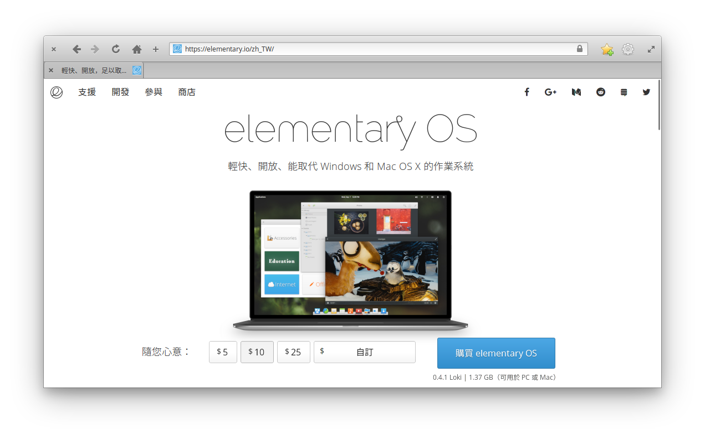

# 第 1 天：什麼是 elementary OS？

[elementary OS](https://elementary.io/) 是一個以 [Ubuntu](https://www.ubuntu.com/) 為基底，全新打造圖形化操作介面的一個發行版。其強調簡潔 (concision)、免設定 (avoid configuration) 及極簡文件 (minimal documentation) 的核心精神，意圖打造最易於使用的 Linux 操作體驗。

筆者一向是個視覺導向的人。當初看上 elementary OS，就是因為其畫面的優雅、輕量的預載環境及無負擔的學習曲線而受其吸引，加上本身工作的開發環境也是以 PHP/Laravel 的開源方案為主，一時突發奇想，*是不是有可能用 Linux 的圖型化發行版，打造一個讓 PHP 開發者也能輕鬆上手、開心工作的開發環境呢？*這系列主題於焉而生。

**在接下來的 30 天裡，將使用 elementary OS 為基礎，目標是同時滿足對設計的堅持與產能的要求，打造自己也愛用的工作機。**主題將囊括 PHP/Laravel 的所有開發家當及身為一個工程師所需要的各項生產力工具，試圖挑戰 Linux 只是簡陋替代品的刻板印象，讓它中看又中用！

## 為什麼會選 Linux 當工作機？

不論這幾年開發潮流如何的移轉，從開發者口中冒出的選項不是 Microsoft Windows 就是 masOS，似乎 Linux 從來都不會是工作機作業系統的首選。話雖如此，從筆者的角度卻覺得，其實用 Linux 當工作機有幾個較少意識到的好處：

1. **工作機就是正式機**

    反正平常寫 PHP/Laravel，說到底最後還不是要部署到 Linux？那直接用 Linux 來開發，不就更早適應正式機的環境？甚至在某些情境下，還可以直接本機測試，省去用虛擬方案模擬環境的麻煩。

2. **具高可攜性**

    當初看上 Linux，其中一個原因就是其可攜性。而大多數的 Linux 都可以直接安裝在 USB 隨身碟上運行，這讓工作環境的可攜、轉移甚至量產都變得可行。甚至可以在教學活動裡，運用這種方式來降低學員環境間的差異。

3. **相形安全的工作環境**

    截至目前為止，Linux 平台上的病毒相對較少 (小眾市場？)。其他平台的病毒也較不容易跨界感染，使用 Linux 當工作機算是一個相形安全的工作環境。

4. **更專心的工作環境**

    的確，Linux 上支援的東西比較少，尤其像電玩這一類的。也因此，意外創造出一個不會被外物誘惑的工作環境！(誤)

## 為什麼選擇 Elementary OS？

Linux 發行版多如牛毛，尤其近幾年主打不同特色的發行版如雨後春筍般的釋出，為什麼會獨鍾 elementary OS？我的理由是這樣的：

1. **想要有一個乾淨的 Linux 環境**
    
    有別於其他主打零調校的發行版已預裝許多軟體，elementary OS 出廠時幾乎什麼都沒有，這對想要自訂開發工作機的工程師來說，是一個很乾淨的系統。工作需要的東西，我自己會想辦法搞定。
    
2. **想要有一個漂亮的 Linux 桌面**

    目前大多數的 Linux 桌面都愈來愈美了，不過要做得優雅又具備該發行版自有的風格的就真的是少數了。而 elementary OS 則是少見才問市就先推[設計指南(Human Interface Guideline)](https://elementary.io/zh_TW/docs/human-interface-guidelines)  的開發團隊。其對設計細節的重視，是筆者非常欣賞的地方。
    
3. **以 Debian 為基底**

    除了視覺上的原因外，開發上還是習慣使用 Debian 流派的設定。因此，在挑選發行版時，也會優先選用以 Debian 為基底的發行版。elementary OS 是以 Ubuntu 為基礎做開發，這意味著它可以直接使用 Ubuntu 的的套件庫、設定也是依著 Ubuntu 走。當遇到問題時，也是用 Ubuntu 的關鍵字就可以查到相關資料。以 Ubuntu 目前的市佔率來說，查資料相對容易。
    
4. **我愛擬真設計！**

    我要誠實的說：「我討厭 Flat Design！」我喜歡 elementary OS 的其中一個很大的原因，是因為它所有圖示都採用擬真 (Skeuomorphism) 的設計，這完全是個人立場問題。 :p 

## 決策模型

在接下來的 30 天裡，筆者會在 elementary OS 上打造可以開發 PHP/Laravel 的工作機，而在做方案選擇時，會依照以下決策模型來評判：

1. **介面一定要漂亮！**
    
    就說是視覺系了嘛~而且目標就是要打破 Linux 軟體都很醜的印象了，所以假如兩個相同功能的軟體，一定先選介面好看的，不好看的就謝謝再聯絡~ (甚至功能超強但介面實在太醜的也不考慮)
    
2. **跨三大平台者優先**

    雖然目標是拿 Linux 當工作機，但不是所有時機手上都有 Linux 可以用；加上工程師有一部份的任務是要彼此交流，儘可能的使用可以橫跨三大作業系統平台的方案，降低轉換環境時的適應時間。若是順利的話，還可以拉人進 Linux 這個坑 (！)。

3. **可以用網路服務解決的就用網路服務**

    現在很多開發工具都直接做成網路服務了，也因此在瀏覽器裡就可以直接使用。這對 Web 開發者來說是再容易適應不過了，也更具可攜性。
    
4. **以能完成預期任務為目標**

    在選擇軟體方案時，以能符合需求為主，對於軟體的授權方式沒有太強烈的要求。換句話說，只要好用、可以提升效率，就算是付費軟體、Freemium 也都接受。

## 免責聲明

**對工程師來說，工作機的選擇當然還是以順手為主。**在這個系列裡，筆者僅從自己是開發者的角度出發去構築，可能無法滿足所有開發工作需求，也無法保證能打造出完美的工作環境。畢竟技術決策永遠只有最適解沒有最佳解，清楚自己的需求並做正確的選擇才是智慧之舉。不論您是懷著一股傻勁跟著筆者一起跳坑、或是抱著觀望的態度、抑或是嗤之以鼻，都由衷地希望您能找到自己最喜歡的一種方式。

準備好了嗎？讓我們拋棄成見，一起重新打破對工作機建置的想法吧！

## 參考資料

* [elementary OS 官網](https://elementary.io)
* [Wikipedia 介紹](https://en.wikipedia.org/wiki/Elementary_OS)
* [elementary OS 官方設計指南](https://elementary.io/zh_TW/docs/human-interface-guidelines)
