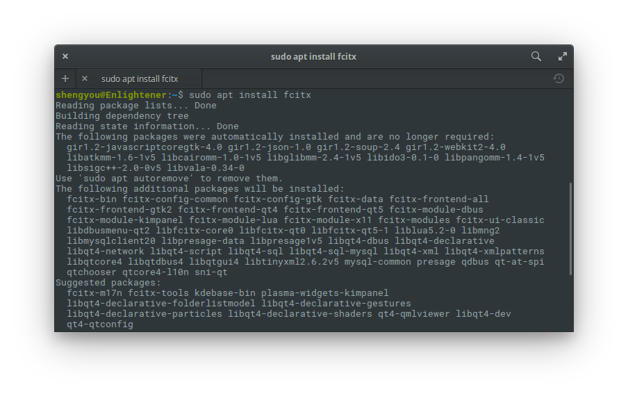

# 第 10 天：安裝/設定中文輸入法

當您安裝完 elementary OS 後，應該會發現根本沒有辦法輸入中文。這是大多數人接觸 Linux 時常遇到的難題，也是筆者寫這系列時最常被問到的主題。事實上，Linux 的桌面環境在近幾年的發展下，目前在中文輸入上已經獲得大幅度的改善。只是因為中文輸入法實在太多樣，再加上每個人偏好不同的條件下，往往在尋找資源上撞壁、不得要領。

老實說，筆者在剛使用 elementary OS 時，針對中文輸入這一塊也的確卡了一段時間。在大量爬文和多次重新安裝系統後，目前已經可以成功地在 elementary OS 上用兩種輸入法輸入中文字。因此，在這一篇介紹裡，就要將這個**精煉過的最小路徑**提供給讀者們參考。

## 先談輸入法框架

在開始之前，先讓讀者建立一個基本印象：在 Linux 的世界裡，在作業系統跟應用程式之間處理鍵盤輸入的是輸入法框架 (input method framework)；而我們所熟知的輸入法 (比方說注音、倉頡、拼音)，則是運作在這個輸入法框架上的一種引擎。換句話說，在 Linux 上要輸入非英文字元的話，要先安裝一個輸入法框架，然後再在這個輸入法框架上安裝自己熟悉的輸入法引擎。

以目前 Linux 桌面環境的現況來看，主流的輸入法框架有兩個：**ibus** 及 **fcitx**，而這兩個輸入法框架上幾乎都可以找到支援各種輸入法的輸入法引擎。從資料上來看 elementary OS 預設的輸入法框架就是 ibus，所以在 elementary OS 上應該只需要安裝和設定自己熟悉的輸入法引擎即可。

可惜的是，筆者照著建議的步驟安裝並沒有成功 (不過還是把當初的參考資料整理在文未的參考資料裡)，反倒是改用 fcitx 後可以成功運作。另外，礙於筆者會的輸入法有限，因此在這篇介紹裡，會以 fcitx 這個輸入法框架及兩個比較常見的輸入法：注音、嘸蝦米來做安裝教學。

## 安裝 fcitx 輸入法框架

由於安裝 fcitx 需要透過官方的 ppa 來源，而 elementary OS 因為擔心第三方來源的軟體在安全性及穩定性可能不是這麼可靠，所以預設是不能增加 ppa 來源的，也就是說不會有 `add-apt-repository` 這個指令。不過，我們還是可以把這個功能手動安裝回來。請先用快速鍵 `Meta`+`T` 打開終端機，並透過 `apt` 套件管理安裝 `software-properties-common` 這個套件：

```bash
$ sudo apt install software-properties-common
```


接著，就可以增加 ppa 來源：

```bash
$ sudo add-apt-repository ppa:fcitx-team/stable
```


*註：有些參考資料提到要安裝 nightly 的來源，不過經過筆者實測，使用 stable 的版本是沒問題的。*

然後要記得先更新套件來源後，就可以搜尋/安裝的到 fcitx 套件：

```bash
$ sudo apt update
$ sudo apt install fcitx
```



## 安裝輸入法引擎

有了 fcitx 後，接著就要安裝自己熟悉輸入法對應的引擎，以安裝注音輸入法來說，可以考慮使用酷音輸入法引擎，其套件名稱為 `fcitx-chewing`；若您跟筆者一樣是使用嘸蝦米輸入法的話，則要安裝碼錶類引擎，套件名稱是 `fcitx-table`，而嘸蝦米的碼錶則是 `fcitx-table-boshiamy`。安裝指令只需要打 `fcitx-table-boshiamy`，碼錶引擎 apt 會自動相依安裝。

```bash
$ sudo apt install fcitx-chewing
$ sudo apt install fcitx-table-boshiamy
```


**在這邊要特別聲明，嘸蝦米輸入法的表格檔是有版權的。換言之，若您沒有向官方購買正版版權的話，在 Linux 上使用嘸蝦米就是違法的行為。筆者在這邊呼籲大家務必重視版權。輸入法就像自己的吃的飯、用的電腦，是生活必需品、是生財工具。從您打字的數量、增加的生產力和省下的時間，購買授權的費用真的不算多，也是支援這個輸入法的未來開發。筆者以身作則，每一個作業系統都有買一套正版授權。**

## 設定 elementary OS 使用的輸入法框架

安裝好 fcitx 輸入法框架及輸入法引擎後，最後就要設定 elementary OS 使用 fcitx 做為預設的輸入法框架。這步驟需要在終端機內使用 `im-config` 指令完成觸發設定程式：

```bash
$ im-config
```

輸入指令後，就會觸發設定程式啟動，並出現以下畫面：


請直接點選確定 (OK)，接著下一步：


由於我們要修改設定，請點選確定 (Yes)，接著選擇 `fcitx`：


確認設定沒問題後，點選確定 (OK) 結束設定程式。完成後要重新登出再登入，或是果斷一點直接重開機。再次進入桌面後，在面板上應該就可以看到鍵盤的圖示，請選擇設定 (Configure)：


在輸入法的部份，請按左下角的 `+` 號來新增輸入法：


選擇自己熟悉的輸入法後按確定。


完成後就可以用 `Ctrl`+`Space` 切換輸入法開始輸入中文啦！


不知道這篇介紹有沒有改變您長久以來對 Linux 中文支援的印象呢？對您有幫助的話麻煩幫我按個掌聲。您是哪一種輸入法的愛好者呢？歡迎在留言裡跟我交流！

## 參考資料：

* 安裝 ppa 說明：[參考 1](https://elementaryos.stackexchange.com/questions/7507/how-can-i-add-a-ppa-in-loki)、[參考 2](https://itsfoss.com/things-to-do-after-installing-elementary-os-loki/)
* 在 elementary OS 上使用 ibus：[參考 1](https://blog.gasolin.idv.tw/2017/11/04/chinese-in-elementary-os/)、[參考 2](http://honwhy.github.io/2015/03/21/elementary-os-chinese-input-method/)
* [fcitx 在 Wikipedia 上的條目](https://zh.wikipedia.org/wiki/FCITX)
* 在 elementary OS 上使用 fcitx：[參考 1](https://sites.google.com/site/paothsungchen/selflearning/elementaryos/inputchinese)、[參考 2](https://3cschool.blogspot.tw/2014/08/elementary-os.html)、[參考 3](https://blog.uuz.moe/2016/09/14/elementary-install-chinese-input/)、[參考 4](https://www.zhihu.com/question/49812071)
* [可參考這篇移除 ibus](http://blog.ilc.edu.tw/blog/index.php?op=printView&articleId=513769&blogId=25793)
* [在 fcitx 上安裝嘸蝦米](https://blog.moli.rocks/2016/12/20/ubuntu-16-04-boshiamy-fcitx/)
