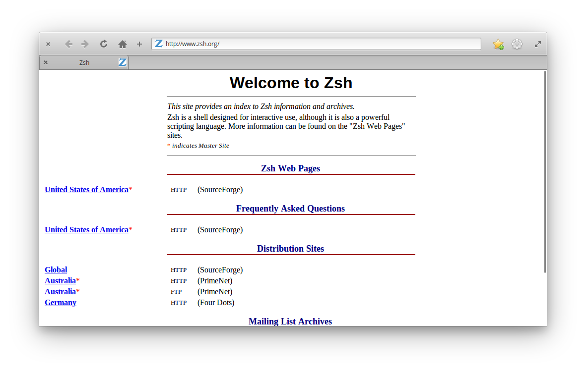
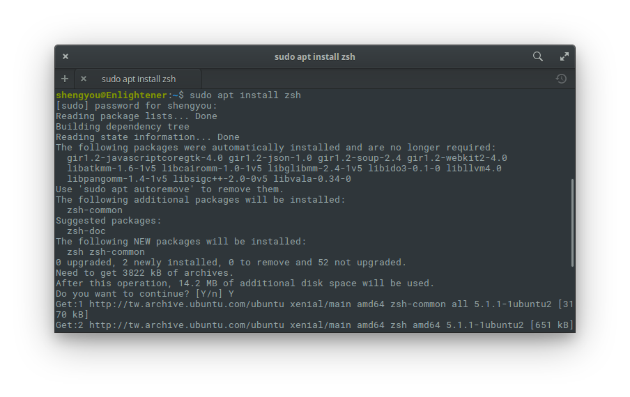
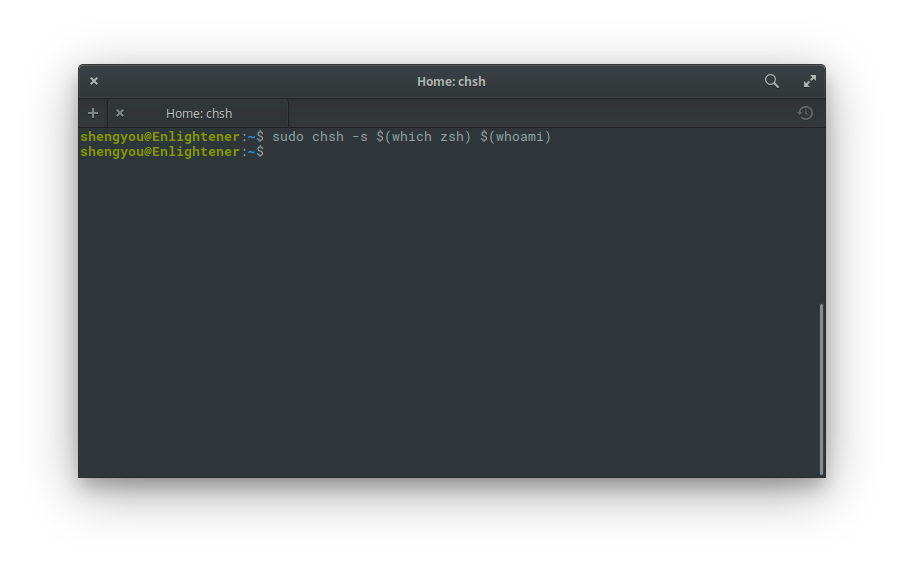
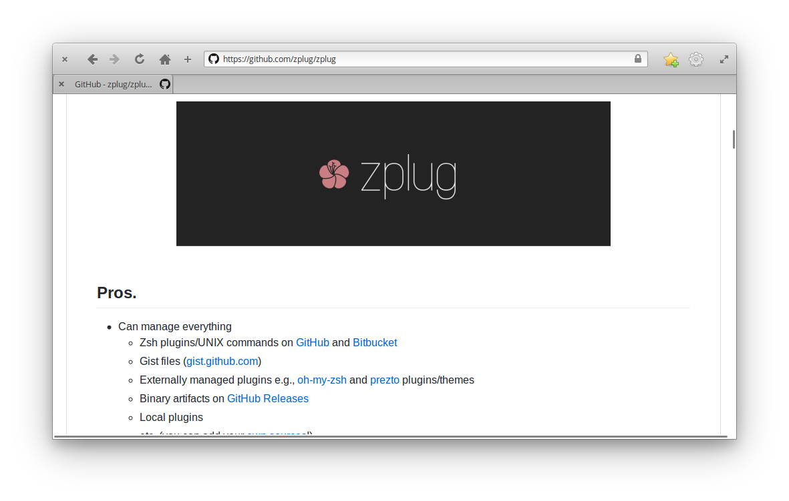
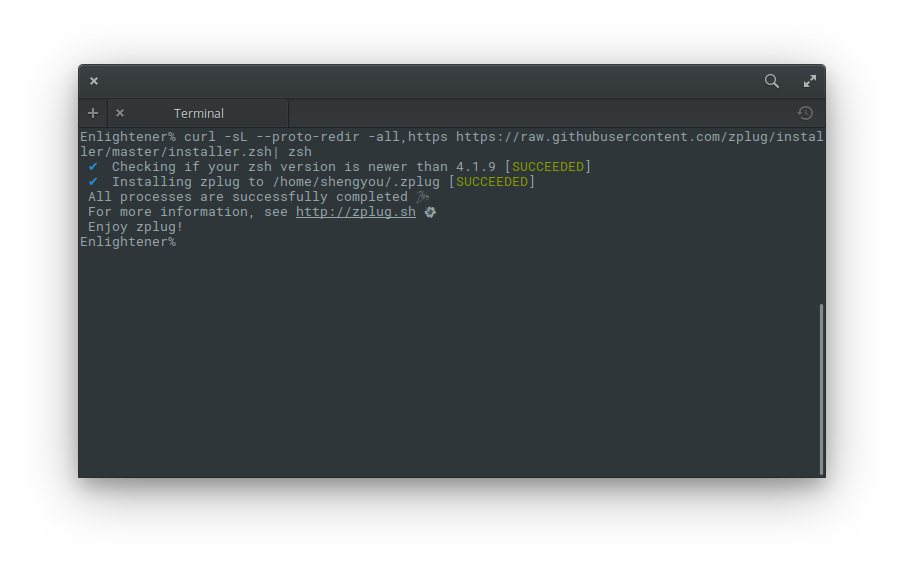
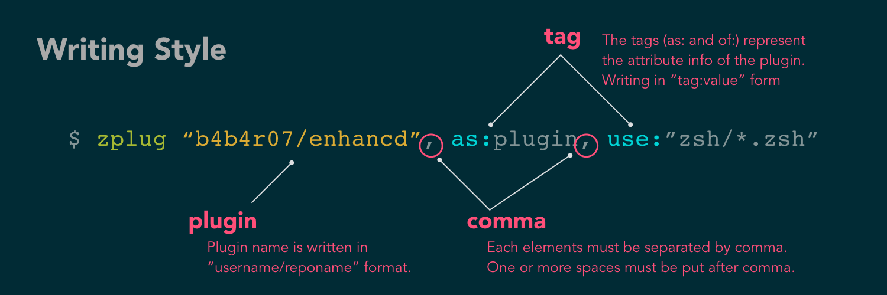
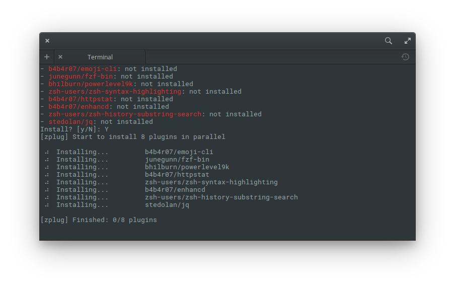

# 第 11 天：終端機功夫

您一定聽過這種說法，想要掌握 Linux，那您一定要熟練終端機；想要發揮 Linux 的極限，一定得透過終端機；想要深入調校 Linux，那終端機的技巧不可少。到底終端機有什麼魅力，僅靠一個黑畫面，就讓一堆工程師對它歌功頌德？又為什麼別人的終端機看起來花俏好用，而我的終端機總是搞不清楚我下的指令？

您很幸運！在這一篇介紹裡，筆者將帶著讀者調校 elementary OS 裡的終端機，在這份簡短的指南裡，我們不僅要安裝各種奇異的外掛讓終端機變得更好用外，更要把終端機弄得華麗花俏，讓你的終端機能從此好用又好看！

## 從換成 zsh 開始

雖然本篇的主題是終端機，但終端機其實只是個應用程式，我們透過終端機操作的其實是名為 Shell 的底層。Shell 是 Linux 作業系統裡，透過指令 (Command) 與核心 (Kernel) 溝通的一個介面，這也是為什麼操作 Linux 往往透過 Shell 指令是最快、最直接的方式。Linux 發展至今，Shell 也跟著演化出好幾個不同的版本，不過大多數的 Linux 發行版預設帶的 Shell 都是 `bash`。

雖然 `bash` 已可滿足大多數日常操作的需求，但若您跟筆者一樣追求的是更多自動提示、語法上色等搶眼球的特色，而且您也聽過或看過 [工程師的鄙視鏈](https://vinta.ws/blog/695) 的話，那您應該已經決定把 Shell 換成 `zsh`(誤)！(好奇為什麼大家都很愛把 Shell 換成 `zsh` 的話，可以參考文章末的參考資料)

`zsh` 是 Shell 家族的其中一個分支，除了繼承 `bash` 原本的功能外，也綜合各家 (包括但不限於 `ksh`、`tcsh`…等) 特性之大成，讓我們在操作 Shell 時可以更愉快些。所以就讓我們先從換 Shell 開始：



### 安裝 zsh

安裝 zsh 的方式非常簡單，直接用 `apt` 套件管理工具就可以了，請用快速鍵 `Meta`+`T` 開啟終端機視窗，輸入以下指令：

```bash
$ sudo apt install zsh
```



### 將預設的 Shell 改成 zsh

我們可以把 `bash`、`zsh` 等 Shell 當成一種應用程式來看，每當我們啟動終端機時，其實也同時啟動一個 Shell 跟作業系統互動。而 elementary OS 預設是用 `bash`，所以我們要將預設的 Shell 改成 `zsh`，這樣下次我們啟動終端機時，才會預設使用 `zsh` 跟作業系統互動：

```bash
$ sudo chsh -s $(which zsh) $(whoami)
```

*註：因為 Shell 是可以依各帳號做不同的預設值，所以參考了[這篇的語法](https://gist.github.com/mkalygin/b3e9de184d83a29a6cd0)用了一個 `whoami` 的技巧，透過指令動態取得目前登入的帳號名稱來設定。*



完成後要重開終端機才會預設進入 `zsh`。

## 搭配 zplug 框架

`zsh` 雖然具有非常多強大的特性，但老實說若沒有經過調校，用起來也感覺不出跟 `bash` 有什麼差異。換言之，只裝好 `zsh` 而沒有搭個框架的話，可說是白費了。而說到 `zsh` 框架，大多數文章都會提到 `oh-my-zsh`。

`oh-my-zsh` 是一個 `zsh` 的全功能框架，作者在 Github 的儲存庫裡管理各開源貢獻者從四面八方送來的佈景主題及外掛，並設計了載入與設定機制，讓使用者可以依自己的需求開/關各設定值，非常方便。筆者也很誠實的承認，當初之所以毅然決然地把 `bash` 換成 `zsh`，完全不是那些把 `zsh` 的好講得天花亂墜的文章，而是因為看上 `oh-my-zsh` 裡華麗的佈景主題風格和特效驚人 (數量也很驚人) 的外掛！(沒辦法，視覺系攻城師的決策天平其實就這麼單純…)

不過，`oh-my-zsh` 雖然好用，但因為作者將所有佈景主題及套件都集中在「一個」Github 儲存庫裡，也因此在初始安裝的時候，就必須把整個儲存庫都複製到本地端；而若您想用的 `zsh` 外掛沒被 `oh-my-zsh` 收錄時，又得另外自行處理。而筆者審視了一下自己常用的外掛後發現，其實真正常用的外掛沒想像中的那麼多，`oh-my-zsh` 相形來說太肥了，也因此興起尋找替代方案的念頭。

其實，`zsh` 社群也不乏框架。從 [zgen](https://github.com/tarjoilija/zgen)、[Antigen](http://antigen.sharats.me/)、[Antibody](https://getantibody.github.io) 到 [zplug](https://github.com/zplug/zplug) 每一套都試圖提供更多的功能及更好的效能。經過筆者一番不負責評比，`zplug` 因為純 shell 語法實作、可平行安裝/更新套件、按需載入、良好的效能，以及最重要的 - 花俏的畫面取勝，成為筆者的新寵。因此以下示範將以使用 `zplug` 為例。



`zplug` 官方也做好一鍵安裝，只需要在終端機輸入以下指令：

```bash
$ curl -sL --proto-redir -all,https https://raw.githubusercontent.com/zplug/installer/master/installer.zsh| zsh
```



就這樣安裝好了！確實無腦無負擔！

## 客製化設定

完成以上這些基礎安裝後，接下來的客製化設定才是重點。以 `zsh` 來說，其設定檔是放在家目錄 (~/) 底下名為 `.zshrc` 的純文字檔，所有 `zsh` 原生的設定、`zplug` 的套件資訊都要統一寫在裡面。請先用文字編輯器打開，若是沒有的話可以自己手動建立一個起來。

由於我們選擇使用 `zplug` 做為 `zsh` 的管理框架，因此在 `.zshrc` 裡的第一行要先把 `zplug` 初始化起來：

```
source ~/.zplug/init.zsh
```

接著，我們就可以開始設定要安裝的 `zsh` 套件有哪些？這一段的語法就要依照官方文件的格式來撰寫，請參考下圖：



### 安裝佈景主題

首先我們以安裝佈景主題為例，假設我們要安裝知名的 `zsh` 佈景主題 [`powerlevel9k`](https://github.com/bhilburn/powerlevel9k)，我們只需要依照官網文件新增一行：

```
zplug "bhilburn/powerlevel9k", use:powerlevel9k.zsh-theme
```

不過，因為 `powerlevel9k` 這個佈景主題用了圖示字型來做一些花俏的視覺效果，所以需要安裝 Powerline 這個字型，請依[官方指南](https://powerline.readthedocs.io/en/latest/installation/linux.html#fonts-installation)完成：

```bash
# 下載檔案
$ wget https://github.com/powerline/powerline/raw/develop/font/PowerlineSymbols.otf
$ wget https://github.com/powerline/powerline/raw/develop/font/10-powerline-symbols.conf

# 安裝字型
$ mv PowerlineSymbols.otf ~/.local/share/fonts/

# 更新字型快取
$ fc-cache -vf ~/.local/share/fonts/

# 安裝字型設定檔
$ mv 10-powerline-symbols.conf ~/.config/fontconfig/conf.d/
```

`powerlevel9k` 提供[非常多的設定選項](https://github.com/bhilburn/powerlevel9k/wiki/Stylizing-Your-Prompt)可以設定，您可以透過各種參數的調整，把您的終端機畫面改得非常炫麗，官方甚至[還有展示頁供大家炫耀自己的畫面](https://github.com/bhilburn/powerlevel9k/wiki/Show-Off-Your-Config)呢！唯一要注意的是，這些設定檔要寫在 `zplug` 安裝 `powerlevel9k` 的設定之前：

```
POWERLEVEL9K_PROMPT_ADD_NEWLINE=true
POWERLEVEL9K_DISABLE_RPROMPT=true
POWERLEVEL9K_LEFT_PROMPT_ELEMENTS=(dir newline vcs)
```

### 安裝套件

`zplug` 安裝套件的方式非常彈性，可以從 Github/Bitbucket、其他的 `zsh` 框架 (比方說 `oh-my-zsh`)，也可以指定 branch/tag/commit、依不同作業系統條件載入，甚至還可以權重排序安裝、或是安裝後觸發編譯，以下示範幾種常用寫法：

```
# 從 Github 安裝
zplug "zsh-users/zsh-history-substring-search"

# 從 on-my-zsh 安裝
zplug "plugins/git", from:oh-my-zsh

# 指定 tag
zplug "b4b4r07/enhancd", at:v1

# 依作業系統載入
zplug "lib/clipboard", from:oh-my-zsh, if:"[[ $OSTYPE == *darwin* ]]"

# 排序安裝
zplug "zsh-users/zsh-syntax-highlighting", defer:2

# 安裝後觸發編譯
zplug "jhawthorn/fzy", \
    as:command, \
    rename-to:fzy, \
    hook-build:"make && sudo make install"
```

在 `.zshrc` 的最後，別忘了加一段自動檢查套件是否安裝的檢查指示，若有沒有安裝的套件，還會自動提醒您要不要裝？多方便啊！

```
if ! zplug check --verbose; then
    printf "Install? [y/N]: "
    if read -q; then
        echo; zplug install
    fi
fi
```

最後一行別忘了把 `zplug` 載入，所有指令和工具才能呼叫喔！

```
zplug load
```

完成後，別忘了把 `.zshrc` 存檔後重開終端機，應該就會看到自動安裝的提示，按下 `Y` 就可以全自動安裝！



## 給 PHP/Laravel 開發者的推薦套件

`zsh` 套件的數量真的非常多、種類也非常多元，其實筆者也是常常很驚訝的發現「原來還有這種套件！」，所以常常跟別人交流用哪些套件其實很個增廣見聞的好方法。在這邊特別把幾個常用或是跟開發 PHP/Laravel 有關的套件列出來給大家參考：

1. `zplug "plugins/git", from:oh-my-zsh` - 增加 git 的指令提示
2. `zplug "plugins/vagrant", from:oh-my-zsh` - 增加 Vagrant 的指令提示
3. `zplug "plugins/docker", from:oh-my-zsh` - 增加 Docker 的指令提示
4. `zplug "docker-compose", from:oh-my-zsh` - 增加 docker-compose 的指令提示
5. `zplug "plugins/composer", from:oh-my-zsh` - 增加 Composer 的指令提示
6. `zplug "plugins/laravel5", from:oh-my-zsh` - 增加 Laravel 的指令提示
7. `zplug "shengyou/codeception-zsh-plugin"` - 增加 Codeception 的指令提示
8. `zplug "shengyou/robo-zsh-plugin"` - 增加 Robo 的指令提示
9. `zplug "plugins/npm", from:oh-my-zsh` - 增加 npm 的指令提示

覺得清單有點長？真要列起來的話，寫成一本書都不為過呢！假如您想要眾覽 `zsh` 套件清單的話，建議您瞧一下 [`awesome-zsh-plugins`](https://github.com/unixorn/awesome-zsh-plugins)。

## 展現/分享您的原力 (dotfile)

雖然在這篇介紹裡，筆者略帶戲虐的更換 Shell、選擇套件管理工具，但其實並無挑起工具論戰的意思。事實上，無論您使用哪一種 Shell、哪一種套件管理工具，都可以做到相同的結果。而由於 Shell 的設定檔通常都是 `.` (dot) 開頭的檔名，而且是一個單純的純文字檔案，體積小又容易傳輸分享。所以您就會發現 Github 上常常有很多神人分(ㄅㄟˋ)享(ㄈㄣˋ)自己的設定檔供大家參(ㄇㄛˊ)考(ㄅㄞˋ)，甚至 Github 還為了這個做了一頁[介紹頁](https://dotfiles.github.io/)呢！

在這篇介紹裡，筆者僅先針對安裝、套件管理及客製化設定這幾點為各位的終端機「功夫」做點蹲馬步的基礎指引，希望能對您在操作終端機時有幫助。你也是 `zsh` 的愛好者嗎？有沒有什麼密技或推薦套件呢？歡迎留言與我交流！

## 參考資料

* [為什麼要用 zsh？](https://www.zhihu.com/question/21418449)
* [zsh 教學](https://github.com/unixorn/zsh-quickstart-kit)
* Command Line 教學：[教學 1](https://medium.freecodecamp.org/conquering-the-command-line-f85f5e46c07c)、[教學 2](https://medium.freecodecamp.org/how-to-energize-your-scary-terminal-with-helpful-little-scripts-c5ae92c12bfe)
* 值得參考的終端機技巧網站：[Command Line Power User](https://commandlinepoweruser.com/)、[Terminals Are Sexy](https://terminalsare.sexy/)、[Command Line Fu](http://www.commandlinefu.com/commands/browse)
* 值得訂閱的終端機技巧頻道：[climagic](https://www.youtube.com/user/climagic/)
* dotfile 介紹：[總覽頁](https://dotfiles.github.io/)、[影片](https://thoughtbot.com/upcase/videos/intro-to-dotfiles)、[清單](https://github.com/webpro/awesome-dotfiles)
