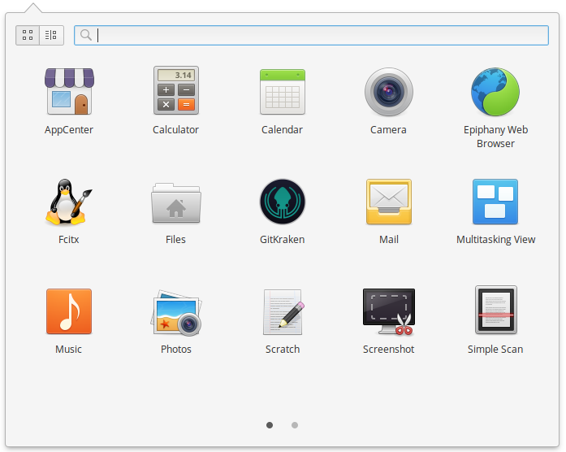

# 第 12 天：git 版本管理系統

在這個版本管理當道，軟體、技術、方法論都如此成熟的年代，假如還有人跟您說版本管理不重要、不需要版本管理，那這個人一定不是您的朋友，請跟他斷交；若是他真的是您的朋友，而您想要救他的話，請把這篇文章的連結貼給他，帶著他把版本管理軟體裝起來，這一篇介紹文就是為了這個情境寫的。

版本管理系統有很多，各有特色也各有專精。不過，以目前最廣為流行的，應該就屬 git  了吧？git 就是由 Linux 的作者 Linus Torvalds 所發起的，當初就是為了讓全世界寫 Linux Kernel 的工程師可以一起協同作業而設計，是一種分散式的版本管理系統。

由此可知，在 Linux 上安裝/運作 git 是天經地義再自然不過的事了。不過，使用 git 的時候，其實非常依賴線圖來理解版本演進的過程；所以有個好的 GUI 圖形介面是非常重要的事。在這一篇介紹裡，筆者除了示範如何安裝 git 指令工具外，也會推薦在 Linux 上也有桌面版本且畫面好看的 GUI 軟體。

## git 指令列

就讓我們先從安裝 git 指令工具開始吧！由於 git 在 Linux 上根本就是內建套件的等級，所以幾乎所有發行版的套件庫都已經有名為 `git` 的套件。只要透過該發行版的套件管理工具安裝就好，非常簡單。不過，由於各發行版在打包套件時，不見得會即時的更新到最新穩定版的 git。因此，筆者在這邊示範時，依照官網的指南把官方 ppa 來源加入，確保可以安裝到最新穩定版。

請先使用快速鍵 `Meta`+`T` 開啟終端機應用程式，並輸入以下指令：

```bash
$ sudo add-apt-repository ppa:git-core/ppa
$ sudo apt update
$ sudo apt install git
```


*註：各 Linux 發行版安裝 git 的指令可以參考[官方安裝指南](https://git-scm.com/download/linux)*

這樣完成了！若是想要確定自己有沒有安裝成功，可以透過指令工具來查詢 git 安裝版本來確認：

```bash
$ git --version
```

若是有成功安裝的話，應該會如圖所示出現類似「git version 2.15.1」的字樣：


## git 圖形介面

雖然在 Linux 上安裝 git 指令列是一件非常容易的事，但對比於圖形介面，Linux 在這一點就蠻吃虧的。您可能熟悉的 git 圖形介面如 SourceTree、GitTower 等，雖然都陸續推出跨平台的版本，但都只有跨到 Windows 和 Mac，獨缺 Linux。

好在也不是完全沒有替代方案，早期我就有觀察到 SmartGit 這套跨平台 git 圖形介面應用程式、近期則是有後起新秀 GitKrakan。在這篇介紹裡，筆者就會帶著大家安裝這兩套可在 elementary OS 上運行的 git 圖形介面應用程式。

### SmartGit

首先介紹 SmartGit 這套老牌的 git 圖型化介面軟體，由於其底層採用 Java 為核心，因此可以跨各種作業系統平台，在各平台上的使用經驗也大致相同。請先至 SmartGit 官網：https://www.syntevo.com/smartgit/ ，網站應該會很聰明的自動選擇下載 Linux 版。


不過，因為預設的下載檔案是 tar.gz 格式，安裝時可能需要自行處理 JRE 的相依安裝。所以，這邊會建議讀者按下載按鈕旁邊的「…」按鈕到下載頁，選擇 Debian 的 `.deb` 打包檔下載。


下載後，開啟終端機程式，直接輸入以下指令安裝：

```bash
$ sudo apt install ./smartgit-17_1_3.deb
```


安裝程式會自動處理套件的相依性，把需要的套件一併安裝完成，然後就可以在應用程式列表內看到 SmartGit 的圖示。


第一次使用時需要先初始化，然後就可以開始用圖形介來管理你的 git 儲存庫啦！有沒有很簡單呢？


### GitKrakan

GitKraken 是近期我觀察到的一套 git 的圖型化介面軟體，跟 SmartGit 不同的地方是，其底層是採用 [Electron](https://electronjs.org/) 技術，因此也可以做到跨平台。其特別強調簡易且精緻的操作畫面，甚至很多複雜的 git 指令都可以轉化成滑鼠的拖曳操作。

請先至 GitKraken 官網：https://www.gitkraken.com/ ，選擇下載 (Download)。


選擇官方提供的 `.deb` 版本下載。


下載完成後，一樣透過 apt 套件管理工具安裝即可：

```bash
$ sudo apt install ./gitkraken-amd64.deb
```


安裝完成後就可以在應用程式列表內看到 GitKraken 的圖示。



第一次使用時需要先申請帳號並初始化，然後就可以開始用 GitKraken 了！GitKraken 的介面風格走暗色神祕風，不知道有沒有吸引到喜歡黑畫面的您呢？


不論您是喜歡黑畫面的指令魔人，還是像筆者一樣是視覺系動物，相信都能在 elementary OS 上找到適合自己的 git 工具。*不過在這邊要提醒一下讀者，不論是 SmartGit 或 GitKraken，若是用於非商業行為的話是可以免費使用；但若是用於商業行為的話，是需要另外購買授權的喔！請大家要有正確的版權觀念。*若您只是想看線圖，不想為了其他功能付費的話，git 的官網上還有介紹一系列其他 Open Source 的 git 圖形介面工具，請參考文章末的參考資料。

有沒有什麼好的 git 工具是筆者沒介紹的呢？歡迎分享給我喔！

## 參考資料

* [git 官網](https://git-scm.com/)
* [Linux 上的 git 圖形介面工具列表](https://git-scm.com/download/gui/linux)
* [GitKrakan 官網](https://www.gitkraken.com/)
* [GitKrakan Youtube 頻道](https://www.youtube.com/channel/UCp06FAzrFalo3txskS1gCfA)
* [SmartGit 官網](https://www.syntevo.com/smartgit/)
