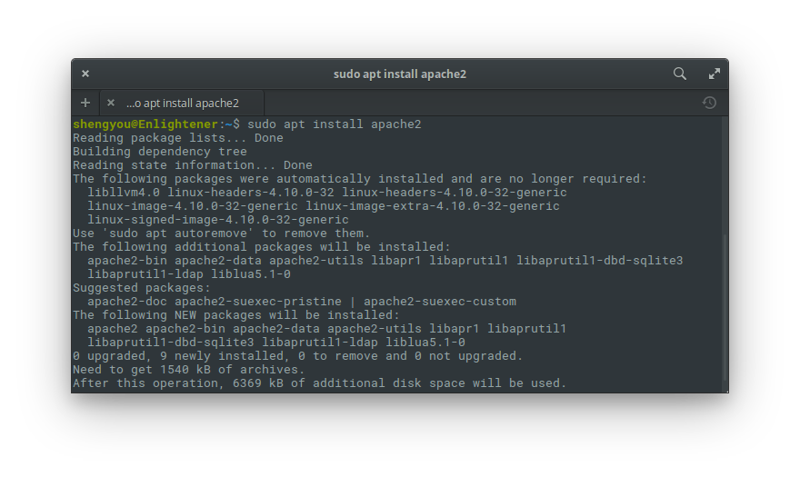

# 第 13 天：以 apt 建置 PHP/Laravel 開發環境

以建置 PHP/Laravel 開發環境來說，大體上需要四個主要元素：作業系統、網頁伺服器、資料庫、PHP 直譯器。而又因為最常見的組合就是 **L**inux、**A**pache、**M**ySQL、**P**HP，所以坊間常見的簡稱就是所謂的 LAMP。當然，隨著近幾年開發典範的轉移，這個簡稱就出現了很多混種，像是在不同作業系統上演伸出來的 **W**(indows)AMP、**M**(ac)AMP；或是更換成不同的伺服器 L**N**(ginx)MP、不同的資料庫 LA**P**(ostgreSQL)P 等，由此可見 PHP 在環境上的廣適性。

由於各 Linux 發行版都會自帶套件管理庫，所以在安裝/更新/移除這些 PHP 開相關開發元件時顯得相形容易，再加上大多數的 PHP/Laravel 開發者也會選擇使用 Linux 做為上線主機的作業系統。因此，直接在 elementary OS 上架 LAMP 環境做開發其實很直覺，也近似於在跟上線主機一樣的環境底下做開發。

elementary OS 屬於 Debian 流派，因此在這篇介紹裡，筆者就以 `apt` 套件管理工具示範如何安裝 AMP 環境，讓讀者可以直接在 elementary OS 上擁有一個開發 PHP/Laravel 的環境。

## 預備動作

在開始安裝前，先讓我們把系統更新到最新版，請先用 `Meta`+`T` 開啟終端機應用程式。另外，安裝過程中常會需要一些開發工具，在開始之前也先把這些工具安裝起來。

```bash
$ sudo apt update
$ sudo apt upgrade
$ sudo apt install software-properties-common
```

## 安裝 Apache

先從 Apache 開始安裝起。Apache 當前穩定版本為 2.4 系列，而在 apt 裡的套件名稱就叫 `apache2`，所以直接下一行指令搞定，完成後也可以檢查一下安裝的版本是否為 2.4.18。

```bash
# 安裝 Apache
$ sudo apt install apache2

# 檢查安裝版本
$ sudo apache2 -v
```



完成後直接用瀏覽器打開 `http://localhost` 應該就可以看到 Apache 預設的啟動畫面：


## 安裝 MySQL

接著來安裝 MySQL 資料庫。由於每一個套件管理庫裡的套件名稱可能略有差異，在安裝時請務必留意。以 apt 來說，MySQL 的套件名稱為 `mysql-server`，請用以下指令安裝，完成後也請檢查一下安裝的版本是否為 5.7.20。

```bash
# 安裝 MySQL
$ sudo apt install mysql-server

# 檢查安裝版本
$ sudo mysql --version
```


在安裝過程中，會出現對話提示來設定 root 帳號的密碼 (輸入兩次)，輸入後請把密碼記起來，之後開發時會用到。


## 安裝 PHP

然後來安裝 PHP。在文章撰寫的當下，PHP 的穩定版本為 7.2。不過，由於 PHP 釋出的版本變快了，各發行版在釋出更新的速度不會這麼即時，所以會建議使用信任來源的 ppa 安裝最新版的 PHP。另外，由於開發 Laravel 時有需要一些必要的外掛擴充，可以在這個時候一併安裝，安裝完後確認一下版本是否為 7.2.1，也可以用 `php -m` 確認一下安裝的外掛是否都有載入。

```bash
# 新增 ppa 來源
$ sudo apt-add-repository ppa:ondrej/php
$ sudo apt update

# 安裝 PHP 及相關擴充
$ sudo apt install php7.2 php7.2-common php7.2-cli php7.2-curl php7.2-gd php7.2-json php7.2-dev php7.2-pgsql php7.2-sqlite3 php7.2-gd php7.2-curl php7.2-memcached php7.2-imap php7.2-mysql php7.2-mbstring php7.2-xml php7.2-zip php7.2-bcmath php7.2-soap php7.2-intl php7.2-readline

# 安裝 Apache 的 PHP 模組
$ sudo apt install libapache2-mod-php7.2
```


## 下載/安裝 Composer

Composer 是 PHP 生態系最廣為使用的相依管理工具。只要您在開發程式時不想要重新打造輪子、想快速引入別人寫好的函式庫、輕鬆管理套件之間的相依性且可以無腦的下載/安裝/更新/載入這些套件的話，那 Composer 就是您的最佳助手。若您以前有使用過 PEAR 的經驗，那您可以簡單地把 Composer 當做是繼任取代品，現在 Composer 幾乎已成為 PHP 開發者的標準配備。

由於 Composer 就是用 PHP 程式語言撰寫後打包成 `.phar` 的執行檔。因此我們才會在前一步先安裝 PHP，有了 `php` 指令後，就可以直接使用 Composer 官網上的[下載指令](https://getcomposer.org/download/)來安裝 Composer：

```bash
$ php -r "copy('https://getcomposer.org/installer', 'composer-setup.php');"
$ php -r "if (hash_file('SHA384', 'composer-setup.php') === '544e09ee996cdf60ece3804abc52599c22b1f40f4323403c44d44fdfdd586475ca9813a858088ffbc1f233e9b180f061') { echo 'Installer verified'; } else { echo 'Installer corrupt'; unlink('composer-setup.php'); } echo PHP_EOL;"
$ php composer-setup.php
$ php -r "unlink('composer-setup.php');"
```


*註：這段指令會從 Composer 官網下載 `composer-setup.php` 這個安裝程式，由於指令裡會驗證這個 .php 檔的雜湊值，所以請**自行**到官網複製這段指令*

完成後，可以把 `composer.phar` 變成全域指令：


```bash
$ sudo mv composer.phar /usr/local/bin/composer
```


最後，透過取得安裝版本來測試一下是否成功安裝。

```bash
$ composer --version
$ composer
```


## 安裝 Laravel

有了以上的基礎建設後，要安裝 Laravel 就變得非常簡單，不過因為我們常常需要同時開發多個 Laravel 專案，所以我會建議在自己的家目錄底下開個專門放專案的目錄 (比方說 `/home/shengyou/Projects`)，然後在這個專案目錄底下建立 Laravel 專案。

### 建立新 Laravel 專案

請先切換工作目錄到您的專案目錄 (Projects) 底下，然後執行 Composer 建立專案的指令即可：

```bash
$ mkdir ~/Projects
$ cd ~/Projects
$ composer create-project laravel/laravel --prefer-dist
```


Laravel 在運行的時候，會將應用程式的 cache 及 log 寫入檔案，因此別忘了把資料夾權限開大：

```bash
$ chmod -R 777 storage
$ chmod -R 777 bootstrap/cache
```

### 建立/開啟虛擬站台

為了讓我們開發時可以支援多個專案，因此我們要在 Apache 上設定虛擬站台。請用 root 權限新增虛擬站台設定檔 `/etc/apache2/site-available/laravel.local.conf` 輸入以下設定檔：

```
<VirtualHost laravel.local:80>
    DocumentRoot "/home/shengyou/Projects/laravel/public"
    ServerAdmin laravel.local

    <Directory "/home/shengyou/Projects/laravel">
        Options All
        AllowOverride All
        Require all granted
    </Directory>
</VirtualHost>
```

完成後要在 Apache 裡啟動這個站台，成功啟動後要重新載入 Apache 設定檔

```bash
# 開啟站台
$ sudo a2ensite laravel.local

# 重新載入 Apache 設定檔
$ sudo systemctl reload apache2
```


### 設定 hosts

在上一步裡，您會看到我們站台的網址是 `laravel.local`，但這個網址只是拿來開發時使用，實際上並不存在。所以我們必需在本機上設定 DNS 對應，讓瀏覽器輸入這個網址時，會被導向到 XAMPP。換句話說，我們必需強制讓 `laravel.local` 會被導向本機 IP，也就是 `127.0.0.1`。

所以請用 root 權限編輯 `/etc/hosts` 這個檔案，並在裡面新增一行：

```
127.0.0.1 laravel.local
```


完成後打開瀏覽器，輸入網址 `laravel.local` 應該就可以看到 Laravel 的專案啟動畫面如下：


完成了！一個可以開發 PHP/Laravel 的開發環境就完成了！

## 系統服務的啟動/關閉/重啟

由於 Linux 預設被當成網路主機使用，所以 apt 在安裝完 Apache 或 MySQL 時，也會預設就把這些服務在開機時預設啟動。但因為我們只是拿來做開發機，並不需要一開機就啟動，所以可以把這個設定關閉。目前主流 Linux 的服務管理大多採用 `systemd`，所以要管理各服務的運作狀態可以統一使用 `systemctl` 這個指令來操作：

```bash
# 讓服務不要預設啟動
$ sudo systemctl disable apache2
$ sudo systemctl disable mysql
```

以後要了解各服務的狀態，或是要啟動/關閉/重啟這些服務時，就使用這些指令即可：

```bash
# 查看服務狀態
$ sudo systemctl status apache2
$ sudo systemctl status mysql

# 啟動各服務
$ sudo systemctl start apache2
$ sudo systemctl start mysql

# 關閉各服務
$ sudo systemctl stop apache2
$ sudo systemctl stop mysql

# 重啟各服務
$ sudo systemctl restart apache2
$ sudo systemctl restart mysql
```

經過這篇的介紹，相信您就可以在 elementary OS 上用 apt 套件管理工具搭建起一個可以開發 PHP/Laravel 的環境。只要抓到重點的 AMP 三個元件的安裝流程，安裝所需花費的時間並不多，之後要移除或更新也很方便。由於所有軟體都是原生安裝，因此在啟動/載入/重開的速度和效能應該都是不錯的。環境安裝一次後，後續要背起來的指令也不多，對熟悉 Linux 操作的讀者應該不是問題。

不過在最後要提醒一下讀者，在本篇的介紹裡，目標先放在建置本機可運作的開發環境。為了讓內容不致於過長或失焦，所以並沒有描述太多關於安全性設定的細節。**若您安裝的是上線運作的主機，請務必依照您的環境做安全性防禦的設定，以確保主機的安全喔！**

## 參考資料

* [DigitalOcean 上的 LAMP 安裝教學](https://www.digitalocean.com/community/tutorials/how-to-install-linux-apache-mysql-php-lamp-stack-on-ubuntu-16-04)
* [PHP 7.2 安裝教學](https://ayesh.me/Ubuntu-PHP-7.2)
* [關閉預設啟動服務指令](https://unix.stackexchange.com/questions/314977/how-to-disable-apache-and-mysql-autostart-when-pc-is-turned-on)
* [Composer 官網](https://getcomposer.org/)
* [Laravel 安裝指南](https://laravel.com/docs/5.5#installing-laravel)
* [Homestead 的 Provisioning Script](https://github.com/laravel/settler/blob/master/scripts/provision.sh)
