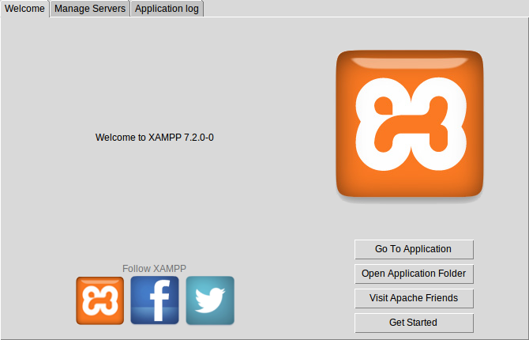
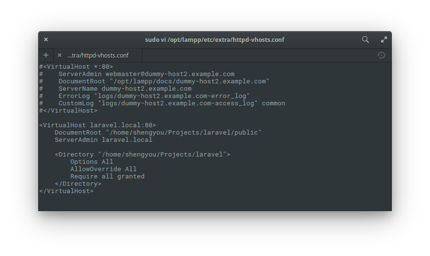

# 第 14 天：以 XAMPP 建置 PHP/Laravel 開發環境

提到建置 PHP 開發環境，許多人的印象與經驗大概都跟筆者一樣，都是從使用 *AMP 的懶人包開始的。這種多合一懶人包的好處在於可以讓開發者跳過建置環境的繁瑣步驟，也可以免去操作虛擬環境的門檻；尤其對於初學者來說，可大大降低入門時的挫折感。只要運用得宜，不失為建立 PHP/Laravel 環境的一種方式。

*AMP 這種懶人包其實在各平台上都有對應的版本，從免費到付費的選項都有。而以 Linux 來說，XAMPP 算是一套老牌且長期有在持續維護的版本。在這篇介紹裡，筆者將示範如何在 elementary OS 上以 XAMPP 來建置 PHP/Laravel 開發環境。

## 下載/安裝 XAMPP

首先要到 XAMPP 官網下載。請打開瀏覽器，輸入網址：https://www.apachefriends.org/ 選擇對應的 Linux 版本後下載。


下載後，官方提供的是一個 `xampp-linux-x64-7.2.0-0-installer.run` 的指令檔，請用 `Meta`+`T` 開啟一個終端機視窗並將工作目錄切換至指令檔所在目錄，先設定指令檔的權限為 755 後以 root 權限執行。

```bash
$ chmod 755 xampp-linux-x64-7.2.0-0-installer.run
$ sudo ./xampp-linux-x64-7.2.0-0-installer.run
```


接著，會啟動一個圖形化的安裝程式，基本上全部按下一步 (Next) 即可。


完成後，安裝程式會把 XAMPP 放在 `/opt/lampp` 之下，這樣就完成安裝動作了！

## 啟動 XAMPP

安裝完 XAMPP 後，若要啟動時，只需要一行指令：

```bash
$ sudo /opt/lampp/lampp start
```


若是 XAMPP 有正常啟動的話，應該會如上圖出現類似「Starting XAMPP...」、「XAMPP: Starting Apache...」、「XAMPP: Starting MySQL...」…等的字樣。這時若打開瀏覽器，瀏覽 `http://localhost/dashboard/` 應該就可以看到 XAMPP 的頁面。


若您偏好使用圖形工具來操作 XAMPP 的話，可以用指令工具將圖形管理介面叫出來使用：

```bash
$ cd /opt/lampp
$ sudo ./manager-linux-x64.run
```



## 安裝 Composer

在早期開發 PHP 應用程式時，往往都需要開發者自行手動管理程式內各函式庫之間的相依性。隨著應用程式的增長，管理相依性就變成一件苦差事。因此，PHP 社群陸續出現了 PEAR、Pyrus 等專案嘗試解決這個問題。近年來，Composer 成為新一代的相依管理工具的主流選擇，目前已是 PHP 開發者的標準配佩。

Composer 採 `phar` 的封裝檔進行散佈。所謂 phar 檔可以把它想像成用 PHP 程式語言寫的執行檔，概念上雷同在 Microsoft Windows 上的 `.exe`，只是需要透過 PHP 引擎來趨動運行。換句話說，當我們要安裝 Composer 前，必需把 PHP 的執行路徑加到系統的環境變數內。

### 將 PHP 設定在 PATH 內

XAMPP 在安裝的時候，會把所有 `bin` (binary 檔) 放在 `/opt/lamp/bin` 底下。所以，我們只需要將這個路徑加到 PATH 裡即可。依據您習慣使用的 Shell 的不同，設定的檔案也會稍有差異 (若您使用的是 Bash 的話請編輯 `.profile`；若您使用的是 Zsh 的話請編輯 `.zshrc`，不知道自己的 Shell 是什麼的話，請用 `$ echo $SHELL` 來查)，打開後請新增以下語法：

```bash
PATH="/opt/lampp/bin:$PATH"
```


完成後，先存檔並重載 (可用 `$ source ~/.profile` 或重新登入或直接重開機)，隨後測試一下是不是能執行 PHP 指令？

```bash
$ php -v
```


### 下載/安裝 Composer

有了 `php` 指令後，就可以直接使用 Composer 官網上的[下載指令](https://getcomposer.org/download/)來安裝 Composer：

```bash
$ php -r "copy('https://getcomposer.org/installer', 'composer-setup.php');"
$ php -r "if (hash_file('SHA384', 'composer-setup.php') === '544e09ee996cdf60ece3804abc52599c22b1f40f4323403c44d44fdfdd586475ca9813a858088ffbc1f233e9b180f061') { echo 'Installer verified'; } else { echo 'Installer corrupt'; unlink('composer-setup.php'); } echo PHP_EOL;"
$ php composer-setup.php
$ php -r "unlink('composer-setup.php');"
```


*註：這段指令會從 Composer 官網下載 `composer-setup.php` 這個安裝程式，由於指令裡會驗證這個 .php 檔的雜湊值，所以請**自行**到官網複製這段指令*

完成後，可以把 `composer.phar` 變成全域指令：


```bash
$ sudo mv composer.phar /usr/local/bin/composer
```


最後，透過取得安裝版本來測試一下是否成功安裝。

```bash
$ composer --version
$ composer
```


## 安裝 Laravel

由於我們可能會同時開發多個 Laravel 專案，所以我會建議在自己的家目錄底下開個專門放專案的目錄 (比方說 `/home/shengyou/Projects`)，然後在這個專案目錄底下建立 Laravel 專案。

### 建立新 Laravel 專案

請先切換工作目錄到您的專案目錄 (Projects) 底下，然後執行 Composer 建立專案的指令即可：

```bash
$ mkdir ~/Projects
$ cd ~/Projects
$ composer create-project laravel/laravel --prefer-dist
```


Laravel 在運行的時候，會將應用程式的 cache 及 log 寫入檔案，因此別忘了把資料夾權限開大：

```bash
$ chmod -R 777 storage
$ chmod -R 777 bootstrap/cache
```

### 開啟虛擬站台支援

為了讓 XAMPP 可以支援多個虛擬站台，我們要先編輯 Apache 設定檔，將功能打開。請用 root 權限編輯 `/opt/lampp/etc/httpd.conf` 檔案，並把其中 `Include etc/extra/httpd-vhosts.conf` 這行取消註解：

```
# Virtual hosts
Include etc/extra/httpd-vhosts.conf
```


### 設定/建立虛擬站台

完成以上的步驟後，接著就要在 XAMPP 裡的 Apache 設定新的虛擬站台。假設我們的專案目錄在 `/home/shengyou/Projects/laravel` 而對應到的虛擬網址是 `laravel.local`。所以我們就要在 `/opt/lampp/etc/extra/httpd-vhosts.conf` 把用不到的虛擬站台註解掉，並新增我們的專案站台：

```
#<VirtualHost *:80>
#    ServerAdmin webmaster@dummy-host.example.com
#    DocumentRoot "/opt/lampp/docs/dummy-host.example.com"
#    ServerName dummy-host.example.com
#    ServerAlias www.dummy-host.example.com
#    ErrorLog "logs/dummy-host.example.com-error_log"
#    CustomLog "logs/dummy-host.example.com-access_log" common
#</VirtualHost>

#<VirtualHost *:80>
#    ServerAdmin webmaster@dummy-host2.example.com
#    DocumentRoot "/opt/lampp/docs/dummy-host2.example.com"
#    ServerName dummy-host2.example.com
#    ErrorLog "logs/dummy-host2.example.com-error_log"
#    CustomLog "logs/dummy-host2.example.com-access_log" common
#</VirtualHost>

<VirtualHost laravel.local:80>
    DocumentRoot "/home/shengyou/Projects/laravel/public"
    ServerAdmin laravel.local

    <Directory "/home/shengyou/Projects/laravel">
        Options All
        AllowOverride All
        Require all granted
    </Directory>
</VirtualHost>
```



*註：請依自己的環境/路徑設定*

### 設定 hosts

在上一步裡，您會看到我們站台的網址是 `laravel.local`，但這個網址只是拿來開發時使用，實際上並不存在。所以我們必需在本機上設定 DNS 對應，讓瀏覽器輸入這個網址時，會被導向到 XAMPP。換句話說，我們必需強制讓 `laravel.local` 會被導向本機 IP，也就是 `127.0.0.1`。

所以請用 root 權限編輯 `/etc/hosts` 這個檔案，並在裡面新增一行：

```
127.0.0.1 laravel.local
```


完成後存檔離開並重開 Apache：

```bash
$ sudo /opt/lampp/lampp restart
```


完成後打開瀏覽器，輸入網址 `laravel.local` 應該就可以看到 Laravel 的專案啟動畫面如下：


Ta-da！一個可以開發 PHP/Laravel 的開發環境就完成了！

## 關閉 XAMPP

完成開發工作後想關閉 XAMPP 的話，一樣透過指令就可以將其關閉：

```bash
$ sudo /opt/lampp/lampp stop
```


成功關閉後，應該會如上圖出現類似「Stopping XAMPP...」、「XAMPP: Stopping Apache...」、「XAMPP: Stopping MySQL...」…等的字樣。

從以上的示範，應該就可以感受到使用 XAMPP 建置 PHP/Laravel 開發環境的簡易程度。**不過，在這邊還是要提醒一下讀者，在這篇介紹裡的目標是協助 PHP 開發者在 elementary OS 上建置開發工作環境，而非正式的上線環境。在沒有做適當的調校前，請不要將這個環境當上線機使用，安全性是沒有經過認證的。若真的想拿 XAMPP 當上線機，XAMPP 官方有為我們準備了一個提升安全性的設定指令，請至少先把這個指令跑完：**

```bash
$ sudo /opt/lampp/lampp security
```

## 參考資料

* [XAMPP 官網](https://www.apachefriends.org/zh_tw/index.html)
* [官方 Linux 常見問答](https://www.apachefriends.org/faq_linux.html)
* [Composer 官網](https://getcomposer.org/)
* [Laravel 安裝指南](https://laravel.com/docs/5.5#installing-laravel)
* [XAMPP 設定 VirtualHost 教學](https://ourcodeworld.com/articles/read/302/how-to-setup-a-virtual-host-locally-with-xampp-in-ubuntu)
* XAMPP 運行 Laravel 教學：[參考 1](https://www.codementor.io/magarrent/how-to-install-laravel-5-xampp-windows-du107u9ji)、[參考 2](https://www.5balloons.info/how-to-install-laravel-5-5-with-xampp/)
