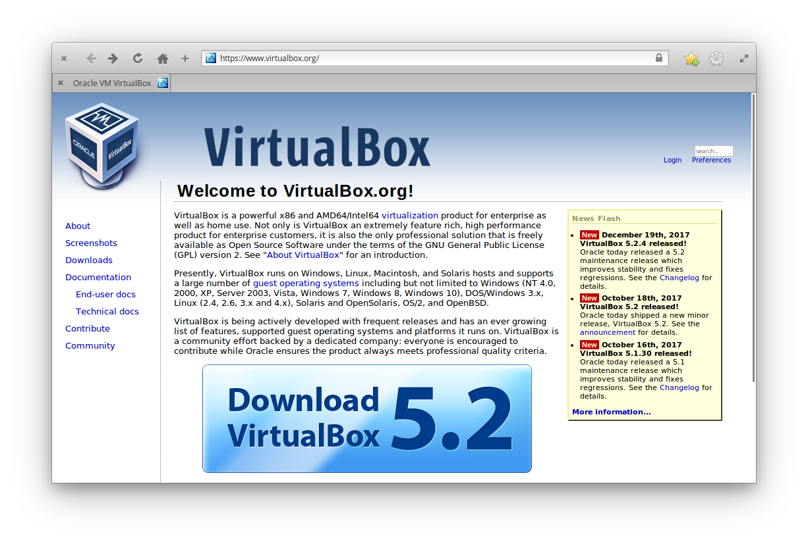
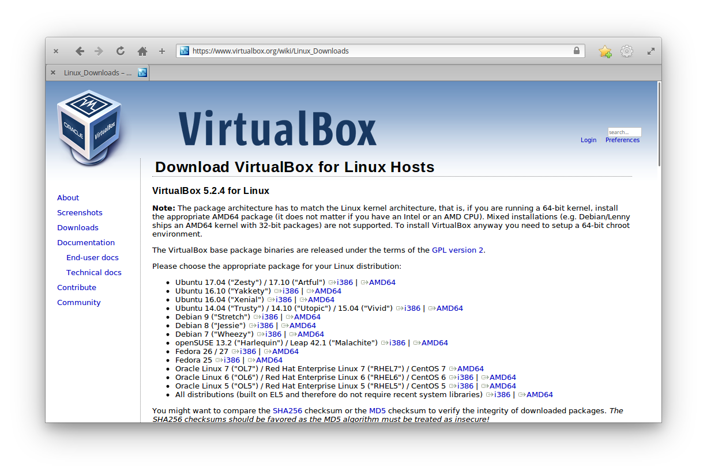
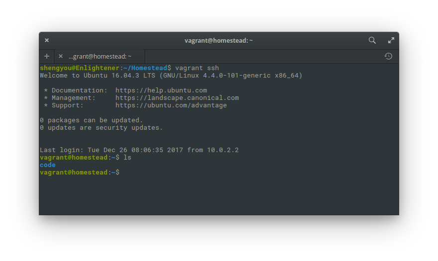

# 第 15 天：以 Vagrant 建置 PHP/Laravel 開發環境

雖然使用 Linux 當工作機可以直接用 apt 套件管理工具在本機端就做出一個跟上線機器相同的環境，不過也不是沒有缺點或風險的。首先您得熟悉套件管理工具及套件名稱，知道如何建置一台上線機器的所有安裝和設定細節；再來，若您需要的開發環境很複雜、相依套件太多，那很有可能把開發環境弄得太亂 (髒)，或是有可能因為部份套件而把本機作業系統弄壞；又或者您需要根據不同的專案需求及情境，做出多種環境組合時，只靠單一台工作機很難模擬。尤其當需要安裝特定套件的不同版本時，光要讓不同版本同時存在又不互相影響就非常費勁。這時候，若能善用虛擬化技術，這樣的情境就相對好解決了。

虛擬化其實已經不是什麼新玩意兒。或許您已經聽過 VirtualBox 這種工具多年，基本概念就是把整個作業系統的硬碟壓成一個檔案，讓它可以在主機 (Host) 上還原運行，甚至若因檔案損毀、或是需要複製多份，都可以透過虛擬化技術來達成。由於虛擬化技術具高度模擬、快速還原/複製的特性，因此近幾年被應用在建置開發環境上。透過如 VirtualBox 這種技術，就可以讓懂建置環境的開發者製作出如母碟的版本，讓其他開發者只需要把母碟複製一份運作起來，就可以在很短的時間內，完成建置開發環境的複雜工作。甚至，現在更出現了如 Vagrant 這種工具，讓操作 VirutalBox 的繁複手續可以用指令來自動化，大大加速了需手動操作的流程。

在 Laravel 的生態圈裡，作者群就發起了 Homestead 這個專案。也就是說**由最了解如何建置 Laravel 開發環境的這些開發者，整合了 VirtualBox、Vagrant 等時下技術，將開發 Laravel 所需要的環境做成了虛擬機。**而我們這些 PHP/Laravel 的開發者只需要照著 Homestead 的下載/安裝/設定步驟，就可以拿到一個官方認證的開發環境，非常方便！而這個虛擬機已經包括開發 Laravel 時所需要的所有元件，包括：

* PHP 5.6~7.2 所有版本 + Composer
* Nginx
* MySQL、MariaDB、Sqlite3、PostgreSQL
* Node.js (包括 Yarn、Bower、Grunt、Gulp)
* Redis、Memcached
* Beanstalkd

在這篇介紹文裡，就讓筆者為您介紹如何使用官方的 Homestead 工具，建置一個由 VirtualBox、Vagrant 所組合出來的 PHP/Laravel 開發環境。

## 下載/安裝 VirtualBox

首先，我們要先到 VirtualBox 下載軟體。請先打開瀏覽器，連至 https://www.virtualbox.org/ 看到下載 (Download Virtual Box) 的大按鈕就點下去。



然後選擇 Linux 發行版 (distributions)。


由於 elementary OS 是基於 Ubuntu 16.04 ("Xenial")，所以選擇對應的 64 位元版本，下載 `.deb` 檔案。



接著就使用 `apt` 套件管理來安裝 VirtualBox，先用 `Meta`+`T` 開啟終端機，將工作目錄切換到下載區後安裝：

```bash
$ sudo apt install ./virtualbox-5.2_5.2.4-119785~Ubuntu~xenial_amd64.deb
```


完成後，可以在應用程式列表內看到 VirtualBox 的圖示。


若點擊圖示後可以看到主畫面的話，VirtualBox 就算安裝完成了。


## 下載/安裝 Vagrant

接著，我們要把 Vagrant 安裝起來。打開瀏覽器，連至 https://www.vagrantup.com/ 點選頁面上的下載 (Download) 連結。


到下載頁後，選擇 Debian 64 位元的版本下載 `.deb` 檔案。


接著就使用 `apt` 套件管理來安裝 Vagrant，在啟終端機裡輸入以下指令：

```bash
$ sudo apt install ./vagrant_2.0.1_x86_64.deb
```


安裝完成後，重開終端機視窗，然後測試以下指令：

```bash
$ vagrant --version
```


假如可以看到類似「Vagrant 2.0.1」的字樣的話，就表示安裝成功了。

## 下載/初始化 Homestead

有了 VirtualBox 及 Vagrant 後，接下來就準備把 Homestead 下載/初始化起來。這部份的動作只需要在第一次使用 Homestead 時做，以後除非是重新安裝或是要更新版本，否則不用再做。

### 下載 Vagrant Box

首先，我們要透過 vagrant 的指令，把 Laravel 官方做好的 Homestead 虛擬機下載下來，請開啟終端機輸入以下指令：

```bash
$ vagrant box add laravel/homestead
```


指令可能會尋問您對應的 provider 為何，請選擇 `virtualbox` 後開始下載。由於 Homestead 虛擬機檔案大小高達近 2GB，下載會視網路速度花一點時間，請耐心等待。完成後，可以用指令確認下載完成：

```bash
$ vagrant box list
```


應該會如圖出現 `laravel/homestead` 在 box 清單內。

### 複製 Homestead 設定工具

由於 Homestead 在設計時，把 Vagrant 的設定檔、工具指令等都以 git 儲存庫來做管理，所以在動作前本機端需要有 git 版本管理系統。若您的工作機上還沒有安裝完成，請參考 [第 12 天：git 版本管理系統](https://medium.com/@shengyou/2018ironman-eos-for-php-developer-day12-51b077fb49b9) 裡的介紹完成安裝/設定，在這篇介紹裡就不重覆說明了。

複製 Homestead 設定工具的方式，就是去 Laravel 官方的 Github 把儲存庫複製 (clone) 回來，根據官方的建議，會將 Homestead 放在家目錄底下：

```bash
$ cd ~
$ git clone https://github.com/laravel/homestead.git Homestead
```


Homestead 設定工具也是一直在進化，目前官方採用 `tag` 的方式管理/釋出版本。在撰文的當下穩定版為 7.0.1，所以透過 git 的 `checkout` 指令切到 7.0.1 版：

```bash
$ cd ~/Homestead
$ git checkout v7.0.1
```


### 初始化 Homestead

為了讓 Homestead 有最大的彈性，官方將所有 Homestead 可以調整的設定獨立成 `Homestead.yaml` 設定檔。而這個設定檔在第一次使用時，可以用剛剛複製回來的工具來產生，產生設定檔的 Script 指令已經包含在 Homestead 工具裡，只需要執行即可：

```bash
$ cd ~/Homestead
$ bash init.sh
```


完成後，在 `~/Homestead` 底下應該會有一個新的 `Homestead.yaml` 檔案產生出來。

## 設定 Homestead

截至目前為止，大部份的基礎工作都已經做完了。而在使用 Homestead 前，唯一需要做的就是設定 `~/Homestead/Homstead.yaml` 這個檔案。請用您習慣的文字編輯器編輯這個檔案：

1. `ip`：可以設定虛擬機拿到的 IP 位址，預設是 `192.168.10.10`，若沒有特別需求不用更改。

2. `memory`、`cpus`：可以設定虛擬機佔用的資源，預設是 1 CPU、2GB 的記憶體，若沒有特別需求不用更改。

3. `provider`：使用的虛擬技術，預設是 `virtualbox`，在這篇示範裡也是使用 VirtualBox 做示範。

4. `authorize`、`keys`：設定登入虛擬機時使用的 SSH 金鑰，預設會使用自己家目錄底下的金鑰。若自己的家目錄底下沒有 key 的話，可以用 `$ ssh-keygen -t rsa -b 4096 -C "{您的 Email}"` 指令產生。

5. `folders`：設定掛載的虛擬目錄，預設是將家目錄底下的 `code` 資料夾掛載到虛擬機 `vagrant` 帳號家目錄底下的 `code` 資料夾。由於我們全新安裝還沒有這個資料夾，請執行 `mkdir ~/code` 指令建立。

註：由於 yaml 檔案是一個非常注重對齊的格式，在編輯的過程中，請小心不要多打或少打空白，以免造成格式出錯，連帶影響 Homestead 的啟動程序。

## 啟動 Homestead

接下來就可以正式啟動 Homestead 這台虛擬機了！在這邊提醒一下讀者，在使用 Vagrant 時的一個反射動作，就是所有指令要在 `Vagrantfile` 所在的資料夾底下執行：

```bash
$ cd ~/Homestead
$ vagrant up
```


## 建立/運行 Laravel 專案

最後，我們就要把 Laravel 專案建立起來並在 Homestead 裡運行。

### 登入 Homestead

由於使用 Homestead 就是把開發環境和工具都獨立封裝在虛擬機裡，也就是說本機端並沒有 PHP、Composer 等指令可以使用，所以請先使用指令登入虛擬機：

```bash
$ vagrant ssh
```



登入後應該會發現工作目錄是在 `/home/vagrant` 底下，而共享資料夾 `code` 已經掛載在家目錄底下了。

### 建立 Laravel 專案

由於 `code` 資料夾是本地端工作機和虛擬機之間連結的共享資料夾，所以我們要在 `code` 資料夾裡建立 Laravel 專案，這樣檔案才會一併同步到本地端工作機。

```bash
$ cd code
$ composer create-project laravel/laravel --prefer-dist
```


完成後應該就會有一個名為 `laravel` 的專案資料夾在 `code` 資料夾內。


### 設定虛擬站台

接著，我們要把新建的專案設定成一個 Nginx 的虛擬站台，這部份要修改 `Homestead.yaml` 裡的設定：

```yaml
sites:
    - map: homestead.local
      to: /home/vagrant/code/laravel/public
```


在設定檔裡有一段 `sites` 的設定，這段設定可以將特定網址 `map` 到虛擬機裡的專案根目錄 (以 Laravel 專案來說，請將根目錄設定在 `public`)，而 Homestead 內建產生 Nginx 虛擬站台的指令樣板，可以幫忙產生對應的設定檔。

註：請注意路徑裡的大小寫

### 設定 hosts

在上一步裡，您會看到我們站台的網址是 `homestead.local`，但這個網址只是拿來開發時使用，實際上並不存在。所以我們必需在本機上設定 DNS 對應，讓瀏覽器輸入這個網址時，會被導向到虛擬機。換句話說，我們必需強制讓 `homestead.local` 會被導向虛擬機的 IP 位置，也就是 `192.168.10.10`。

所以請用 root 權限編輯 `/etc/hosts` 這個檔案，並在裡面新增一行：

```
192.168.10.10  homestead.local
```


完成後存檔離開。

### 重新 provision 機器

由於我們更動了 `Homestead.yaml` 這個檔案，所以要更新一次機器上的設定。好在 Homestead 已經把所有的動作寫成指令檔，我們只需要透過 Vagrant 來重新 provision 機器即可。請在 `~/Homestead` 底下執行指令：

```bash
$ vagrant reload --provision
```


您會看到 vagrant 會跑一系列的動作，其中就包括重新建立所有 Nginx 的站台設定檔。完成後，就可以打開瀏覽器，輸入網址：`http://homestead.local` 就可以看到 Laravel 的預設啟動畫面。


以上就是使用 Homestead 建立 PHP/Laravel 開發環境的流程。由於流程牽涉到軟體安裝、終端機指令、Homestead 設定檔及建立專案等動作，初接觸的新手可能會覺得步驟稍嫌複雜，但其實您已經跳過建置環境最複雜的步驟，而且只要做過一次後，後續常用的指令就只剩以下幾個：

1. 啟動 Homestead：`$ vagrant up`
2. 進入 Homestead：`$ vagrant ssh`
3. 暫停 Homestead：`$ vagrant suspend`
4. 將 Homestead 關機：`$ vagrant halt`

## 參考資料

* [VirtualBox 官網](https://www.virtualbox.org/)
* [Vagrant 官網](https://www.vagrantup.com/)
* [Homestead 安裝指南](https://laravel.com/docs/5.5/homestead)
