# 第 16 天：以 Docker 建置 PHP/Laravel 開發環境

在上一篇的介紹裡，筆者提到了使用虛擬機建置開發環境的好處，包括獨立的運作/測試空間、完整模擬真實主機環境、易於複製/還原…等。不過，這些好處雖然明顯且具體，但也不是完全沒有缺點的。比方說虛擬機因為要完整模擬一台主機，所以整個映像檔往往很大，以 Homestead 來說就吃掉 2GB 的硬碟空間；也因為是完整的一台主機，所以吃電量也近乎兩倍；同理，虛擬機也是非常吃運算效能的。換言之，使用虛擬機基本上是個非常吃硬體規格的一個選擇。由於是當您需要開啟多台虛擬機時，其所需付的代價可見一般。

您一定會好奇，難道沒有折衷的方案嗎？在近幾年虛擬技術的發展下，最近出現了個新的選項叫 Docker。有別於 VirtualBox 將一整台電腦從作業系統 + 應用程式一起壓成虛擬機的作法，Docker 則是在各作業系統上先做出一個共通的平台，而因開發而需要安裝的其他軟體，再依需求一個一個以容器 (Container) 的方式運作在這個平台上。由於不需要每次都先建立一個作業系統的底層，所以其所消耗的硬碟空間、運算資源及效能都會相較少一些。也因此 Docker 成為近幾年，尤其是在測試環境上非常熱門的一種選項。

在這篇介紹裡，筆者將會示範如何運用 Docker 這項技術來建置 PHP/Laravel 的開發環境，在過程中會用到目前在 Laravel 國外社群裡比較受歡迎的 Laradock 這個打包版。您可以把 Laradock 想像成是 Homestead 去掉作業系統層後的版本，未來要開發 PHP/Laravel 時，只要把 Laradock 運行起來即可。

## 安裝 Docker

在使用 Laradock 之前，得先在 elementary OS 上把 Docker 環境安裝起來。Docker 可以在各個不同作業系統平台上運作，不過安裝方式略有不同，詳細的安裝方式可以參考官網文件。在這邊示範的版本是 Docker EE for Ubuntu Xenial 16.04 (LTS) x86_64 的版本。

您當然可以照著官方文件一行一行的貼指令去執行，不過筆者的這個系列偏好是*愈無腦愈好*。而官方有提供一個自動安裝指令可以讓我們下載後直接執行安裝，只需要兩行指令：

```bash
$ curl -fsSL get.docker.com -o get-docker.sh
$ sh get-docker.sh
```

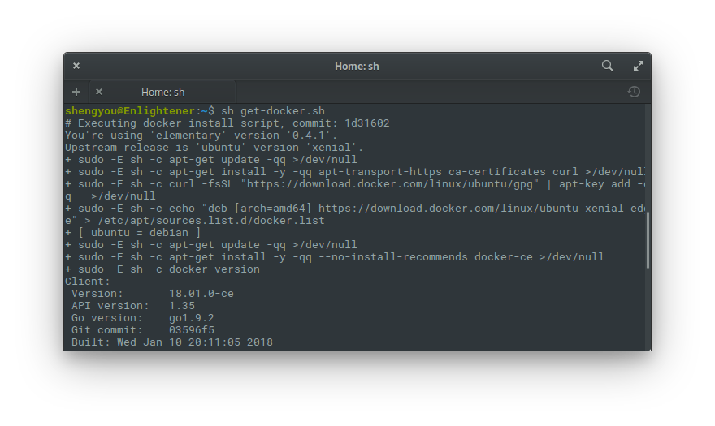

執行後這個 Script 就會自動判斷我們所需使用的版本並下載安裝，安裝完成後可以用指令確認自己安裝成功及安裝的版本：

```bash
$ docker -v
```

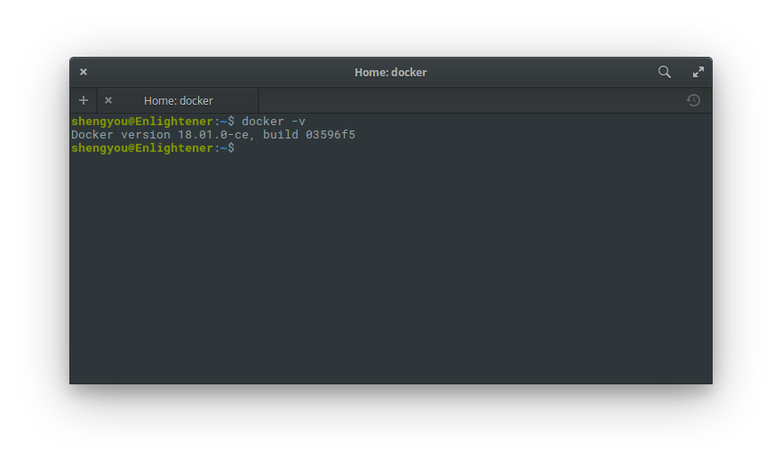

*註：安裝完成後就可以將 `get-docker.sh` 檔案刪除*

另外，由於 Laradock 會用到 `docker-compose` 這個指令，因此我們需要用 `apt` 將這個指令安裝起來：

```bash
$ sudo apt install docker-compose
```

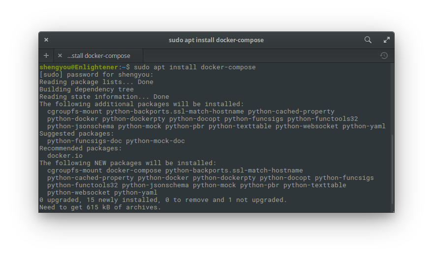

若您之後使用 docker 指令時不想要一直打 `sudo` 的話，可以依照官方的建議將自己的帳號加到 `docker` 這個群組：

```bash
$ sudo usermod -aG docker shengyou
```

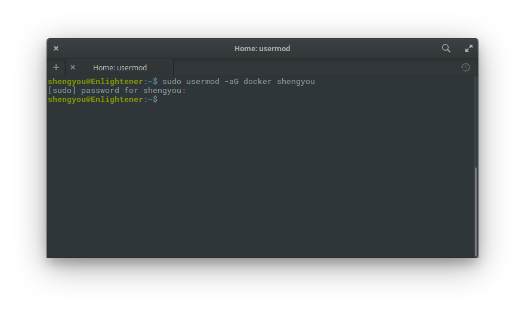

不過要提醒您的是，由於我們目前是在自己的本機端建置開發環境，所以這樣設定比較沒有安裝性風險。但若是在正式機上建置 Docker 的話，則建議您閱讀一下[官方文件](https://docs.docker.com/engine/security/security/#docker-daemon-attack-surface)，了解這樣設定可能帶來的風險。

*註：以上步驟全部安裝完成後建議重新開機*

## 安裝/啟動 Laradock

Laradock 是一個用 Docker 建造的 PHP 開發環境，一開始作者僅是為了 Laravel 而打包的，不過隨著更多使用需求及開放社群貢獻者的加入，現在已經可以支援眾多 PHP 開發情境，包括 Symfony、CodeIgniter、WordPress、Drupal…等。當然，您可以拿 Laradock 做各種 PHP 專案開發，在這篇介紹裡會先以 Laravel 專案為示範。

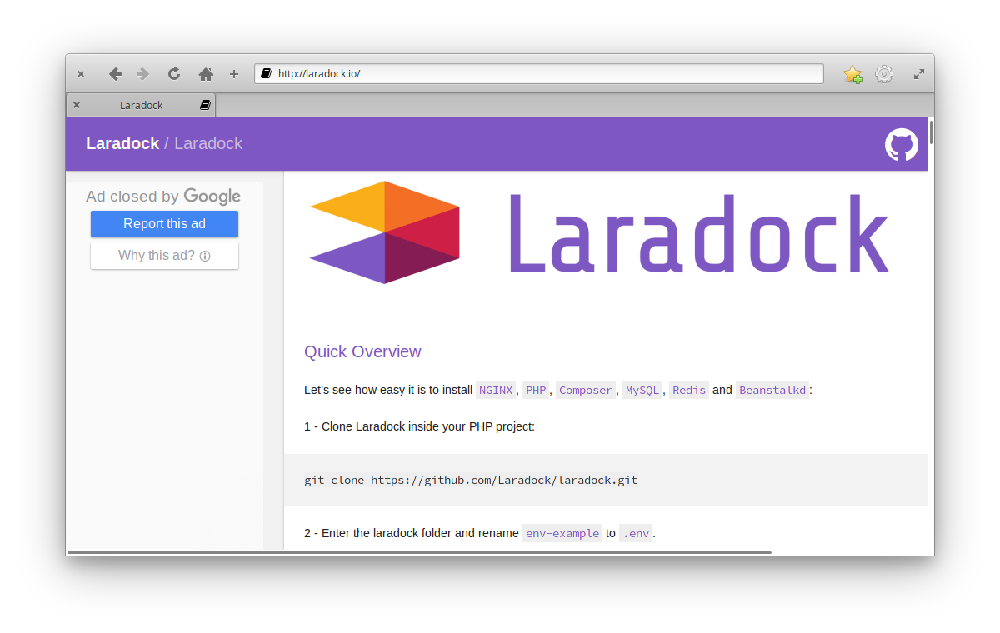

Laradock 可以有兩種使用方式：一種是一個 Laravel 專案就啟動一個 Laradock，這種方式的好處是每一個專案環境都是乾淨獨立的，但缺點就是消耗硬碟空間；另外一種方式就是所有專案共用一個 Laradock，優缺點剛好相反。假如您跟筆者一樣都是以開發 Laravel 專案為主，專案版本也都是 5.3 以上的話，共用一個 Laradock 應該會相形簡單些，而在這篇介紹裡也以這種方式為例。

### 取得 Laradock 專案

第一步要先取得 Laradock 專案，筆者依照 Homestead 的慣例，也把 Laradock 專案放在家目錄裡，指令如下：

```bash
$ cd ~/
$ git clone https://github.com/laradock/laradock.git Laradock
```

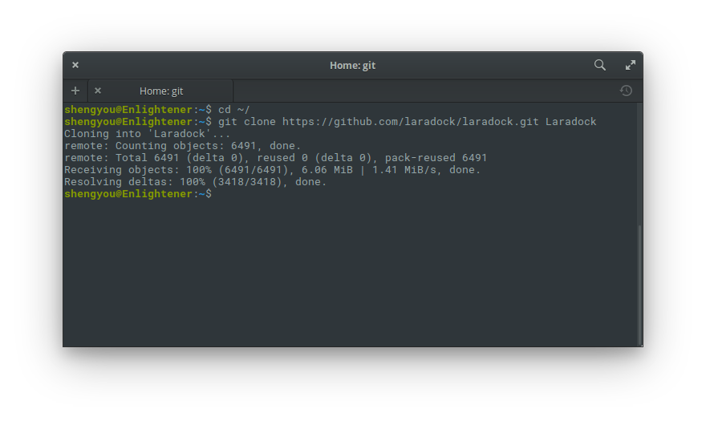

### 設定 Laradock

Laradock 提到環境設定檔供我們依需求客製化調整，請將先設定檔從範例樣板複製出來：

```bash
$ cp env-example .env
```

### 啟動 Laradock

接著就可以將 Laradock 提供的容器啟起來，以我們運行一個最基本的 Laravel 專案來說，只需要 `nginx` 及 `mysql` 即可：

```bash
docker-compose up -d nginx mysql
```

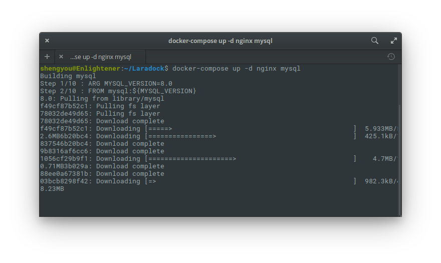

*註：其實除了 `nginx`、`mysql` 這兩個容器會被建立外，也會同時啟動 `php-fpm` 及 `workspace` 這兩個容器。另外，第一次下載/安裝/啟動容器會花費一些時間，可以先放著讓它跑一陣子。*

## 建立/運行 Laravel 專案

最後，我們就要把 Laravel 專案建立起來並在 Laradock 裡運行。

### 設定 Laradock

由於我們可能會同時開發多個 Laravel 專案，所以我會建議在自己的家目錄底下開個專門放專案的目錄 (比方說 `/home/shengyou/Projects`)，然後在這個專案目錄底下建立 Laravel 專案。建立好的同時，我們也要先把專案目錄設定給 Laradock，讓它知道我們的專案都放在家目錄底下的 Projects 資料夾。

打開 `~/Laradock/.env` 檔案，設定 `APPLICATION` 參數內為 `~/Projects`，存檔後離開。

```
APPLICATION=~/Projects/
```

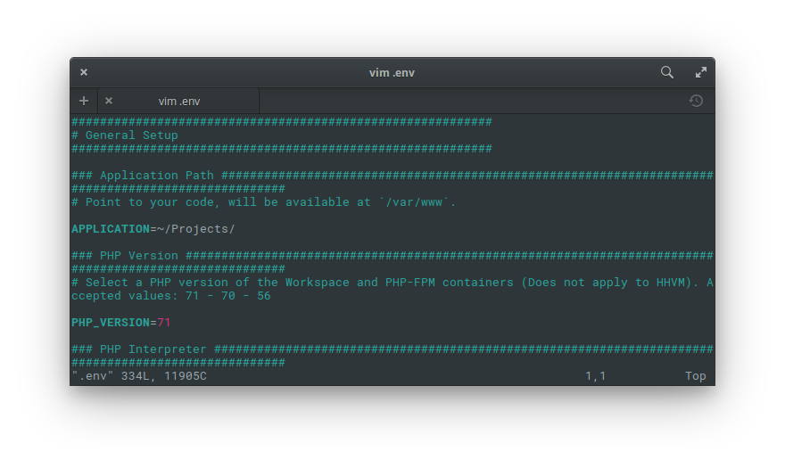

### 進入 `workspace` 容器

使用 Docker 這種虛擬化技術就是希望能把開發環境和工具都封裝在容器裡，也就是說本機端並沒有 PHP、Composer 等指令可以使用。而 Laradock 在啟動時，有幫我們準備一個名為 `workspace` 的容器，只要進到這個容器裡面，就可以有 `composer`、`artisan` 這些指令可以使用。所以請先使用以下指令進入容器內：

```bash
$ docker-compose exec workspace bash
```

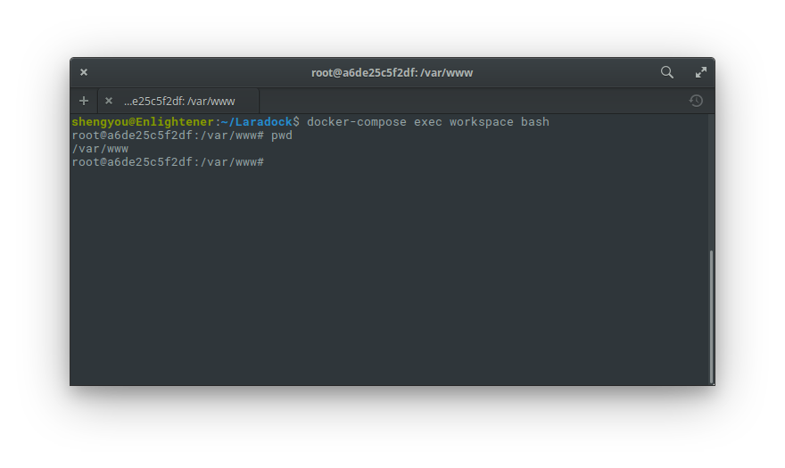

登入後應該會發現工作目錄是在 `/var/www` 底下，而裡面的內容就是我們本機 `~/Projects` 的內容。

### 建立 Laravel 專案

由於 `/var/www` 資料夾是本機和容器之間連結的資料夾，所以我們要在 `/var/www` 資料夾裡建立 Laravel 專案，這樣檔案才會一併同步到本地端工作機。

```bash
$ composer create-project laravel/laravel --prefer-dist
```

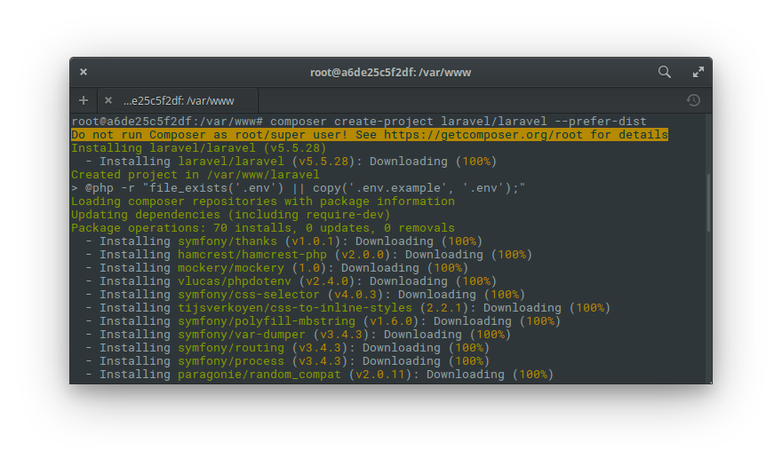

### 建立站台

接著，我們要把新建的專案設定成一個 Nginx 的虛擬站台。Laradock 已經提供數種 Nginx 的站台樣板，只要用 Laravel 的樣板複製一份即可：

```bash
$ cd ~/Laradock/nginx/sites
$ cp laravel.conf.example laravel.test.conf
```

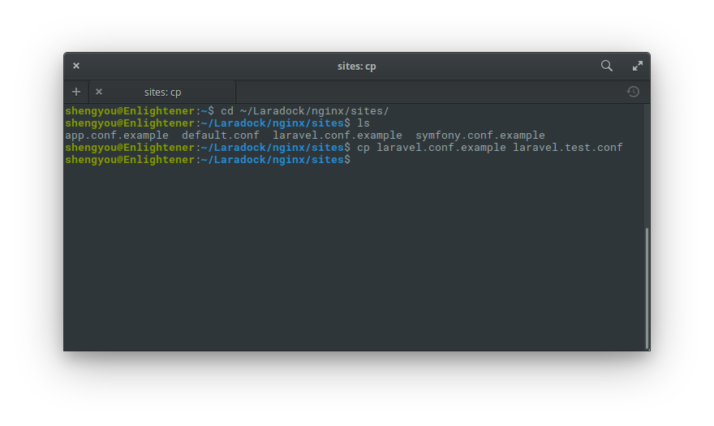

請將設定檔裡裡的 `server_name` 及 `root` 依照自己的環境做設定。`server_name` 設定的是站台的網址，在範例裡我們用 Laradock 預設的 `laravel.test`；`root` 則是設定專案的 Document Root，我們也延用 Laradock 預設的 `/var/www/laravel/public`。

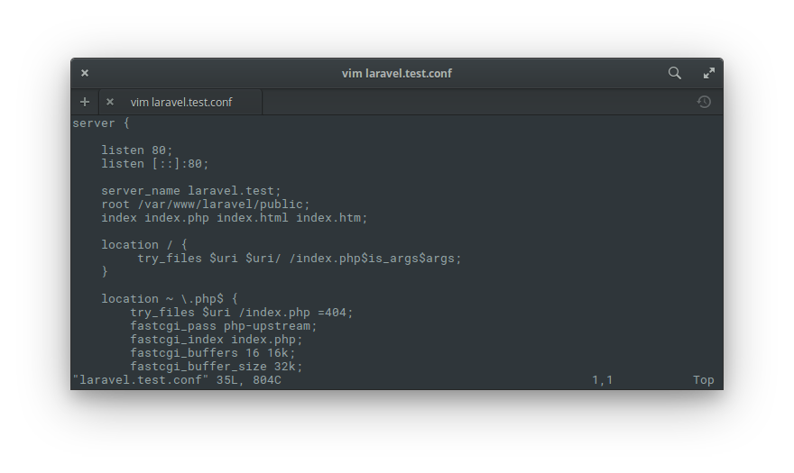

### 設定 hosts

在上一步裡，您會看到我們站台的網址是 `laravel.test`，但這個網址只是拿來開發時使用，實際上並不存在。所以我們必需在本機上設定 DNS 對應，讓瀏覽器輸入這個網址時，會被導向到容器。換句話說，我們必需強制讓 `laravel.test` 會被導向本機容器，也就是 `127.0.0.1`。

所以請用 root 權限編輯 `/etc/hosts` 這個檔案，並在裡面新增一行：

```
127.0.0.1 laravel.test
```

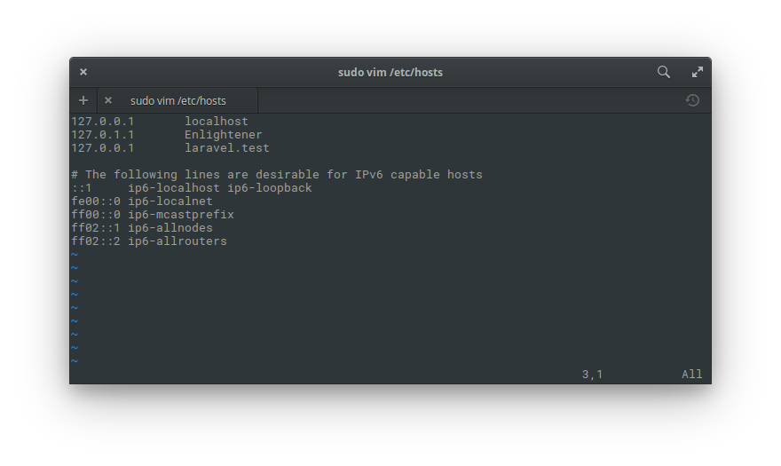

完成後存檔離開。接著把容器重啟：

```bash
$ docker-compose down
$ docker-compose run -d nginx mysql
```

完成後打開瀏覽器，輸入網址 `laravel.test` 應該就可以看到 Laravel 的專案啟動畫面如下：

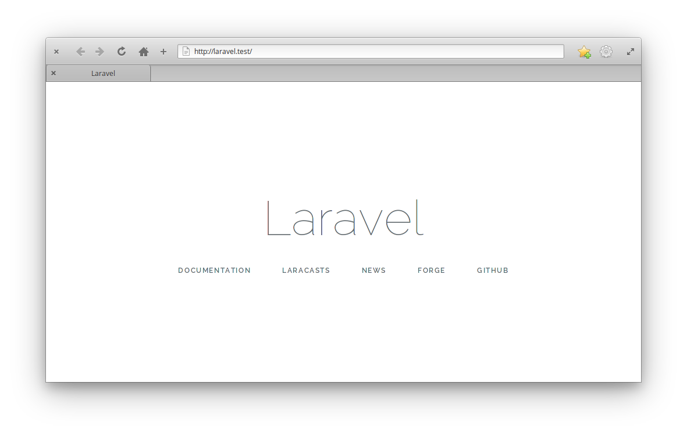

就這樣！一個用 Docker 建立 PHP/Laravel 開發環境就完成了！

### 關閉 Laradock

當完成開發工作後想關閉 Laradock 的話，可以使用以下指令將其關閉，等需要使用時再次開啟：

```bash
$ docker-composer down
```

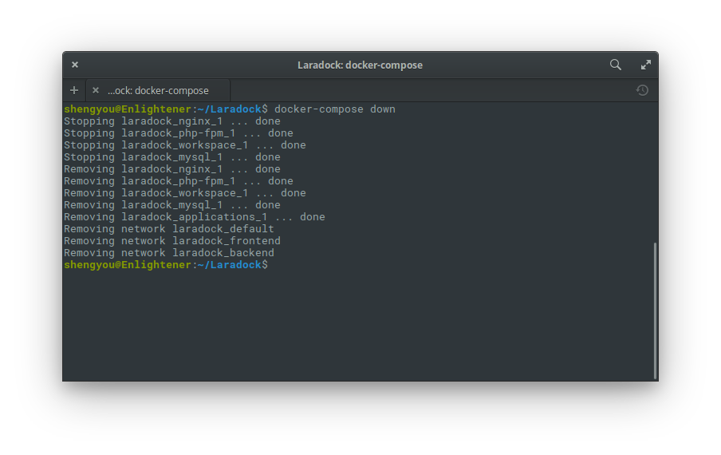

最後，Docker 安裝完後，會被設定成在開機時預設啟動。但因為我們只是拿來做開發機，並不需要一開機就啟動，所以可以透過 `systemctl` 將其設定為預設不啟動，等需要開發時再啟動即可：

```bash
$ sudo systemctl disable docker
```

在這一段系列裡，筆者示範了四種主流的 PHP/Laravel 環境建置方式，希望能帶給讀者一些啟發。而讀者也可以從前後這幾篇介紹裡，挑選最適合自己的方案來建置開發工作機。以這四種建置方式來說，您最偏好哪一種？為什麼呢？歡迎留言與我交流！

## 參考資料

* [Docker 官方 Linux 安裝文件](https://docs.docker.com/engine/installation/linux/docker-ce/ubuntu/#install-docker-ce)
* Docker 官方 Linux 自動安裝指令：[文件](https://docs.docker.com/engine/installation/linux/docker-ce/ubuntu/#install-using-the-convenience-script)、[原始碼](https://github.com/docker/docker-install)
* [Laradock 官網](http://laradock.io/)
* [Laradock 原始碼](https://github.com/laradock/laradock)
* [Laradock 教學文](https://medium.com/@madhusudhansubedi/it-is-easy-to-set-up-environment-for-laravel-using-laradock-69cdc4e64b08)
