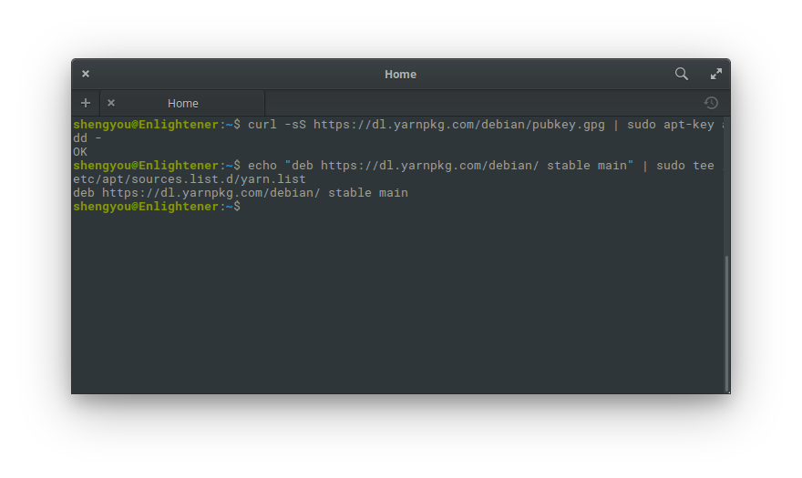

# 第 17 天：安裝 Node.js 及 NPM

相對於後端程式語言平分天下、各據山頭，前端程式語言則是風起雲湧的戰國時代。在這個年頭，相信大家都能體會到所謂前端正夯是個什麼樣的風景，即便不是全端工程師也多多少少會碰到一點 Javascript；身為 DevOps 工程師也得學會怎麼裝 Node.js。

而 Laravel 從 5.0 版開始，就將前端 asset pipeline 的功能直接整合 Node.js 生態圈，推出以 Gulp 為核心的 Elixir 套件，並在 Homestead 虛擬機裡就直接預裝好相關工具，大大降低前端開發的繁雜步驟及痛苦。隨著開發典範的轉移，Elixir 現也改以 Webpack 為核心更版成新的 Mix 套件。由此可見即便是以後端為主力的 Laravel 工程師，也應該要知道如何建置 Node.js 環境。

對比於 PHP (程式語言) 和 Composer (相依管理工具) 之間的關係，在 Javascript 的世界裡就是 Node.js 和 NPM。由於 Node.js 的生態圈現在非常的活躍且更迭迅速，NPM 這種套件相依管理工具就變得尤其重要。因此官方在釋出安裝檔時，已經綁定 Node.js 及 NPM，在安裝時會一併安裝。

Node.js 官方現在提供兩種版本：LTS 及 Current。LTS 即 Long term support ，意指是當前穩定且會長期維護的版本，在撰文的當下 Node.js 是 8.9.3 版而 NPM 是 5.5.1 版。若我們只是一般使用者，並非前端工程師或是有需要測試最新功能的話，建議使用這個版本；Current 則是指目前最新版，可以拿到最新的功能 (Feature)。在本篇介紹裡，會以示範安裝 LTS 版本為主。另外，雖然官方也有直接釋出 binary 版本可供下載，但為了日後更新方便，安裝方式也會採用以 `apt` 套件管理工具來做安裝。

## 安裝 Node.js 及 NPM

首先，請先打開瀏覽器，連至 Node.js 官網：https://nodejs.org/ 然後「不要」點畫面正中央的下載 (Download)，而是點導覽列上的下載。


進到下載頁面後，也不是選中間最明顯的下載區，而是把頁面往下捲，選擇其他平台 (Additional Platforms) 選項裡的從套件管理工具安裝 (Installing Node.js via package manager) 連結。


接著，再點選各 Linux 發行版裡的「Debian and Ubuntu based Linux distributions」後，取得安裝指令。


然後使用快速鍵 `Meta`+`T` 開啟終端機，依照官網提供的指令逐一輸入：

```bash
$ curl -sL https://deb.nodesource.com/setup_8.x | sudo -E bash -
```


*註：這段指令會檢查您的 Linux 版本並會將 ppa 來源加入到您的 apt 內，請確定看到程式有成功辨識出 elementary OS、新增 key 並跑完 update，才算完成。*

```bash
$ sudo apt-get install nodejs
```


安裝完成後，可以用指令來確認一下安裝的版本。首先檢查 Node.js 的版本：

```bash
$ node -v
```


再檢查 NPM 的版本：

```bash
$ npm -v
```


基本上以上的步驟已經安裝好 Node.js 及 NPM，不過因為 NPM 有時候會需要在本機端編譯一些套件，所以會建議把編譯套件 (`build-essential`) 也裝起來。

```bash
$ sudo apt install build-essential
```

若您之前已經裝過的話，會出現類似下圖這種回應：


## 安裝 Yarn

早先在 NPM 大改版之前，效能和下載速度一直是被大家詬病的問題。當時由 Facebook 釋出的 Yarn 套件管理工具，主打效能優、多線下載、自動快取及產生 lock 檔，搶走了不少 NPM 的使用者。即便到了今日，雖然 NPM 的效能有不少改善，許多開發者還是習慣使用 Yarn 來做套件管理。因此，在這邊也示範一下如何安裝 Yarn。

請打開瀏覽器，連至 Yarn 官網：https://yarnpkg.com/ 點選安裝 (Install)。


依照 Linux 安裝指引，先加入 Yarn 官方 key 及 ppa 來源：

```bash
$ curl -sS https://dl.yarnpkg.com/debian/pubkey.gpg | sudo apt-key add -
$ echo "deb https://dl.yarnpkg.com/debian/ stable main" | sudo tee /etc/apt/sources.list.d/yarn.list
```



然後就可以直接用 `apt` 裝 `yarn` 這個套件了：

```bash
$ sudo apt update
$ sudo apt install yarn
```


安裝完後一樣用指令確認一下版本：

```bash
$ yarn -v
```


## 安裝 Global 套件

Javascript 因為有 V8 引擎的加持，儼然成為前/後端通吃的語言。也因此，許多 Javascript 開發者就拿來做出許多工具，甚至可以取代一些系統管理的指令，這種散佈應用程式的方式就是 NPM 的 Global 套件。既然都帶著讀者安裝了 Node.js 及套件管理工具，在這邊就順道示範一下怎麼安裝 Global 套件。筆者要示範安裝的 Global 套件就是號稱可以取代 `htop` 指令的 `vtop`。

請直接使用以下指令安裝 (視自己偏好的套件管理工具)：

```bash
# 使用 NPM
$ sudo npm install -g vtop

# 使用 Yarn
$ sudo yarn global add vtop
```


`vtop` 是一套指令模式的系統狀態監控工具，除了有各項數值外，主打的就是「畫面漂亮」，完全符合本系列介紹文的風格！到底有多美形的，請執行以下指令：

```bash
$ vtop
```


TA-DA！畫面有沒有很漂亮+動感呢！希望這篇介紹文能夠讓您在工作機上建置起 Node.js 及套件管理工具，並學會如何安裝 Global 套件。您有什麼推薦的 Node.js 套件嗎？歡迎留言與我交流！

## 參考資料

* [Node.js 官網](https://nodejs.org/)
* [Yarn 官網](https://yarnpkg.com/)
* [vtop 介紹文](https://parall.ax/blog/view/3071/introducing-vtop-a-terminal-activity-monitor-in-node-js)

