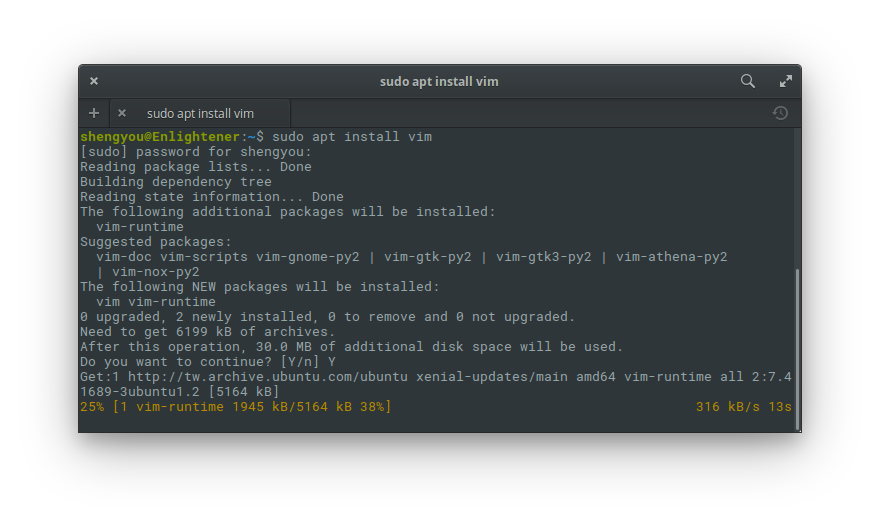
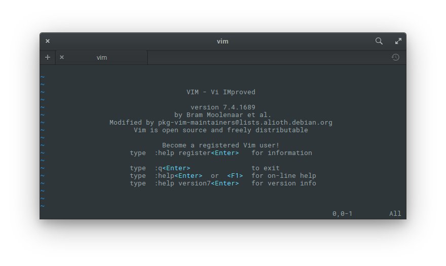
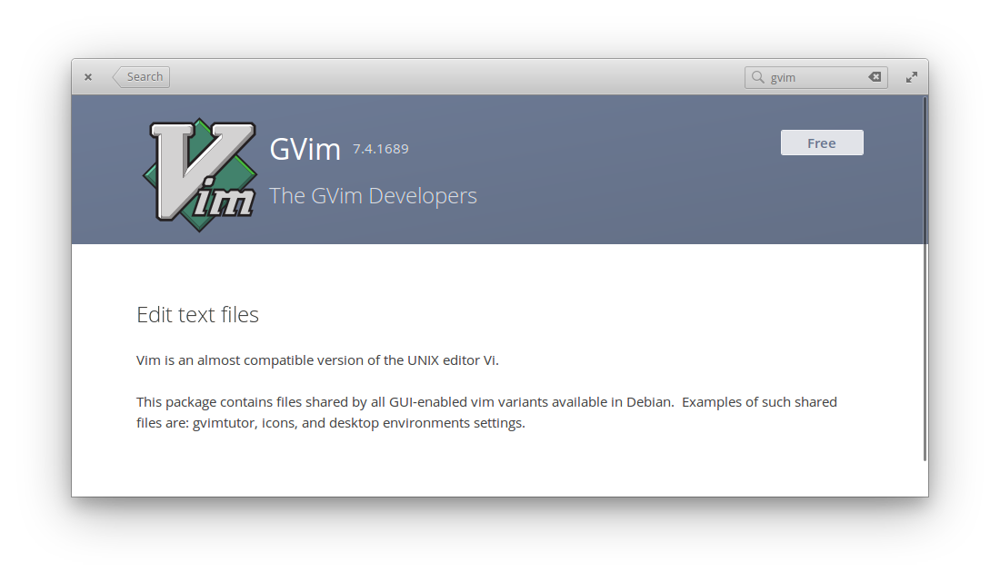
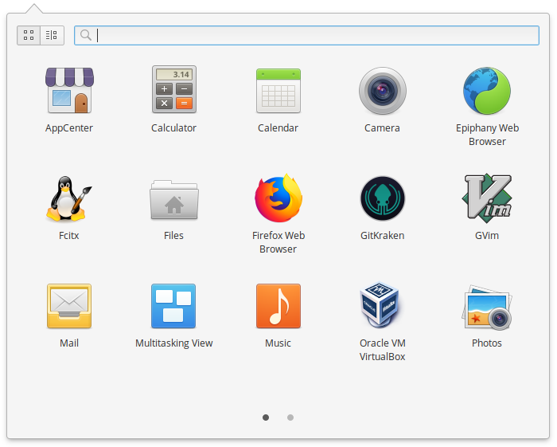
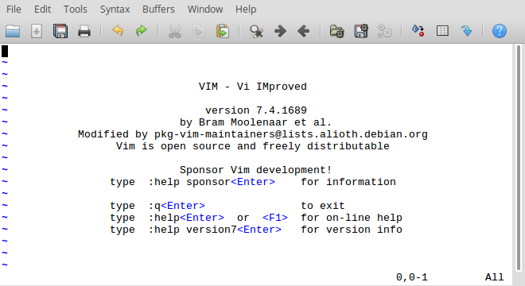
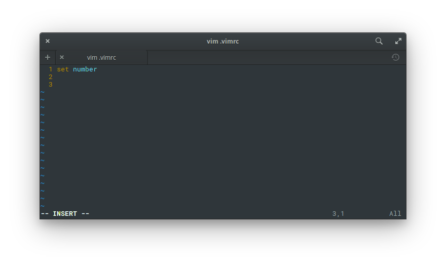
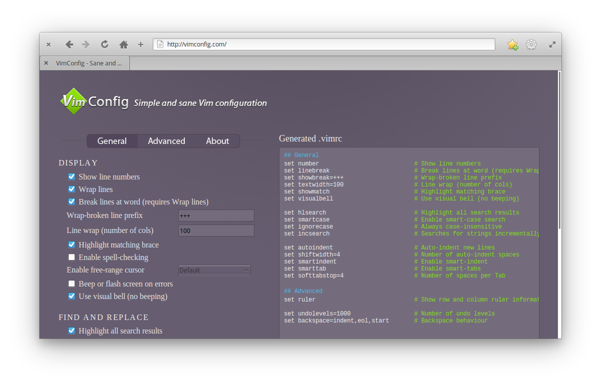
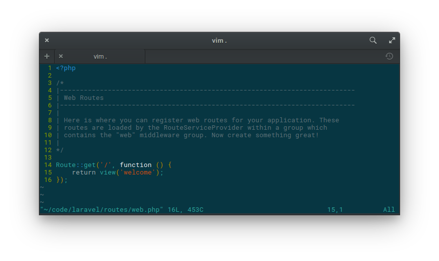
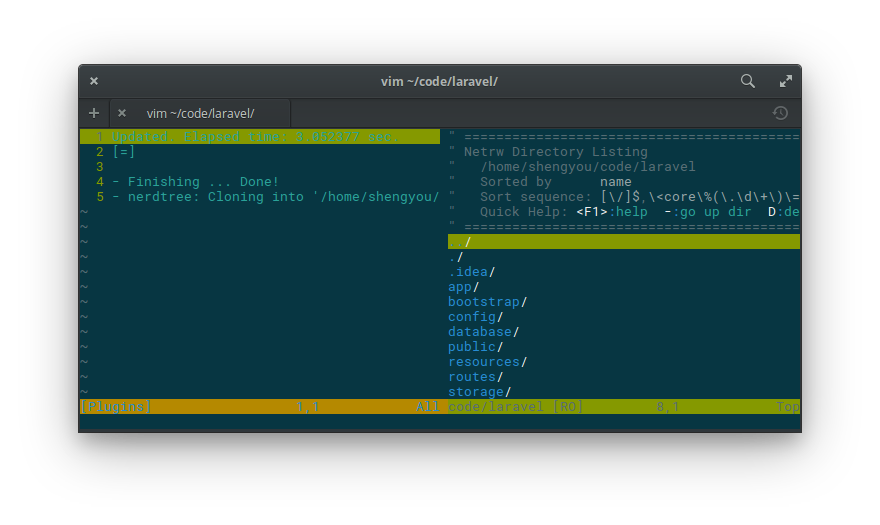

# 第 18 天：安裝/設定 Vim 編輯器

在介紹完一系列的環境建置方案後，接下來想要為各位讀者介紹如何在 elementary OS 上安裝 PHP/Laravel 的程式碼編輯工具。對開發者來說，每天用以維生的工具就是編輯器了。而因為每個人習慣的吃飯傢伙不同，所以編輯器市場也是群雄割據、各擁一方。在接下來的這個系列裡，就讓筆者從 Vim 這個老牌 (派？) 編輯器開始介紹起吧！

由於很多網路主機並不會安裝圖形操作介面，因此 Vim 這種可以直接在指令列裡運行的編輯器，就成了主機上首選的編輯工具。不過，Vim 具有「模式」的操作設計、加上可以高度客製化的特性、滿天飛的套件選擇，調校得宜的話則功能直逼 IDE；但步驟的繁複程度卻往往讓人不得其門而入。

因此，筆者在這邊希望能簡單地從安裝、設定、外掛套件三部份，為各位讀者做個簡單的 Vim 入門指引，試圖降低 Vim 的啟動門檻。至於 Vim 的基本操作、實務秘訣就整理在文章末的參考資料供讀者自行深入挖堀了。

## 安裝 Vim 指令列

安裝 Vim 的方式非常簡單，直接用 `apt` 套件管理工具就可以了，請用快速鍵 `Meta`+`T` 開啟終端機視窗，輸入以下指令：

```bash
$ sudo apt install vim
```



而因為 Vim 原生就是一個指令列工具，所以就直接在終端機裡使用。可以在自己的家目錄底下測試一下安裝是否正確？

```bash
$ cd ~
$ vim
```



應該可以看到如上的畫面，若已成功安裝後，輸入 `:q!` 離開。

目前 elementary OS 套件庫上的是 Vim 7.4 的版本。不過其實 Vim 8 已經問市了，假如您想要安裝最新版的話，可以新增以下 ppa 來源安裝：

```bash
$ sudo add-apt-repository ppa:jonathonf/vim
$ sudo apt update
$ sudo apt install vim
```

## 安裝 gVim 圖形介面

許多人對於 Vim 是指令列工具，必須在終端機裡操作感到不適應，或是希望 Vim 可以有更多視窗分頁、剪貼簿及滑鼠操作方面的整合。假如有這樣的需求，那就可以考慮裝 gVim 這個版本。gVim 是 Vim 的圖型介面版，除了有獨立的應用程式視窗外，也跟桌面系統的圖形操作有更好的喬接。

既然是圖形介面版，推薦的安裝方式也採用圖形介面的流程。請先到應用程式選單裡，開始應用程式商店 (AppCenter)，然後搜尋 `gVim` 這個關鍵字，出現的第一個選項就直接點選免費 (Free) 安裝。



安裝完成後，就可以在應用程式選單裡看到 gVim 的圖示。



啟動後的畫面就長得如下圖：



看起來有沒有很熟悉呢？其實就是把原本在終端機的畫面放到獨立的應用程式視窗，然後多了工具列、選單列…等，但基本操作還是要使用 Vim 指令的。

## 客製化設定

Vim 只有基本的文件編輯功能，您所看到其他高手的 Vim 之所以能如此花俏，全是靠大量的客製化設定所組合出來的。而 Vim 的設定檔預設就是去讀取使用者家目錄底下的 `.vimrc` 檔 (有些 gVim 版本會讀 `.gvimrc`)，裡面可以根據操作需求客製化 Vim 的顯示及行為。

比方說，假如進入 Vim 後，希望預設會在左邊顯示文件行號，則就可以這樣設定：

```
set number
```



透過這種非常單純的設定檔，就可以將 Vim 調校的合您所意。也因此，您會看到 Github 上常常會有大神把自己的 `.vimrc` 公開出來讓眾人觀(ㄇㄛˊ)摩(ㄅㄞˋ)，比方說：[amix](https://github.com/amix/vimrc) 的或 [vgod](https://github.com/vgod/vimrc) 的。

雖然 Vim 可以高度客製化，不過相信會來讀這個系列的讀者一定是視覺系而非硬漢系。這麼苦的差事實在不太適合我們，所以可以考慮用一下 [VimConf](http://vimconfig.com/) 這個工具，至少用勾選的方式幫忙產生設定檔，總是比較輕鬆一點！



請到 VimConf 網站上，根據您的需求把選項勾一勾，勾完後把右邊產生出來的設定檔複製貼上到您的 `.vimrc` 後存檔重開 Vim (或是直接在 Vim 裡下指令：`:so %` 或 `:so ~/.vimrc`) 就搞定了！

## 安裝 Vim 套件

雖然 Vim 提供高度客製化的能力，但全部都自己客製也太苦了對吧？所以 Vim 有提供類似套件的機制，讓我們可以安裝別的 Vim 大神寫好的套件，就可以直接擁有跟大神一樣的 Vim 設定，多美好啊！在這邊筆者就以示範安裝 `jdkanani/vim-material-theme` 這個佈景主題做示範，讓讀者了解 Vim 套件的機制及安裝流程。

請先連至 [`jdkanani/vim-material-theme` 的 Github 儲存庫](https://github.com/jdkanani/vim-material-theme) 觀看一下手動安裝說明及樣式截圖。然後開啟終端機，在家目錄底下建立 `~/.vim/color` 資料夾，再將佈景主題檔下載下來：

```bash
$ cd ~
$ mkdir .vim
$ cd .vim
$ mkdir colors
$ cd colors
$ wget https://raw.githubusercontent.com/jdkanani/vim-material-theme/master/colors/material-theme.vim
```

安裝完成後，設定 `.vimrc` 檔：

```
syntax enable
set background=dark
colorscheme material-theme
```

設定完後再重開 Vim (或是直接在 Vim 裡下指令：`:so %` 或 `:so ~/.vimrc`)，應該就可以看到佈景主題變成下圖這種樣式：



## Vim 的套件管理

雖然安裝 Vim 套件並不會太複雜，但因為 Vim 有滿山滿谷的套件，套件間又有下載/安裝/更新/相依性的問題要處理。這時候就必需仰賴套件管理工具來協助我們管理這些 Vim 套件，而套件管理工具往往成為 Vim 使用者第一個要選邊站的抉擇。

在 Vim 的世界裡，套件管理有幾個常見的選項：[Pathogen](https://github.com/tpope/vim-pathogen)、[NeoBundle](https://github.com/Shougo/neobundle.vim) (現被 [Dein.vim](https://github.com/Shougo/dein.vim) 取代)、[Vundle](https://github.com/VundleVim/Vundle.vim) 及 [vim-plug](https://github.com/junegunn/vim-plug)。這些套件管理各有歷史、優/缺點及特性，也各有死忠支持者。以前筆者曾經使用過 Vundle，不過筆者最近在做了一些市調 ([1](https://www.reddit.com/r/vim/comments/4qo7ur/which_plugin_installer_or_vim_package_manager/)、[2](https://ssarcandy.tw/2016/08/17/vim-plugin-manager/)) 後發現，vim-plug 這個套件管理框架具備設定簡單、快速的同步下載功能、極少化的容量佔用及按需載入的特性，讓 Vim 啟動及運行效能更好，加上 [我 Seafood](https://github.com/storyn26383) 也推薦使用。因此，在這篇介紹裡就選用這個 vim-plug 套件管理工具來做示範。

首先，請先打開您的 `.vimrc` 然後依照官網的說明，將自動安裝設定放在最前面：

```bash
if empty(glob('~/.vim/autoload/plug.vim'))
  silent !curl -fLo ~/.vim/autoload/plug.vim --create-dirs
    \ https://raw.githubusercontent.com/junegunn/vim-plug/master/plug.vim
  autocmd VimEnter * PlugInstall --sync | source $MYVIMRC
endif
```

再來，我們要把所有要安裝的 Vim 套件名稱全部寫在 `plug#begin()` 和 `plug#end()` 之間，而在寫套件名稱時，還可以設定按需載入的時間點。在這邊就示範安裝 NERDTree 這個套件：

```
call plug#begin('~/.vim/plugged')
" 把要安裝的套件寫在這裡
Plug 'scrooloose/nerdtree', { 'on':  'NERDTreeToggle' }
call plug#end()
```

完成後就把 `.vimrc` 存檔，然後重開 Vim (或是直接在 Vim 裡下指令：`:so %` 或 `:so ~/.vimrc`) 後就會看到如下圖的安裝動畫，所有的套件就安裝回來可以使用了。



## 給 PHP/Laravel 開發者的推薦套件

因為 Vim 沒掛套件的話實在沒什麼功能，所以整個社群都很認真的在幫它寫套件，所有的使用者也很認真的在掛套件。一般平均來說，掛到 20 個套件也是很正常的事。這時候你會發現難不是難在掛套件，而是套件太多不知道該掛哪些套件？在這邊特別把幾個跟開發 PHP/Laravel 有關的套件列出來給大家參考：

1. [scrooloose/nerdtree](https://github.com/scrooloose/nerdtree) - 讓 Vim 有 Tree 型式的檔案面板

2. [editorconfig/editorconfig-vim](https://github.com/editorconfig/editorconfig-vim) - 跨編輯器的格式設定工具

3. [junegunn/fzf.vim](https://github.com/junegunn/fzf.vim) - 整合 [fzf](https://github.com/junegunn/fzf) 功能

4. [mattn/emmet-vim](https://github.com/mattn/emmet-vim) - Emmet 功能整合

5. [SirVer/ultisnips](https://github.com/SirVer/ultisnips) - code snippets 套件

6. [StanAngeloff/php.vim](https://github.com/StanAngeloff/php.vim) - PHP 語法提示

7. [arnaud-lb/vim-php-namespace](https://github.com/arnaud-lb/vim-php-namespace) - 補齊 Namespace 的工具

8. [stephpy/vim-php-cs-fixer](https://github.com/stephpy/vim-php-cs-fixer) - php-cs-fixer 整合

9. [lvht/phpcd.vim](https://github.com/lvht/phpcd.vim) - PHP 語法 AutoComplete 外掛

覺得清單有點長？若您不止是開發 PHP/Laravel 的話，這清單可能還不夠呢！這時候我就會建議您考慮用 [Vim Bootstrap](http://www.vim-bootstrap.com/) 這種線上產生器產生一個來用，或是乾脆直接用[我 Seafood 的 .vimrc](https://github.com/storyn26383/sasaya-vim) 吧！

Vim 是個博大精深的編輯器，真要討論起來，獨立寫成一本書都不為過呢！在這篇介紹裡，僅先針對安裝、設定、套件及套件管理等幾個基礎部份做入門。由於 Vim 跨平台的特性，這些知識都能直接帶到不同平台上延用，花點時間學習和調校是個非常划算的投資，希望以上的介紹對您能有所幫助。你也是 Vim 的愛好者嗎？有沒有什麼密技或推薦套件呢？歡迎留言與我交流！

## 參考資料

* [Vim 官網](http://www.vim.org/)
* 可訂閱的 Vim 頻道：[Vimcast.org](http://vimcasts.org/)、[Vim Meetups](https://www.youtube.com/playlist?list=PL8tzorAO7s0jy7DQ3Q0FwF3BnXGQnDirs)
* Vim 教學站：[Vim Wiki](http://vim.wikia.com/wiki/Vim_Tips_Wiki)
、[Upcase](https://thoughtbot.com/upcase/vim)、[Interactive Vim tutorial](http://www.openvim.com/)、[Vim Adventures](https://vim-adventures.com/)、[A vim Tutorial and Primer](https://danielmiessler.com/study/vim/)、[Vim Galore](https://github.com/mhinz/vim-galore)
* [Vim 佈景主題平台](http://vimcolors.com/)
* [Vim 密技分享平台](https://vimawesome.com/)
* Vim 速查表：[速查表 1](https://vim.rtorr.com/)、[速查表 2](http://www.viemu.com/a_vi_vim_graphical_cheat_sheet_tutorial.html)
* 安裝 Vim 8 教學：[教學 1](https://itsfoss.com/vim-8-release-install/)、[教學 2](https://askubuntu.com/questions/875003/ubuntu-16-10-repository-providing-vim-8)
