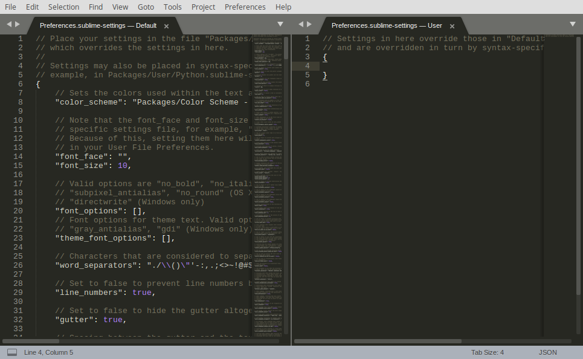

# 第 19 天：安裝/設定 Sublime Text 編輯器

由於 Sublime Text 輕量、效能好、大量套件及跨平台的特性，讓它成為近幾年來各程式語言開發者的新寵。在這段編輯器系列文裡，就讓筆者帶著大家在 elementary OS 上安裝/設定 Sublime Text 編輯器，讓大家在 Linux 使用它時可以少踩一些雷。

## 安裝 Sublime Text

Sublime Text 原生就跨平台，現已支援直接從各 Linux 發行版的套件管理安裝。請打開瀏覽器，連至 Sublime Text 官網：https://www.sublimetext.com/ 。網站應該會很聰明的偵測您的作業系統，然後自動顯示安裝 (INSTALL FOR LINUX) 按鈕。


進入安裝提示頁後，請選擇 `apt` 套件管理工具的安裝指南，並依據官方的安裝指南一步一步完成。


首先加入 key：

```bash
$ wget -qO - https://download.sublimetext.com/sublimehq-pub.gpg | sudo apt-key add -
```


為確保 `apt` 可以安裝來自 HTTPS 的來源，請安裝 `apt-transport-https` 這個套件。

```bash
$ sudo apt install apt-transport-https
```


*註：經實測 elementary OS 已經預設安裝*

接著加入 source list 來源，在這邊示範安裝穩定 (stable) 版本：

```bash
$ echo "deb https://download.sublimetext.com/ apt/stable/" | sudo tee /etc/apt/sources.list.d/sublime-text.list
```


然後就可以透過 `apt` 來安裝 Sublime Text 了：

```bash
$ sudo apt update
$ sudo apt install sublime-text
```


接著就可以在應用程式選單裡看到 Sublime Text 的圖示，點擊後就可以啟動。


官方支援 `apt` 後，安裝輕鬆了不少呢~

## 修正中文 (CJK 字元) 無法輸入的問題

事情往往不會這麼順利，當您裝完 Sublime Text 後會發現，在 elementary OS 上居然沒辦法輸入中文！查詢相關資料後會發現，似乎在 Linux 上跟輸入法框架還有些問題。好在的是，Open Source 的世界就是會有好心人來幫忙解套，請參考新北市保太老師的[說明](http://learninginfree.blogspot.tw/2013/11/sublime-text-3-ubuntu.html)。

嗯~可惜的是對於我們這種視覺系開發者來說，這步驟好複雜啊！幸運的是，lyfeyaj/sublime-text-imfix 這個 Github 儲存庫已經把所有步驟寫成指令檔，只要照著指令做就可以解決！

首先，先把儲存庫複製回來：

```bash
$ cd ~/code
$ git clone https://github.com/lyfeyaj/sublime-text-imfix.git
```


接著直接執行指令即可無腦完成！

```bash
$ cd sublime-text-imfix
$ ./sublime-imfix
```

執行完後就可以正輸入中文了！


## 客製化設定

每個開發者對自己的編輯器一定都有一套調校心法，所以拿到編輯器的第一件事，就是要先了解怎麼客製化。在 Sublime Text 裡，只要點選 Preferences 功能表，選擇 Settings，就會開啟一個獨立的編輯視窗如下圖：



在這個分成左右兩半的視窗裡，已經預先開好一個 json 檔案，左邊是 Sublime Text 的預設設定、右邊是您想要客製化的設定。而 Sublime Text 的運作邏輯，就是會先載入預設設定後，再載入您的客製化設定；換句話說，就是會用您的客製化設定來覆蓋預設設定。

所以客製化 Sublime Text 的設定很簡單：

1. 先在左邊的視窗裡找到您要客製化的選項，比方說字型大小 (`font_size`) 預設是 10

2. 把這個選項複製後直接貼在右邊，然後更改成您想要的值，比方說 16

3. 存檔後 Sublime Text 就會立刻套用

可以微調的選項其實很多，大家可以花點時間仔細研究一下有哪些選項可以設定。不過要特別注意一下的是，*因為 Sublime Text 的設定檔是用 JSON 格式，所以在**編輯時要注意語法要符合 JSON 格式的要求** (比方說不可以有多餘的逗點、掉引號之類的)，不然有時會有意外的錯誤。*

## 外掛套件

Sublime Text 功能非常也輕量，預設的功能其實不多。但它的特色之一，就是支援以 Python 為底層的套件系統。加上由社群主導的 [Package Control](https://packagecontrol.io/) 網站上網羅了大量的外掛套件，生態系非常蓬勃。因此，安裝完 Sublime Text 的第一件事通常都是先安裝套件管理系統。

安裝方式也是照著指令貼即可，請先打開瀏覽器至：https://packagecontrol.io/installation 畫面中就會顯示給 Sublime Text 3 的安裝指令，請先全選後複製起來。

```
import urllib.request,os,hashlib; h = '6f4c264a24d933ce70df5dedcf1dcaee' + 'ebe013ee18cced0ef93d5f746d80ef60'; pf = 'Package Control.sublime-package'; ipp = sublime.installed_packages_path(); urllib.request.install_opener( urllib.request.build_opener( urllib.request.ProxyHandler()) ); by = urllib.request.urlopen( 'http://packagecontrol.io/' + pf.replace(' ', '%20')).read(); dh = hashlib.sha256(by).hexdigest(); print('Error validating download (got %s instead of %s), please try manual install' % (dh, h)) if dh != h else open(os.path.join( ipp, pf), 'wb' ).write(by)
```

*註：請以官網提供的程式碼為主*


接著，打開 Sublime Text 主視窗，選擇 View 功能表底下的 Show Console (或是用快速鍵 Ctrl+`)，並把剛剛的指令貼進去後按 Enter 鍵執行。安裝完成後，就可以在 Preference 功能表底下看到新的 Package Control 這個功能。


點選後，就會出現一個新的指令框，請在裡面輸入「ins (一邊打字就會一邊過濾)」，就會出現 Install Package 選項。


按 Enter 鍵後，就會出現另一個指令框，這邊就可以輸入您想安裝的套件。套件可以在 Package Control 上找到名字，這邊示範如何安裝「Material Theme」這個佈景主題。


*註：安裝完後還會出現提示安裝其他圖示套件，請一併安裝。*

完成後，請按 Preferences 功能表底下的 Theme...，然後就會有選單可以切換不同的佈景主題。


設定好之後，就會有像下圖這樣美美的圖示專案面板介面主題囉！


## 給 PHP/Laravel 開發者的推薦套件

當然，以一個開發者來說，只裝個佈景主題絕對不可能滿足您的對吧？在這邊針對 PHP/Laravel 開發，推薦一些不錯的套件給大家參考：

1. [Side​Bar​Enhancements](https://packagecontrol.io/packages/SideBarEnhancements) - 增強版的側邊欄

2. [Git​Gutter](https://packagecontrol.io/packages/GitGutter) - 可以在行號旁顯示 git 提示

3. [Editor​Config](https://packagecontrol.io/packages/EditorConfig) - 跨編輯器的格式設定工具

4. [Bracket​Highlighter](https://packagecontrol.io/packages/BracketHighlighter) - 自動標示括號匹配

5. [Naomi](https://packagecontrol.io/packages/Naomi) - 增強的語法高亮度

6. [Emmet](https://packagecontrol.io/packages/Emmet) - 快速 HTML 程式碼輸入

7. [All Autocomplete](https://packagecontrol.io/packages/All%20Autocomplete) - 語法自動補完

8. [DocBlockr](https://packagecontrol.io/packages/DocBlockr) - 支援 DockBlock 語法

9. [PHP Companion](https://packagecontrol.io/packages/PHP%20Companion) - 協助輸入 PHP Namespace 等

10. [Sublime​Linter](https://packagecontrol.io/packages/SublimeLinter) - 語法檢查器

11. [Sublime​Linter-php](https://packagecontrol.io/packages/SublimeLinter-php) - PHP 語法檢查器

12. [Sublime​Linter-phplint](https://packagecontrol.io/packages/SublimeLinter-phplint) - phplint 整合

13. [Sublime​Linter-phpcs](https://packagecontrol.io/packages/SublimeLinter-phpcs) - phpcs 整合

14. [Sublime​Linter-phpmd](https://packagecontrol.io/packages/SublimeLinter-phpmd) - phpmd 整合

15. [Phpcs](https://packagecontrol.io/packages/Phpcs) - phpcs、php-cs-fixer、linter、phpmd 整合

16. [Xdebug Client](https://packagecontrol.io/packages/Xdebug%20Client) - 整合 Xdebug

17. [Laravel 5 Artisan](https://packagecontrol.io/packages/Laravel%205%20Artisan) - 支援在 Sublime Text 裡執行 artisan 指令

18. [Laravel Blade Auto​Complete](https://packagecontrol.io/packages/Laravel%20Blade%20AutoComplete) - Blade 語法提示

19. [Laravel Blade Highlighter](https://packagecontrol.io/packages/Laravel%20Blade%20Highlighter) - Blade 語法高亮度

20. [Laravel Blade Spacer](https://packagecontrol.io/packages/Laravel%20Blade%20Spacer) - Blade 語法空白修正

21. [Laravel Helper Completions](https://packagecontrol.io/packages/Laravel%20Helper%20Completions) - Laravel Helper 語法提示

Sublime Text 的定位雖然是一個輕量的編輯器，但加掛大量套件後，功能也逼近 IDE。也因此每個開發者、不同的開發語言往往都有自己一套的調校指南。在這篇介紹裡，僅先針對安裝、設定及外掛套件三大部份做入門指引，更多參考資料就整理在文章末，希望對您能有所幫助。

在本文最後也提醒您，Sublime Text 本身是付費軟體，雖然官方讓大家可以無限期全功能「試用」(只會定期會跳出是否購買的尋問框)，不過同為軟體開發者，若真的覺得好用也別忘了付費支持喔！您也是 Sublime Text 的愛好者嗎？有沒有什麼密技或推薦外掛呢？歡迎留言與我交流！

## 參考資料

* [Sublime Text 的 Wikipedia 條目](https://en.wikipedia.org/wiki/Sublime_Text)
* [Sublime Text 的 Linux 安裝指南](https://www.sublimetext.com/docs/3/linux_repositories.html)
* Sublime Text 在 Linux 上中文問題解法：[參考 1](http://learninginfree.blogspot.tw/2013/11/sublime-text-3-ubuntu.html)、[參考 2](https://opensource.ntpc.edu.tw/moodle/mod/forum/discuss.php?d=30)
* [Sublime Text CJK 修正指令](https://github.com/lyfeyaj/sublime-text-imfix)
* [Sublime Text 官方設定文件](https://www.sublimetext.com/docs/3/settings.html)
* [Package Control 官網](https://packagecontrol.io/)
* [Material Theme 官網](http://equinsuocha.io/material-theme/)
* [由 Matt Stauffer 撰寫的 Sublime Text 指南](https://mattstauffer.com/blog/sublime-text-3-for-php-developers/)
* [Sublime Text 教學書及影片](https://sublimetextbook.com/)
* Sublime Text 整合 Xdebug 教學：[參考 1](https://nyphper.wordpress.com/2017/03/09/setup-sublime-text-3-with-xdebug-for-remote-debugging/)、[參考 2](https://www.sitepoint.com/debugging-xdebug-sublime-text-3/)、[參考 3](https://stackoverflow.com/questions/47616085/how-to-setup-xdebug-in-sublime-text-3)
