# 第 20 天：安裝/設定 Atom 編輯器

還記得在 Sublime Text 出現後，在編輯器市場引起了一場不小的旋風。沒想到過了幾年後，由 Github 官方推出的 Atom 編輯器，以 Javascript 為核心 (官方甚至為了開發出 Atom 而釋出了 Electron 這項技術)、強調開放原始碼、跨平台、內建 git 及套件系統…等特性，再次衝擊開發者對編輯器的想像。在這篇介紹裡，就讓筆者帶著大家在 elementary OS 上安裝/設定 Atom 編輯器，盡可能移植大家在其他平台的操作經驗，讓讀者可以見識 Atom 在 Linux 上跨平台的表現。

## 安裝 Atom

由於 Atom 官方有提供自動安裝檔，所以安裝很容易。請打開瀏覽器，連至 Atom 官網：https://atom.io/ 。網站應該會很聰明的偵測到您的作業系統為 Linux，然後自動顯示下載 (Download) 的按鈕。

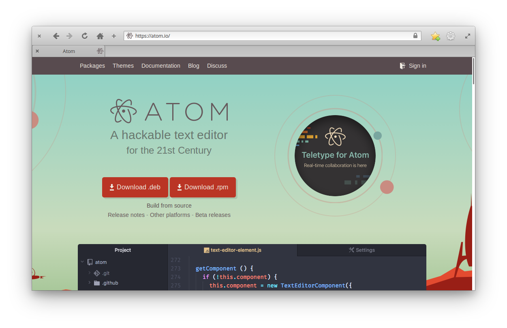

由於 elementary OS 是 Debian 流派，所以請下載 `.deb` 的安裝檔。下載完成後，請用 `Meta`+`T` 開啟終端機視窗，並以 `apt` 套件管理工具進行安裝：

```bash
$ cd ~/Downloads
$ sudo apt install ./atom-amd64.deb
```

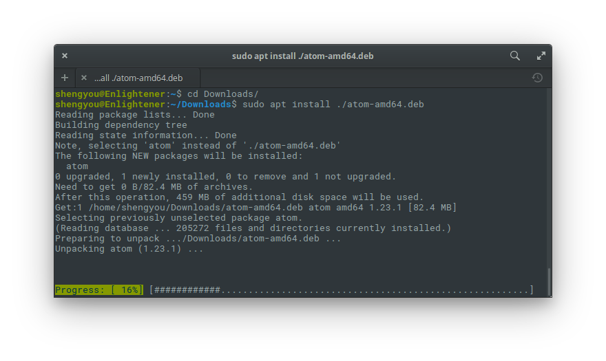

若您喜歡直接用 `apt` 套件管理來安裝的話，官方也有提供 `apt` 的 key 及 source list，可參考 [官網的 Linux 安裝指南](http://flight-manual.atom.io/getting-started/sections/installing-atom/#platform-linux)：

```bash
$ curl -L https://packagecloud.io/AtomEditor/atom/gpgkey | sudo apt-key add -
$ sudo sh -c 'echo "deb [arch=amd64] https://packagecloud.io/AtomEditor/atom/any/ any main" > /etc/apt/sources.list.d/atom.list'
$ sudo apt update
$ sudo apt install atom
```

安裝完成後，就可以在應用程式選單內看到 Atom 的圖示。

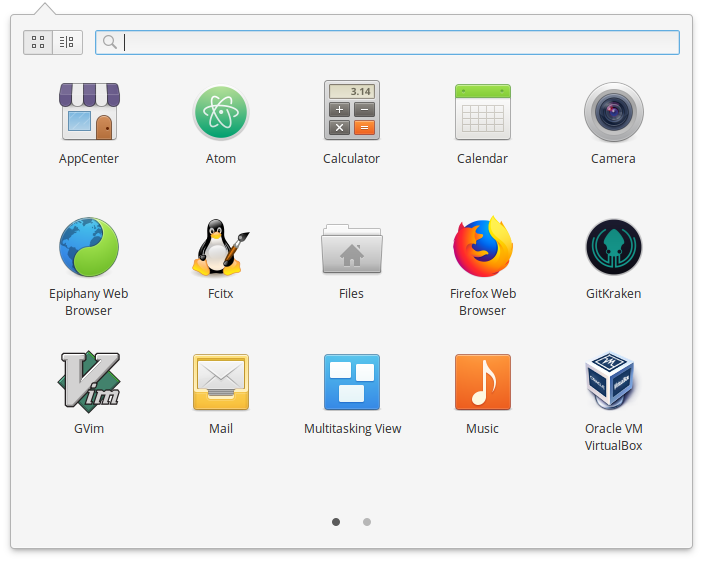

開啟 Atom 後就可以看到其應用程式主視窗。

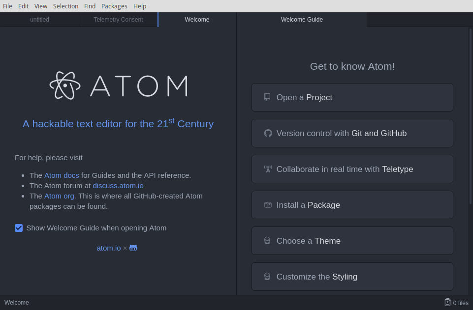

## 客製化設定

身為一位專業的開發者，裝完軟體的第一件事一定是先研究怎麼客製化。Atom 的客製化選項已經很貼心的做成圖形化介面，您可以透過功能表 Edit 底下的 Preference 開啟面板 (或是用快速鍵 `Ctrl`+`,`)：

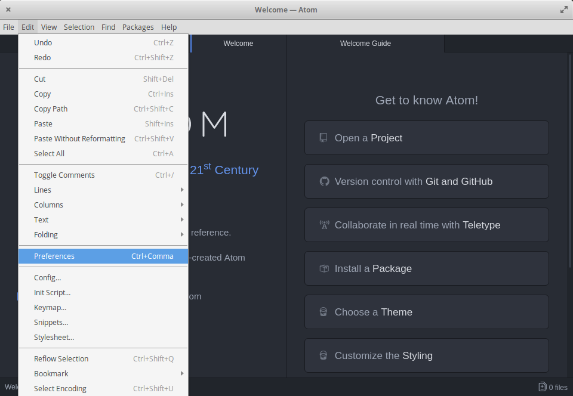

在這個面板裡，您可以針對幾個常見的分類做調整，包括：Core、Editor、Keybindings。每進入一個分類，裡面就有選項可以勾選或是輸入設定值，非常直覺。若您覺得這樣設定實在不夠 Geek，也可以按下分類選單最下面的「Open Config Folder」。Atom 會開啟您家目錄底下的 `.atom` 資料夾供您直接編輯設定檔。Atom 的設定檔格式為 `.cson`，有點類似 JSON 的格式但不需要寫一堆大括號。另外，您也可以修改 Atom 以 Coffee Script 語法做成的啟動指令 `init.coffee` 來客製應用程式初始化時的動作。

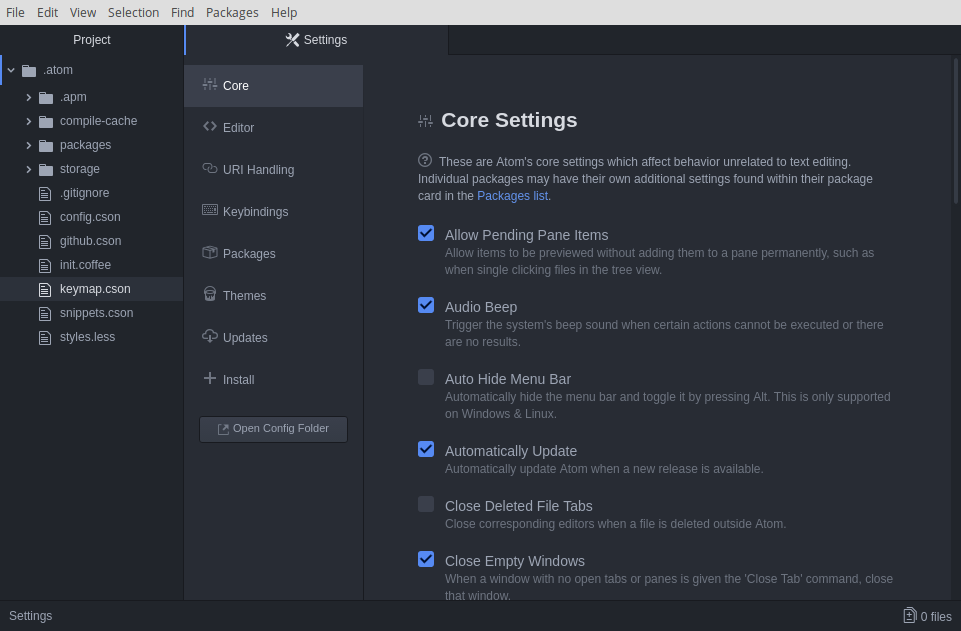

## 外掛套件

Atom 出廠時只是個輕量的編輯器，不過其內建外掛系統的機制，可以依照需求做高度的客製化。事實上，Atom 本身就是一個由官方套件組成的編輯器。而由於整個 Atom 生態系都是開放原始碼，因此目前已經累積出非常大量的套件可供安裝使用，官方也提供 平台供大家上傳分享與搜尋。

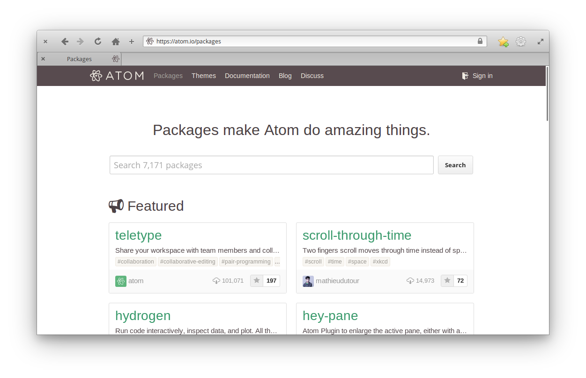

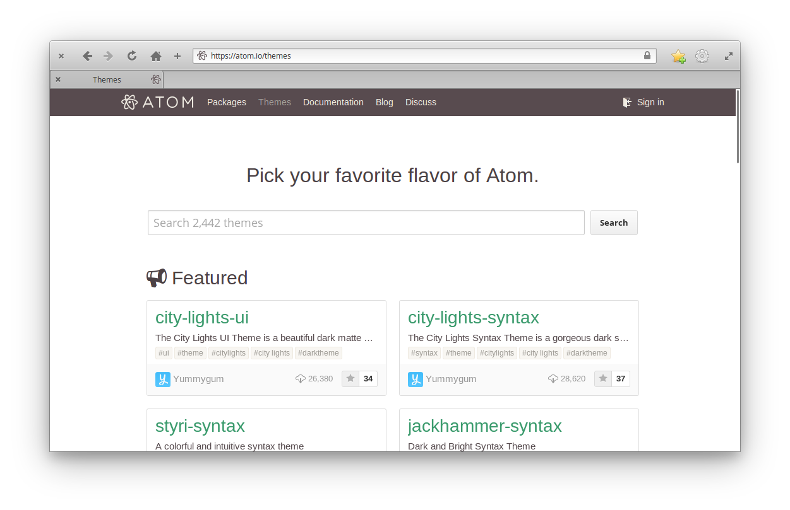

Atom 的外掛套件在官方平台上可概分為兩種：[套件](https://atom.io/packages) 及 [佈景主題](https://atom.io/themes)。安裝的方式也非常直覺，只要打開設定 Preference 面板，切換到安裝 (Install) 分頁，就可以直接搜尋套件及佈景主題來安裝。以下就示範安裝 `atom-material-ui` 及 `atom-material-syntax` 這兩個佈景主題，一個是用於整個 Atom 介面的佈景主題、一個是用於程式碼上色的佈景主題，請在搜尋框內將搜尋範圍切到佈景主題 (Themes) 後，輸入 `atom-material` 字串搜尋：

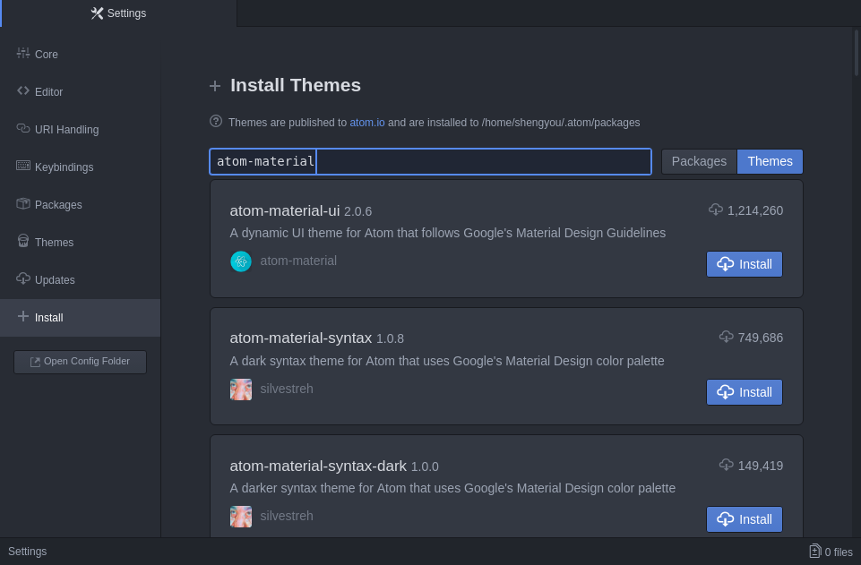

當搜尋結果出來後，選定要安裝的佈景主題點擊安裝 (Install) 安裝即可。安裝完成後，請點選左邊側邊欄的佈景主題設定 (Themes)：

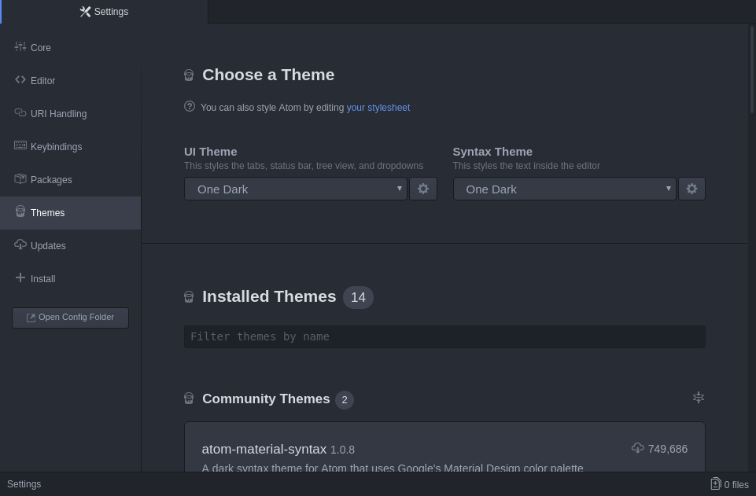

切換 UI Theme 及 Syntax Theme 成 `Atom Material`，隨即 Atom 就會載入佈景主題的設定：

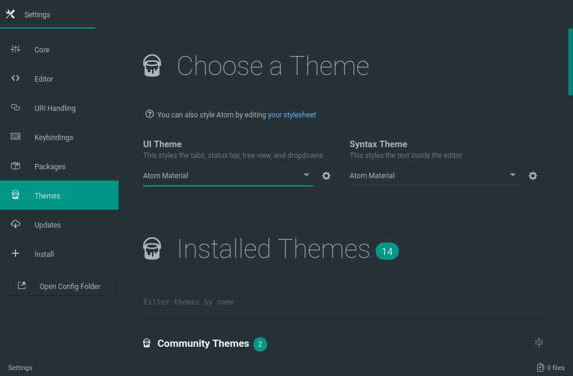

若是按下選單右邊的齒輪按鈕就可以依照自己的喜好做更進階的設定。而安裝套件的流程基本上是大同小異的，有沒有非常容易呢？

雖然 Atom 有提供美型的圖形介面供安裝和設定外掛套件，但我相信您內心的技客 (Geek) 魂一定早就按捺不住使用指令列的衝動吧？Atom 的套件管理其實底層就是用指令列 (apm - Atom Package Manager) 實作的，所以若是您要使用指令列來安裝套件，只需要先確定套件名稱、打開終端機、輸入指令即可完成！

```bash
$ apm install <package_name>
```

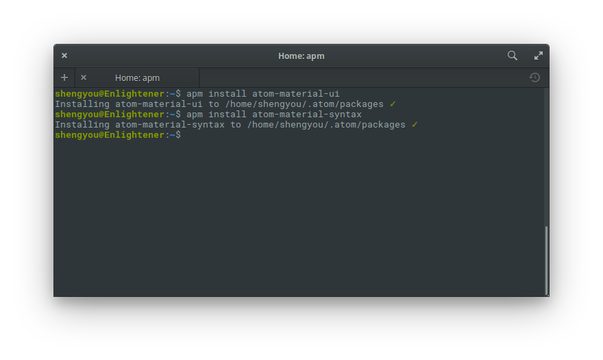

## 給 PHP/Laravel 開發者的推薦套件

最後，在這邊針對 PHP/Laravel 開發，推薦一些不錯的套件給大家參考：

1. [editorconfig](https://atom.io/packages/editorconfig) - 跨編輯器的格式設定工具

2. [highlight-selected](https://atom.io/packages/highlight-selected) - 高亮度選取字串

3. [emmet](https://atom.io/packages/emmet) - 快速 HTML 程式碼輸入

4. [minimap](https://atom.io/packages/minimap) - 仿 Sublime Text 的 minimap 功能 (安裝完後推薦再裝 [minimap-highlight-selected](https://atom.io/packages/minimap-highlight-selected))

5. [teletype](https://atom.io/packages/teletype) - 可多人同步共享編輯視窗，做遠端協作時超好用

6. [php-integrator-base](https://atom.io/packages/php-integrator-base) - PHP 相關的整合 (需先安裝 [project-manager](https://atom.io/packages/project-manager))，安裝完後推薦再裝 [php-integrator-navigation](https://atom.io/packages/php-integrator-navigation)、[php-integrator-autocomplete-plus](https://atom.io/packages/php-integrator-autocomplete-plus)、[php-integrator-annotations](https://atom.io/packages/php-integrator-annotations)、[php-integrator-refactoring](https://atom.io/packages/php-integrator-refactoring)

7. [docblockr](https://atom.io/packages/docblockr) - 整合 DocBlock

8. [php-cs-fixer](https://atom.io/packages/php-cs-fixer) - 整合 php-cs-fixer

9. [php-debug](https://atom.io/packages/php-debug) - 整合 Xdebug

10. [tester-phpunit](https://atom.io/packages/tester-phpunit) - Laravel 台灣社群夥伴 Recca 所開發的 PHPUnit 測試套件 (需先安裝 [tester](https://atom.io/packages/tester) 套件)

11. [laravel](https://atom.io/packages/laravel) - 提供 Laravel 及 Helper 的 snipperts

12. [language-blade](https://atom.io/packages/language-blade) - 提供 Laravel Blade 語法支援

13. [ide-php](https://atom.io/packages/ide-php) - 讓 Atom 看起來更像 PHP IDE (需先安裝 [atom-ide-ui](https://atom.io/packages/atom-ide-ui)) *註：這個套件仍在開發階段，請斟酌使用*

在這篇介紹裡，僅先針對安裝、設定及外掛套件三大部份做入門指引，更多參考資料就整理在文章末，希望對您能有所幫助。您也是 Atom 的愛好者嗎？有沒有什麼密技或推薦外掛呢？歡迎留言與我交流！

## 參考資料

* [Atom 官網](https://atom.io/)
* [Atom 的 Wikipedia 條目](https://en.wikipedia.org/wiki/Atom_\(text_editor\))
* [Atom 官方手冊](http://flight-manual.atom.io/)
* [Atom 官方套件平台](https://atom.io/packages)
* [Atom 官方佈景主題平台](https://atom.io/themes)
* 給 PHP 開發者的 Atom 指南：[參考 1](https://php.earth/docs/interop/atom)、[參考 2](https://medium.com/@sergioserra/using-atom-io-for-php-development-c1d271f351b2)、[參考 3](https://medium.com/@gdiasdasilva/7-must-have-atom-packages-for-php-developers-1db6e4772a95)、[參考 4](https://medium.com/diegodev/atom-for-php-developers-9d8d16bbbaf8)、[參考 5](https://bitpress.io/php/laravel/2017/02/13/larasnippets-atom-plugin/)
