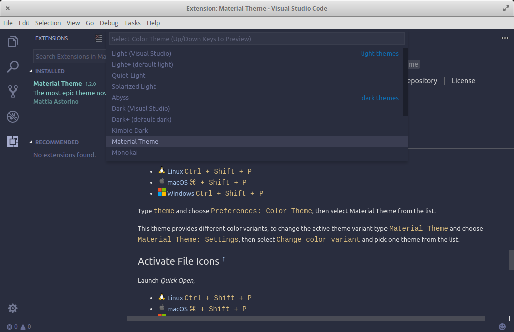

# 第 21 天：安裝/設定 Visual Studio Code 編輯器

在 Github 推出 Atom 後，為「以 Javascript 開發桌面應用程式」帶來新的示範，其底層也從 Atom Shell 更名為 Electron 後釋出，讓更多人可以用這種方式來開發桌面應用程式。Atom 很棒，許多外掛套件的開發者也發揮了各種天份，讓 Atom 上有了很多很有創意的套件。不過唯一的缺點就是 Atom 先天的底層設計，加上套件愈掛愈多後，容易變得效能不彰甚至很慢。

結果沒想到這時候微軟 (Microsoft) 突然跳出來，以同樣的 Electron 架構、加上開發 Visual Studio 的經驗，做出 Visual Studio Code 這個全新的編輯器。主打內建智能提示、git 版本管理、除錯功能及外掛系統，而且在效能上有重大的改善。

繼 Visual Studio Code 出現在市場之後，開發者的決策天平又開始傾斜，編輯器市場又進入一種群雄割據的狀態。在這篇介紹裡，就讓筆者帶著大家在 elementary OS 上安裝/設定 Visual Studio Code 編輯器，讓讀者可以見識 Visual Studio Code 在 Linux 上跨平台的表現。

## 安裝 Visual Studio Code

由於 Microsoft 官方有提供自動安裝檔，所以安裝很容易。請打開瀏覽器，連至 Visual Studio Code 官網：https://code.visualstudio.com/ 。網站應該會很聰明的偵測到您的作業系統為 Linux，自動顯示兩種安裝檔的下載的按鈕。


由於 elementary OS 是 Debian 流派，所以請下載 `.deb` 的安裝檔。下載完成後，請用 `Meta`+`T` 開啟終端機視窗，並以 `apt` 套件管理工具進行安裝：

```bash
$ cd ~/Downloads
$ sudo apt install ./code_1.19.1-1513676564_adm64.deb
```


若您喜歡直接用 `apt` 套件管理來安裝的話，官方也有提供 `apt` 的 key 及 source list，可參考 [官網的 Linux 安裝指南](https://code.visualstudio.com/docs/setup/linux)：

```bash
$ curl https://packages.microsoft.com/keys/microsoft.asc | gpg --dearmor > microsoft.gpg
$ sudo mv microsoft.gpg /etc/apt/trusted.gpg.d/microsoft.gpg
$ sudo sh -c 'echo "deb [arch=amd64] https://packages.microsoft.com/repos/vscode stable main" > /etc/apt/sources.list.d/vscode.list'
$ sudo apt update
$ sudo apt install code
```

安裝完成後，就可以在應用程式選單內看到 Visual Studio Code 的圖示。


開啟 Visual Studio Code 後就可以看到其應用程式主視窗。


## 客製化設定

緊接著介紹如何客製化 Visual Studio Code 的設定。請先點選左邊側邊欄最下方的齒輪圖示，選擇 Settings，就會開啟一個獨立的編輯視窗如下圖：


在這個分成左右兩半的視窗裡，已經預先開好一個 json 檔案，左邊是 Visual Studio Code 的預設設定、右邊是您想要客製化的設定。而 Visual Studio Code 的運作邏輯，就是會先載入預設設定後，再載入您的客製化設定；換句話說，就是會用您的客製化設定來覆蓋預設設定。


所以客製化 Visual Studio Code 的設定很簡單：

1. 先在左邊的視窗裡找到您要客製化的選項，比方說字型大小 (`editor.fontSize`) 預設是 14

2. 把這個選項複製後直接貼在右邊，然後更改成您想要的值，比方說 18

3. 存檔後 Visual Studio Code 就會立刻套用

可以微調的選項其實很多，大家可以花點時間仔細研究一下有哪些選項可以設定。相信有使用過 Sublime Text 的讀者，應該會對 Visual Studio Code 的設定方式很熟悉吧？不過一樣要注意的是，*因為設定檔是用 JSON 格式，所以在**編輯時要注意語法要符合 JSON 格式的要求**，不然有時會有意外的錯誤。*

## 外掛套件

微軟在釋出 Visual Studio Code 的時候就定位的很清楚，其要提供的是一個最基礎的開發工具平台，官方無法顧及所有程式語言，但因為內建就有套件系統加上強大的開放原始碼生態系，開發者可以根據自己使用的程式語言特性，為 Visual Studio Code 開放套件，讓其可以支援更多程式語言。

而安裝外掛非常簡單，請直接打開存邊側邊欄的「外掛」圖示，其就的展開一個外掛清單面板，在這個面板裡，只要在上方的輸入框輸入欲尋找的外掛名稱，下方就會列出所有可能的選項，再點擊安裝 (Install) 按鈕即可。以下就示範安裝 `Material Theme` 這個佈景主題：


安裝完成後，請點選重新載入 (Reload) 的按鈕讓 Visual Studio Code 重新載入所有外掛。

接著，我們要將現有的佈景主題換成 Material Theme，請先用快速鍵 `Ctrl`+`Shift`+`P` 開啟 Command Palette 輸入框，再輸入「Theme (輸入關鍵字即可，Visual Studio Code 會自動過濾可能的符合選項)」，選擇 「Preferences: Color Theme」後，Visual Studio Code 就會把所有佈景主題列出，當您用上/下箭頭切換時，就可以預覽佈景主題套用的結果。成功套用後如下圖：



## 給 PHP/Laravel 開發者的推薦套件

已經熟悉這個系列套路的朋友，應該都在等這一段！就不拖時間馬上針對 PHP/Laravel 開發，推薦一些不錯的套件給大家參考：

1. [EditorConfig for VS Code](https://marketplace.visualstudio.com/items?itemName=EditorConfig.EditorConfig) - 跨編輯器的格式設定工具

2. [PHP Extension Pack](https://marketplace.visualstudio.com/items?itemName=felixfbecker.php-pack) - 官方推薦針對 PHP 開發的外掛包，包含了 [PHP IntelliSense](https://marketplace.visualstudio.com/items?itemName=felixfbecker.php-intellisense) 及 [PHP Debug](https://marketplace.visualstudio.com/items?itemName=felixfbecker.php-debug) 兩個外掛

3. [PHP Intelephense](https://marketplace.visualstudio.com/items?itemName=bmewburn.vscode-intelephense-client) - PHP 語法智能提示 (也有一個類似的叫 [PHP Intellisense - Crane](https://marketplace.visualstudio.com/items?itemName=HvyIndustries.crane))

4. [Composer](https://marketplace.visualstudio.com/items?itemName=ikappas.composer) - 整合 composer

5. [PHP DocBlocker](https://marketplace.visualstudio.com/items?itemName=neilbrayfield.php-docblocker) - 支援 DockBlock 套件

6. [PHP Symbols](https://marketplace.visualstudio.com/items?itemName=linyang95.php-symbols) - 支援 PHP 的 Symbol 套件

7. [phpfmt - PHP formatter](https://marketplace.visualstudio.com/items?itemName=kokororin.vscode-phpfmt) - 自動格式化工具

8. [PHP Getters & Setters](https://marketplace.visualstudio.com/items?itemName=phproberto.vscode-php-getters-setters) - PHP 類別 getter 及 setter 產生器

9. [PHP Namespace Resolver](https://marketplace.visualstudio.com/items?itemName=MehediDracula.php-namespace-resolver) - 協助 import PHP Namespace 工具

10. [phpcs](https://marketplace.visualstudio.com/items?itemName=ikappas.phpcs) - 整合 phpcs

11. [PHP Mess Detector](https://marketplace.visualstudio.com/items?itemName=ecodes.vscode-phpmd) - 整合 phpmd

12. [Simple PHP CS Fixer](https://marketplace.visualstudio.com/items?itemName=calebporzio.simple-php-cs-fixer) - 整合 php-cs-fixer

13. [VSCode-PHPUnit](https://marketplace.visualstudio.com/items?itemName=recca0120.vscode-phpunit) - Laravel 台灣社群夥伴 Recca 開發的 PHPUnit 外掛

14. [Laravel Extension Pack](https://marketplace.visualstudio.com/items?itemName=onecentlin.laravel-extension-pack) - Laravel 台灣社群夥伴 Winnie 開發的 Laravel 外掛包，包括了 [Laravel Blade Snippets](https://marketplace.visualstudio.com/items?itemName=onecentlin.laravel-blade)、[Laravel 5 Snippets](https://marketplace.visualstudio.com/items?itemName=onecentlin.laravel5-snippets)、[Laravel Artisan](https://marketplace.visualstudio.com/items?itemName=ryannaddy.laravel-artisan)

15. [Laravel goto view](https://marketplace.visualstudio.com/items?itemName=codingyu.laravel-goto-view) - 支援 Laravel Blade 路徑

自從 Visual Studio Code 問世後，再次刮分了一部份的編輯器市場。相信從這篇介紹文裡也可以感受到 Visual Studio Code 在開發 PHP/Laravel 應用程式的潛力。礙於篇幅的限制，在這裡僅先針對安裝、設定及外掛套件三大部份做入門指引，更多參考資料就整理在文章末，希望對您能有所幫助。您也是 Visual Studio Code 的愛好者嗎？有沒有什麼密技或推薦外掛呢？歡迎留言與我交流！

## 參考資料

* [Visual Studio Code 官網](https://code.visualstudio.com/)
* [Visual Studio Code 的 Wikipedia 條目](https://en.wikipedia.org/wiki/Visual_Studio_Code)
* [Visual Studio Code 官方手冊](https://code.visualstudio.com/docs/)
* [Visual Studio Code 官方套件平台](https://marketplace.visualstudio.com/VSCode)
* [Visual Studio Code 官方針對 PHP 開發提供的指南](https://code.visualstudio.com/docs/languages/php)
* 筆者之前針對使用 Visual Studio Code 開發 PHP/Laravel 所分享的簡報：[給 PHP 開發者的 VS Code 指南](https://www.slideshare.net/shengyou/community-open-camp-php-vs-code)、[凌波微步：wagon + VS Code 的輕功哲學](https://www.slideshare.net/shengyou/wagon-vs-code)、[使用 wagon + VS Code 輕鬆打造 Windows 平台 PHP/Laravel 開發環境](https://www.slideshare.net/shengyou/wagon-vs-code-windows-phplaravel)、[Visual Studio Code 快速上手指南](https://www.slideshare.net/shengyou/visual-studio-code-62532711)
* [Visual Studio Code 開發 Laravel 的指南](https://medium.com/@ardanirohman/laravel-%EF%B8%8F-visual-studio-code-debug-environment-65440274d3b0)
