# 第 22 天：安裝/設定 PhpStorm

PHP 因為弱型別語言的天性，在編輯器的智能提示上較難實作，加上語法驗證、偵錯與性能分析等工具也是後期才慢慢出現，因此相較於其他強型別語言，PHP 一直沒有一個好的開發工具。市場上常見的是以編輯器+外掛為主的方案，以整合開發環境 (IDE) 來說，除了半官方 Zend 推出的 Zend Studio 外，其他如 Eclipse 的 PDT、Sun (現為 Oracle) 的 Netbeans 都是寫 Java 之外「順便」支援 PHP。以上這些方案不是不好，但真要拿來開發專案時，總覺得搔不到癢處。沒有順手的 PHP IDE 相信是 PHP 開發者一直以來的心頭之痛。

好在這幾年有些變化，隨著 DocBlock 的廣泛使用、PHP-FIG 推出的各項標準、Composer 相依管理工具成為業界默認標準、PHP 7 支援更多強型別語法，要幫 PHP 做好工具這件事變得愈來愈可行。而 JetBrains 挾著其在 IntelliJ IDEA 及 ReSharper 上豐富的 IDE 產品經驗，為 PHP 開發量身打造了 PhpStorm。有別於其他是透過外掛搭建而成的方案，PhpStorm 完完全全針對 PHP 開發人員的需求訂制，從開發環境整合、語法驗證、智能提示、測試/偵測/性能分析等一應俱全，說它是 PHP 界的 Visual Studio 也不為過。

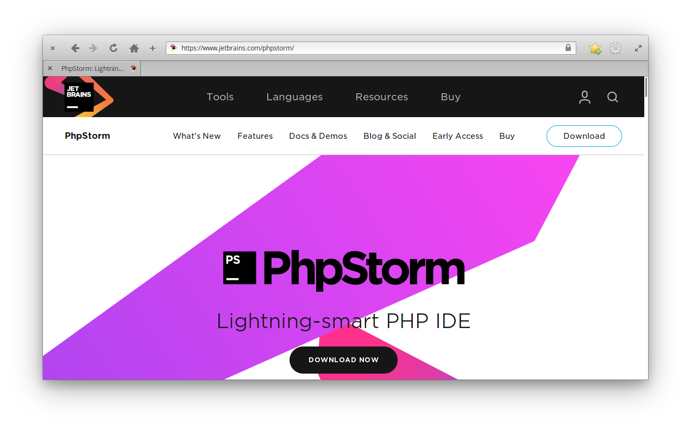

由於 JetBrains 是使用 Java/Kotlin 為基底打造 PhpStorm，意味著要讓 PhpStorm 跨平台是再容易不過了！在這篇介紹裡，筆者將帶著大家在 elementary OS 上安裝 PhpStorm，並介紹一下幾個常見的 PhpStorm 設定及外掛。

## 安裝 PhpStorm

常見的 PhpStorm 安裝方式都是直接用官方的安裝檔來安裝。不過，因為 JetBrains 的產品線很廣、更新又很勤，有些跨多個程式語言的開發者常常會需要裝多個 JetBrains 旗下的 IDE，有時一個一個下載/安裝/更新很麻煩。因此，官方現在推出 Toolbox 應用程式，只要登入您的 JetBrains 帳號，就會列出授權範圍內可以安裝的所有應用程式，只要一鍵就可以統一管理所有 IDE 的專案、軟體更新，非常方便，也是筆者比較推薦的安裝方式。因此在這篇介紹裡就以 Toolbox 安裝 PhpStorm 做示範。

首先，請打開瀏覽器，連至 JetBrains 官網：https://www.jetbrains.com/ 點選上方導覽列的工具 (Tools) 選單，點選 Toolbox 連結至下載頁。

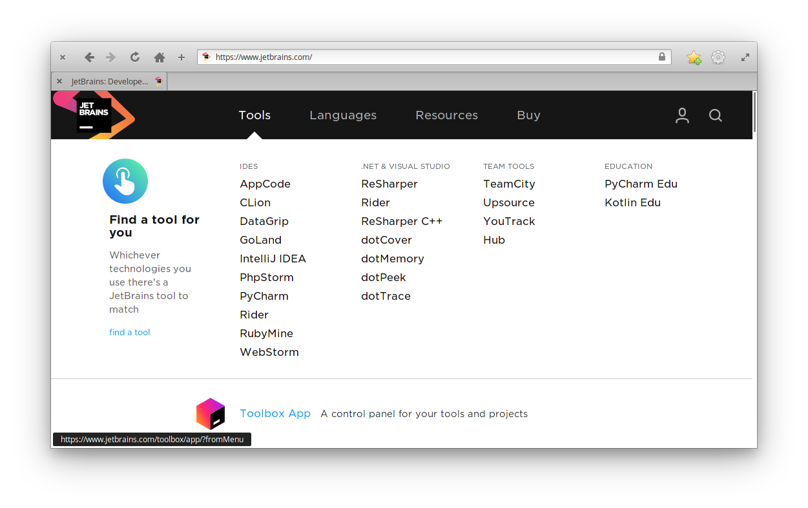

下載頁應該會很聰明的偵測到您的作業系統為 Linux，然後自動顯示下載 (Download) `.tar.gz` 的按鈕。

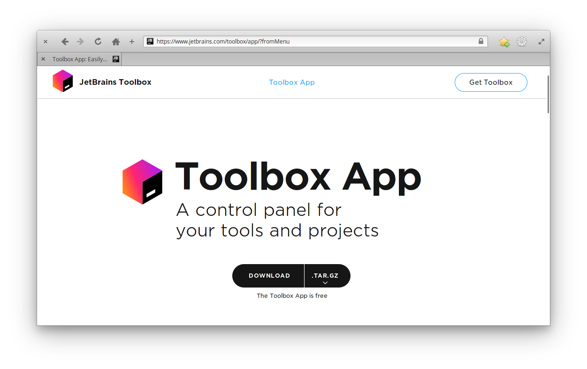

下載完成後，請用直接點一下 `jetbrains-toolboox-1.6.2914.tar.gz` 的檔案，elementary OS 會開啟一個解壓縮視窗，直接把裡面的資料夾拖曳出來解壓縮。

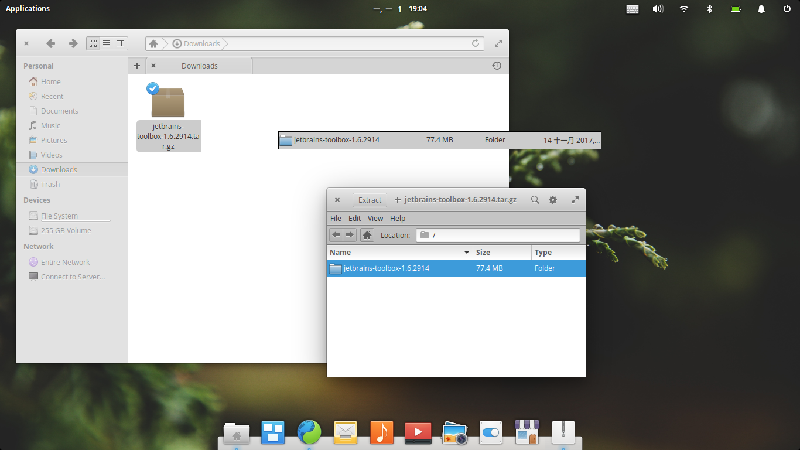

解壓縮後請打開資料夾，裡面會有一個 `jetbrains-toolbox` 的檔案。直接點繫這個檔案，Toolbox 就會啟動，並在面板右邊的狀態指標區出現圖示。

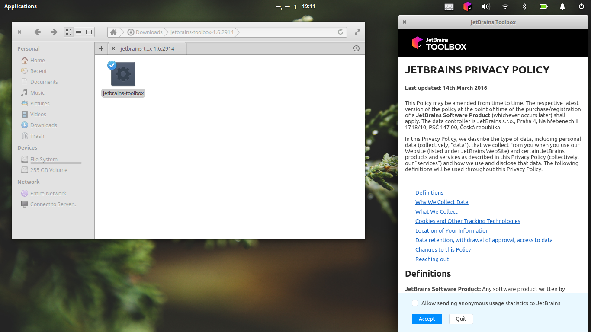

請先點選 Accept 接受條款，並在下一個畫面登入您的 JetBrains 帳號。接著您就會看到您的帳號底下可以安裝的所有工具清單。

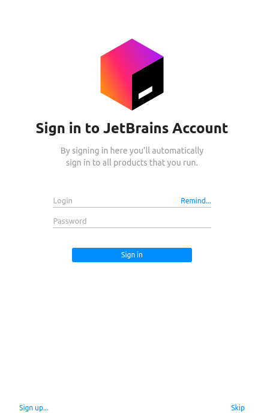

點選 PhpStorm 旁的安裝 (Install) 按鈕，Toolbox 就會自動下載並安裝 PhpStorm。

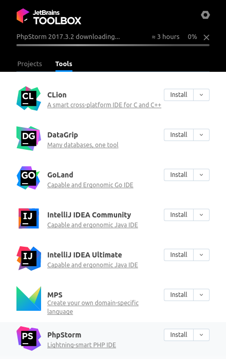

打完收工！完成後就會在應用程式選單裡看到 PhpStorm 及 Toolbox 的圖示。

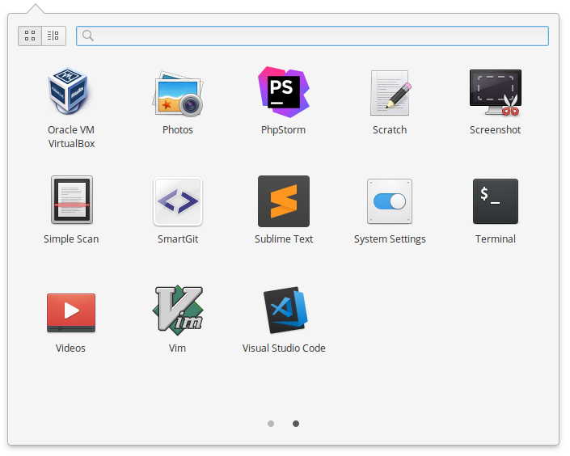

安裝完成後其實就可以把當初下載的壓縮檔和解壓之後的執行檔丟掉了。因為 Toolbox 會自動把自己安裝在 `~/.local/share/JetBrains/Toolbox` 裡，並在 `~/.config/autostart/jetbrains-toolbox.desktop` 及 `~/.local/share/applications/jetbrains-toolbox.desktop` 建立捷徑，後續就會自我管理了，很聰明吧？另外，也建議讀者可以設定 Toolbox 不要在系統啟動時自動執行，經實測會拖慢一些系統進入桌面的啟動時間。

以上就是使用 Toolbox 安裝 PhpStorm 的流程。當然，若您還是習慣直接安裝 PhpStorm 的話，這邊簡單提示一下另外兩種安裝方式：

1. 先到 PhpStorm 官網的下載頁：https://www.jetbrains.com/phpstorm/download/#section=linux 下載 `.tar.gz` 壓縮檔，依照一樣的方式解壓縮後，把 PhpStorm 的資料夾放到您想要的地方 (比方說 `~/Applications`)，然後打開終端機進到 PhpStorm 資料夾，再執行 `./phpstorm.sh` 即可啟動

2. 若您有依照 [第 9 天：安裝 Brave 瀏覽器] 的介紹安裝 [snapd](https://snapcraft.io/) 的話，現在官方也提供 Snap 的安裝方式，只要打開終端機輸入一行指令 `sudo snap install phpstorm --classic` 就搞定了。

## 初始化 PhpStorm

目前 PhpStorm 的最新版本為 2017.3.2，在這個新版本裡，初次啟動時，會有一個初始化的流程協助您做 PhpStorm 的基礎偏好設定，在這邊一併示範給讀者。

首先，PhpStorm 會尋問您是不是有設定檔要匯入，因為我們是初次安裝，所以直接按「Do not import settings」下一步。

第二步是依您的偏好選擇 IDE 的主色系 (UI Theme)：(許多工程師因為護眼的理由所以選擇黑背景)

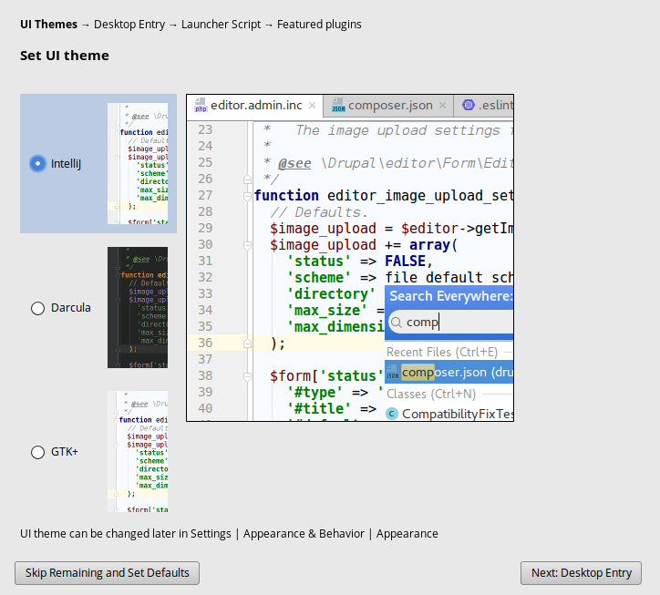

第三步是尋問您要不要建立一個桌面捷徑，以在 elementary OS 上來說可以不需要，可以取消勾選。

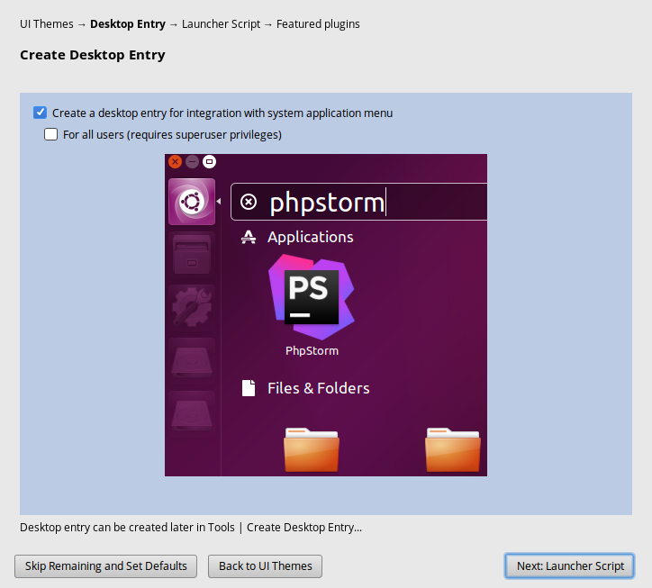

第四步是尋問要不要建立指令列工具，讓您可以從指令列開啟 PhpStorm，這步就看您的個人習慣(指令魔人請勾選)，建立好的指令預設會放在 `/usr/local/bin` 底下。

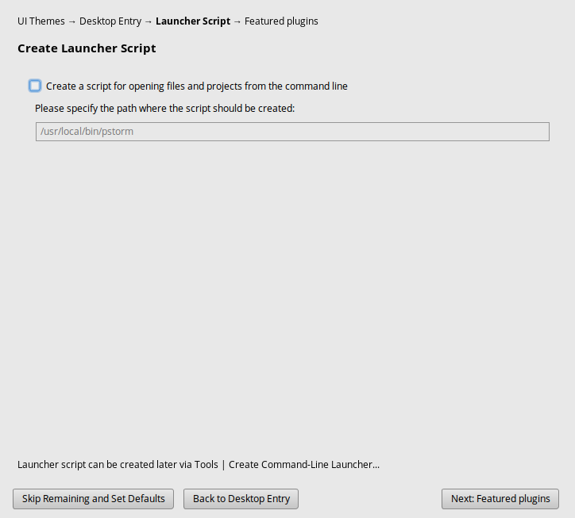

第五步是尋問您要不要安裝精選套件，若您還不太熟悉沒關係，稍晚會詳細說明。

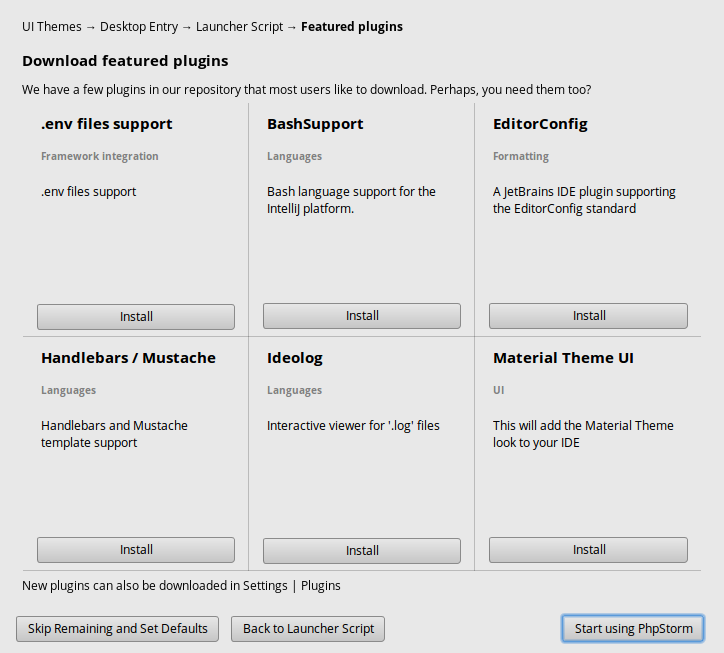

完成後 PhpStorm 就會正式啟動。

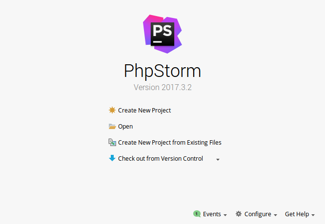

## 客製化設定

PhpStorm 是個全功能的 IDE，可以客製化的設定非常多，在這邊簡要的針對幾個視覺系的需求來做設定介紹。請先選擇 Configure 功能表底下的 Settings，開啟設定面板：

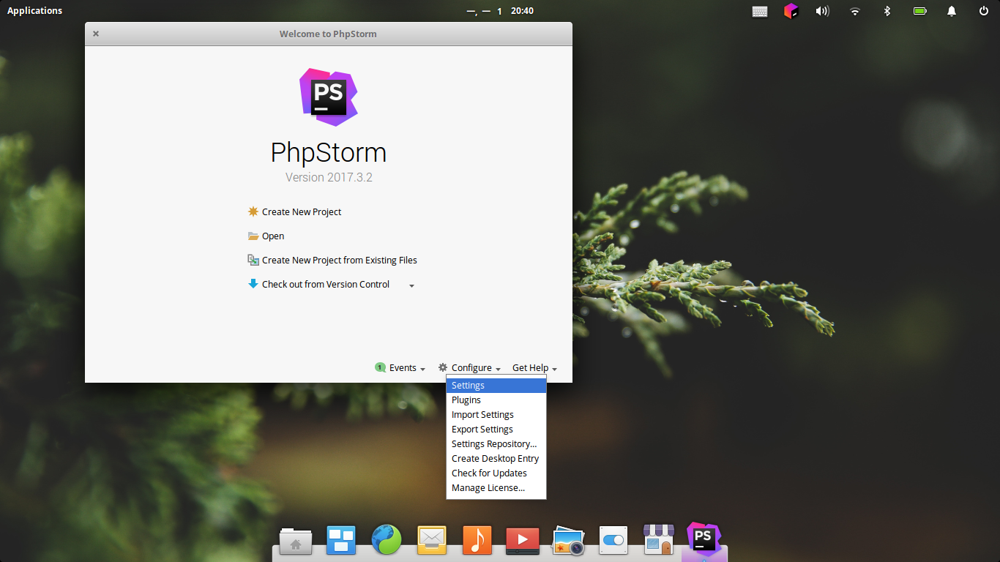

在設定面板的左邊會有所有可以設定的分類 (選項多到可以分類啊！)，請依照您想要設定的分類尋找子項目，然後會在右邊出現對應的設定選項。

1. 設定 IDE 主色系 (UI Theme)

    請選擇 Appearance & Behavior 底下的 Appearance，在右邊有一個 Theme 的下拉式選單，假如您剛剛選擇的 UI 主色系不滿意的話，可以在這邊更換。
    
    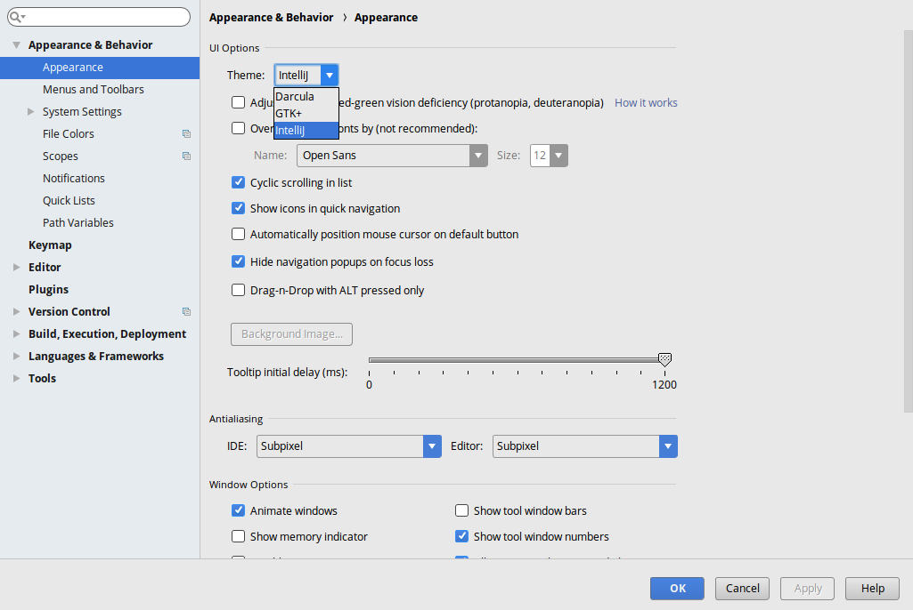

2. 設定編輯器字型、字級 (Font、Size)

    請選擇 Editor 底下的 Font，在右邊可以選擇字型 (Font)及字級 (Size)。順道一提，筆者最近的新寵是 Fira Code (別忘了勾 Enable font ligatures) 搭配稍大一點 (約 14-18)的字級。
    
    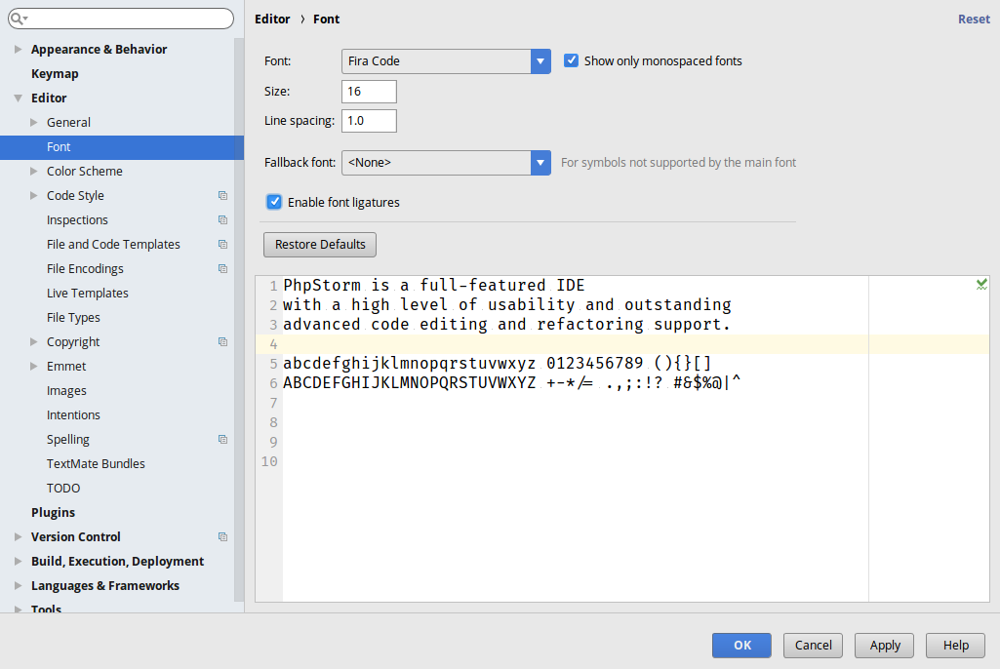

3. 設定程式碼色彩主題 (Color Scheme)

    PhpStorm 的程式碼色彩主題可以根據不同程式語言獨立設定，在這邊先示範如同設定統一的預設值。請選擇 Editor 底下的 Color Scheme，在右邊的 Scheme 下拉式選單裡選擇。
    
    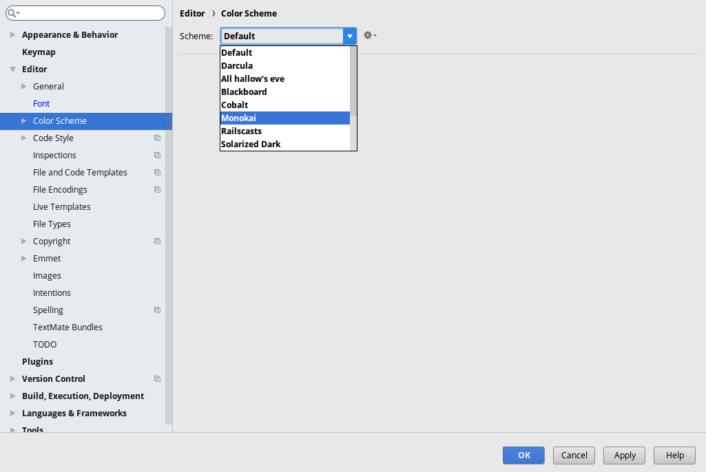

*註：所有 PhpStorm 的設定都是可以隨時調整的，所以若您跟筆者一樣三心二意、喜新厭舊也沒關係，選擇的當下別太糾結！*

## 外掛套件

JetBrains 已經將其旗下的 IDE 統整成名為 IntelliJ 的平台，其意指所有 IDE 間共享著同樣的開發方式及使用經驗，在這個平台上可以根據需求及語言特性開發外掛套件來擴充功能。換句話說，PhpStorm 其實就是 IntelliJ 家族裡，預先載好 PHP 相關外掛的 IDE 而已。

也因此，在 PhpStorm 上安裝外掛是再自然不過的事，官方也有外掛入口網站可供查詢。在這邊筆者延續這個系列的慣例，也在 PhpStorm 以安裝 Material Theme  做外掛套件安裝的示範。

首先一樣進入設定面板，選擇 Plugins。要注意一下的是，在這邊列出的是目前「已經」安裝的套件，要安裝新套件時，請先點選右邊區塊下方中間的「Browse repositories」按鈕：

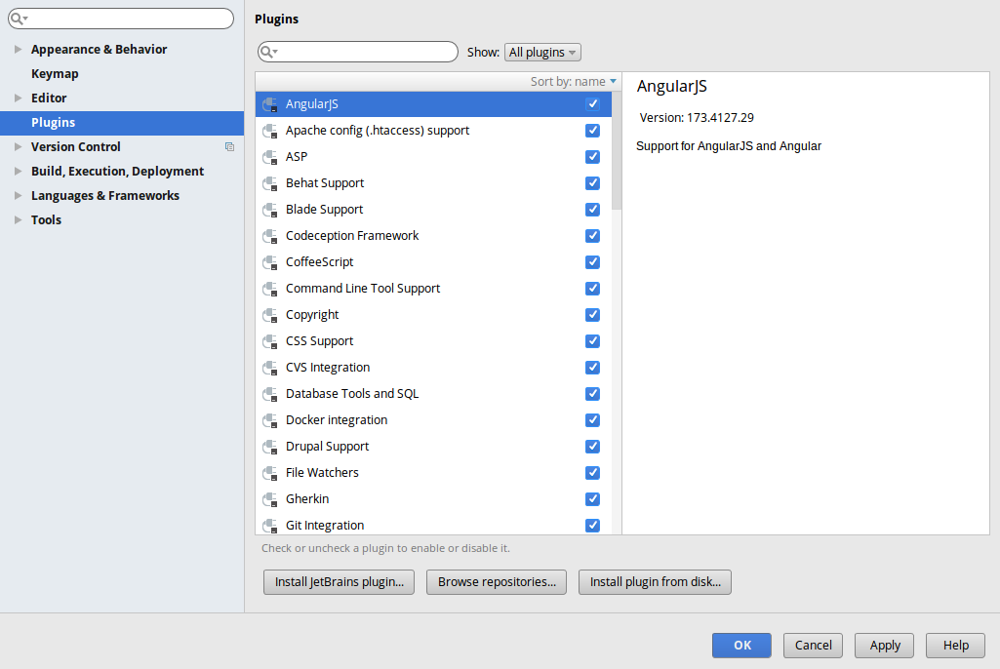

此時會再開啟一個子視窗，程式會去抓取官方套件庫的資料做列表。請在上方的搜尋框裡輸入「material」關鍵字，應該就會在下面的搜尋結果看到「Material Theme UI」這個外掛套件。請點選右邊綠色的安裝 (Install) 按鈕，PhpStorm 就會自動下載並安裝。

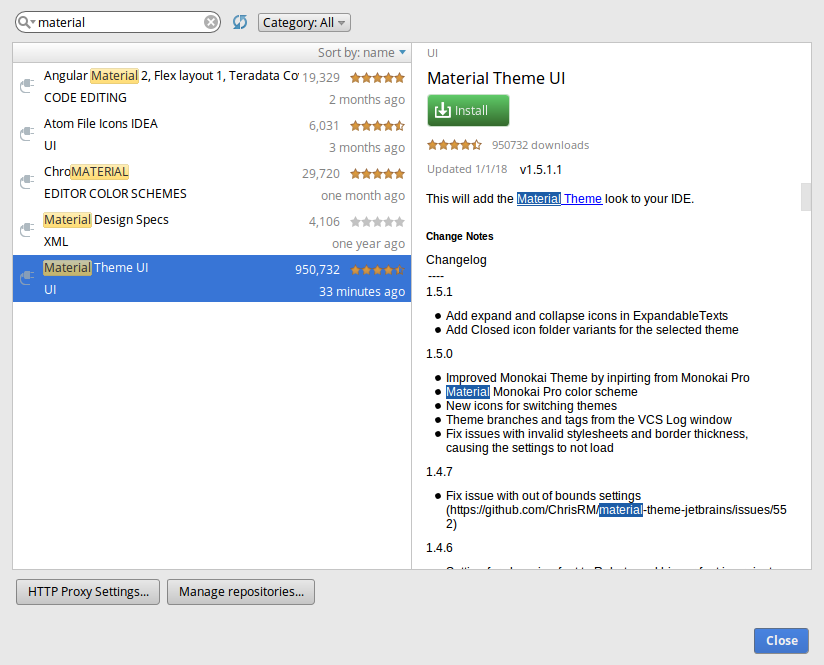

安裝完後會提示您重新啟動 PhpStorm，重開套用完佈景主題後看起來就像下圖：

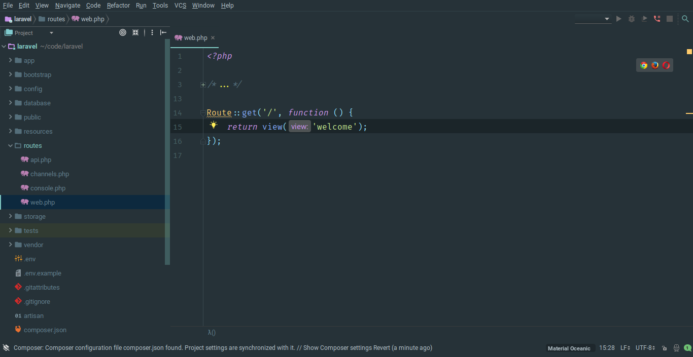

## 給 PHP/Laravel 開發者的推薦套件

由於 PhpStorm 天生就是針對 PHP 開發工作所設計的 IDE，所以內建的功能就已經非常夠用了，不太需要再裝什麼外掛。以下推薦的外掛套件大多是一些輔助工具，或是針對框架做進階支援：

1. [.ignore](https://plugins.jetbrains.com/plugin/7495--ignore) - 支援各種版本管理系統 (包括 git) ignore 檔案格式的自動樣板產生、語法提示及語法驗證

2. [EditorConfig](https://plugins.jetbrains.com/plugin/7294-editorconfig)- 支援 EditorConfig 跨編輯器的格式的語法/顯示提示及語法驗證

3. [PHP composer.json support](https://plugins.jetbrains.com/plugin/7631-php-composer-json-support) - 支援編輯 `composer.json` 檔案時的智能提示及語法驗證

4. [.env files support](https://plugins.jetbrains.com/plugin/9525--env-files-support) - 自動解析 `.env` 檔的內容，並在編輯 `env()` 時出現智能提示

5. [Laravel Plugin](https://plugins.jetbrains.com/plugin/7532-laravel-plugin) - 針對 Laravel 框架特性做更多智能提示

還記得筆者在初接觸 PhpStorm 時，對於其各項炫麗又殘暴的功能感到非常驚豔，一試成主顧。另外，即便 PhpStorm 是需要付費的商業軟體，仍獲得 PHPUnit 之父 Sebastian Bergmann **[在 Twitter 上的稱讚及推薦](https://twitter.com/s_bergmann/status/867709638829105153)**，其威力可見一斑。若您還沒有試過，建議您先下載試用版體驗一番，滿意的話歡迎加入訂閱鐵粉的行列。

從這篇簡短的介紹裡，相信讀者可以見識到 PhpStorm 在 Linux 上跨平台的表現。若您原本在其他平台就有使用 PhpStorm 的經驗，應該可以非常平順/無痛地把習慣帶過來。礙於篇幅和目標主題的設定，僅先針對安裝、設定及外掛套件三大部份做入門指引，更多參考資料就整理在文章末，希望對您能有所幫助。未來會再針對 PhpStorm 的進階功能做更深入的教學，敬請期待！而在 elementary OS 上安裝 PHP/Laravel 的程式碼編輯工具系列也在這邊告一段落。

您也是 PhpStorm 的鐵粉嗎？有沒有什麼密技或推薦外掛呢？歡迎留言與我交流！

## 參考資料

* [PhpStorm 官網](https://www.jetbrains.com/phpstorm/)
* [PhpStorm 官方文件](https://www.jetbrains.com/phpstorm/documentation/)
* [PhpStorm 官方套件平台](https://plugins.jetbrains.com/)
* [PhpStorm 官方 Youtube 頻道](https://www.youtube.com/user/JetBrainsTV/)
* [筆者之前針對使用 PhpStorm 開發 PHP/Laravel 所分享的簡報](https://medium.com/@shengyou/full-in-love-with-phpstorm-f6d484109978)
* [PhpStorm 非官方佈景主題平台](http://www.phpstorm-themes.com/)
* [PhpStorm 密技分享平台](http://phpstorm.tips/)
* [在 Linux 上解除安裝 PhpStorm](https://toolbox-support.jetbrains.com/hc/en-us/articles/115001313270-How-to-uninstall-Toolbox-App-)
