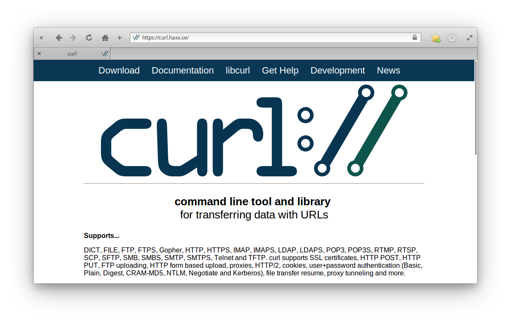
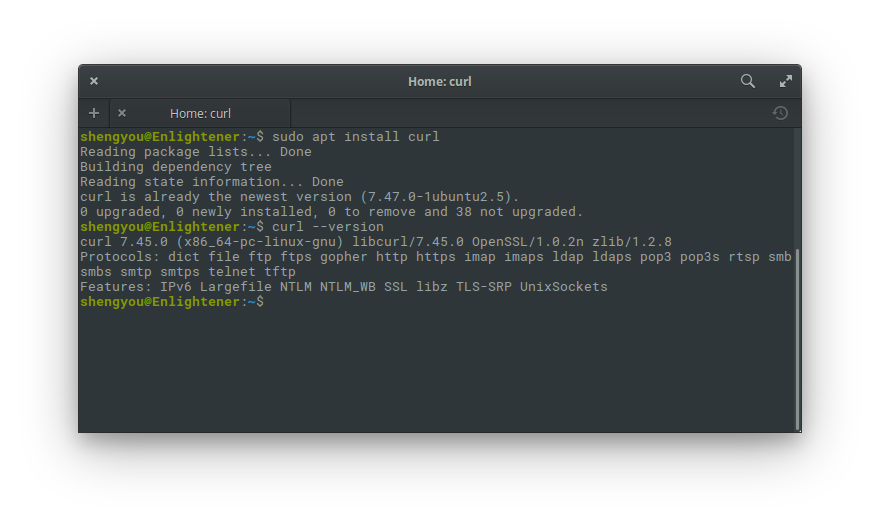
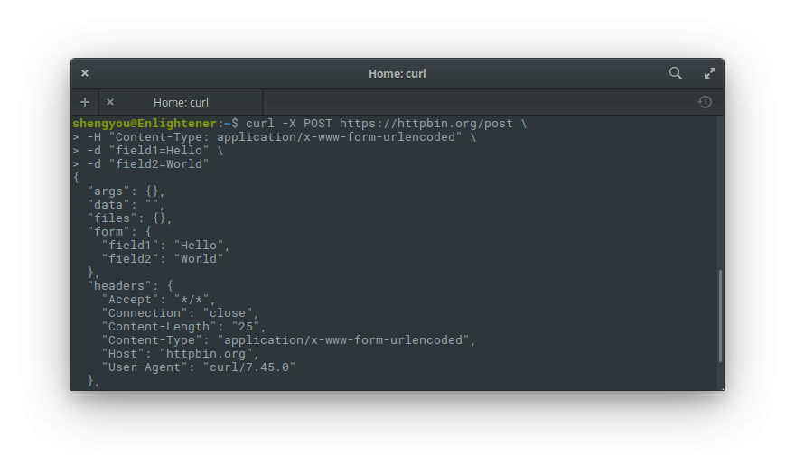
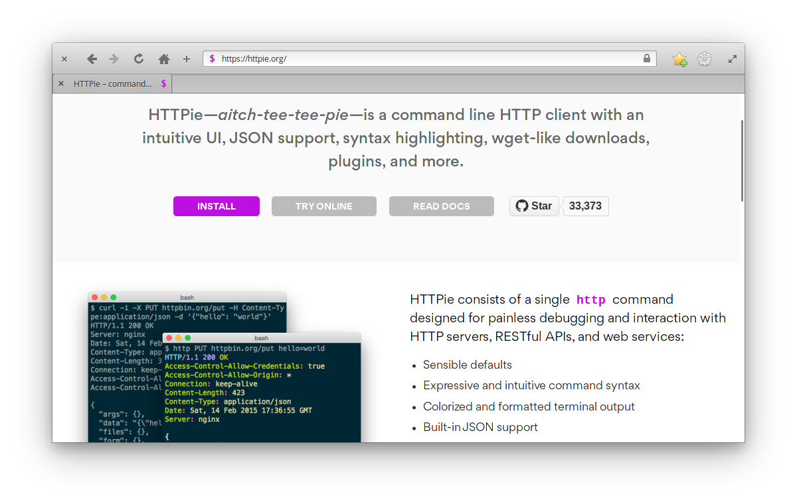
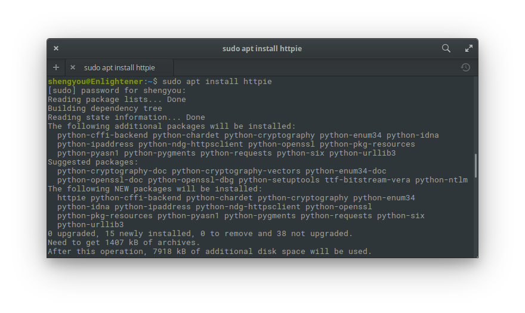
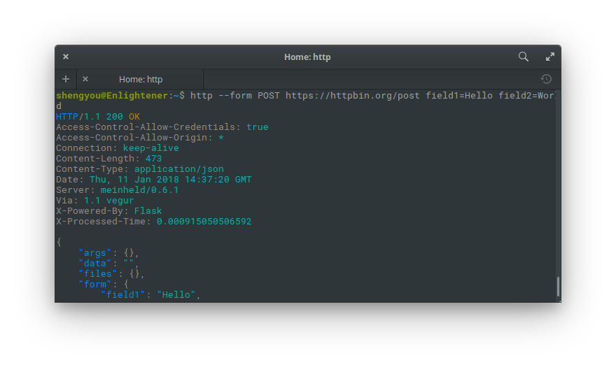
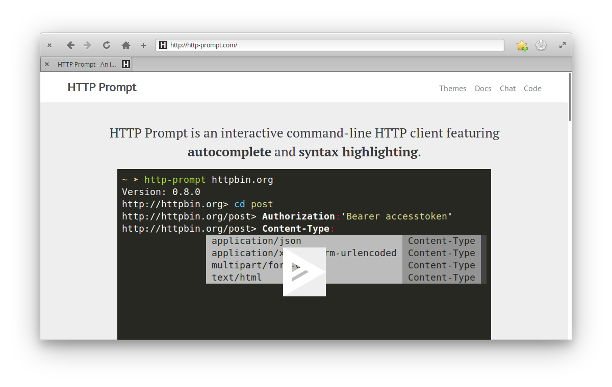
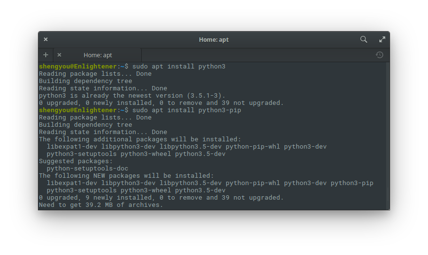
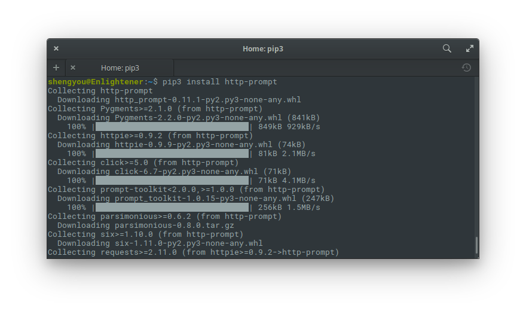

# 第 23 天：安裝/使用指令列 HTTP Client

在這個前、後端分離當道的年代，攻城獅們也默默地分成兩邊。以 PHP 程式語言來說主攻後端，換言之，當我們要跟前端攻城獅同步開發的時候，可能會因為暫時沒有畫面可以使用的關係，所以必需自己想辦法模擬前端介面的行為，這時候我們就會需要 HTTP Client 工具來做輔助。

所謂 HTTP Client 就是可以模擬 HTTP Request 的動作，透過它來執行諸如 `GET`、`POST`、`PUT`、`PATCH`、`DELETE` 等 HTTP 動詞 (Verb)，並在每一次的 Request 裡傳遞標頭 (Header) 及資料 (Data)。除了發送 Request 外，也要把接收到的 Response 顯示給我們做驗證與除錯。由於純後端 API 開發沒有畫面的這個特性，因此一個好的 HTTP Client 除了要能夠協助我們模擬 HTTP Request 的發送與接收外，最好還能夠在開發過程中提供更多的補助，如提示標頭的選項、參數自動補全、維持 Cookie 及 Session 的狀態；甚至顯示 Response 時，還能夠自動依據 Response 標頭自動格式化及語法高亮度顯示等。

在這篇介紹裡，筆者將示範如何使用指令列 HTTP Client。在示範的過程中，會將 HTTP Request 發到 [httpbin](https://httpbin.org/) 做測試。httpbin 是一個專門拿來測試 HTTP Request 的網路服務，只要依照文件發動 HTTP Request 到指定的路徑，就會將它收到的內容以 JSON 格式回傳，在測試 API 行為時非常好用。而我們的測試範例非常單純，就是發動一個 `POST` 動作到 `https://httpbin.org/post` 並以 `表單型式 (form-data)` 傳遞兩組資料 `field1=Hello`、`field2=World`。而筆者會展示三種指令列 HTTP Client 供評選，各位讀者可以在看完示範後，選一個自己喜歡的方案。

## 從 cURL 開始

只要提到指令列的 HTTP Client，相信您一定聽過 cURL 這個指令。cURL 是一個以 C 撰寫而成的函式庫，由於年資以高達 21 年，所以幾乎所有程式語言 (高達 40 種以上！) 都已經有原生綁定的對應函式庫，其廣適性及通用性可見一斑。



### 安裝 cURL

由於 cURL 實在老牌，各 Linux 發行版上一定都找得到套件，甚至預設就已經安裝。以 elementary OS 來說，也只需要一行 `apt` 指令就可以完成安裝，完成後可以檢查一下是否成功。

```bash
# 安裝 cURL
$ sudo apt install curl

# 驗證安裝版本
$ curl --version
```



### 用 cURL 發 POST Request

假如您輸入指令 `curl --help` 的話，應該可以發現 cURL 可以下的參數非常多 (多到你可能需要查個表、找份教學或是直接貼人家的範例)。以本篇的示範來說，我們至少要知道 `-X` 這個參數是指定使用的 HTTP 動詞、後面要接目標 URI；`-H` 是用來指定標頭的內容；而 `-d` 這個參數則是拿來傳遞資料，所以轉換成指令如下：

```bash
$ curl -X POST https://httpbin.org/post \
       -H "Content-Type: application/x-www-form-urlencoded" \
       -d "field1=Hello" \
       -d "field2=World"
```

若是成功完成的話，應該會收到 httpbin 回傳的 JSON 資料，裡面會把我們丟過去的資料再回傳給我們做確認，類似如下：



只要背下 cURL 的參數用途以及 HTTP Request 有哪些標頭可以指定，基本上就可以滿足我們 87% 左右的開發需求。若想看更多 cURL 操作 POST 動作的範例，筆者覺得 [這篇 gist](https://gist.github.com/subfuzion/08c5d85437d5d4f00e58) 寫得算是簡單易懂。

## 再探 HTTPie

cURL 雖然強大，但對筆者這種視覺系動物來說，又要背參數、回傳的格式又是如此單調，實在難受啊！所以就開始尋找有沒有比 cURL 更直覺、好看的方案呢？

果不其然，有一個以 Python 為基底的開放原始碼專案叫 HTTPie，就試圖提供更直覺的指令、內建語法高亮度，完全打中筆者的喜好！



## 安裝 HTTPie

HTTPie 雖然是一個 Python 套件，但因為官方已針對所有發佈方式都做好打包，所以在 elementary OS 只需要用 `apt` 即可輕鬆安裝，完成後可以檢查一下是否成功。

```bash
# 安裝 HTTPie
$ sudo apt install httpie

# 驗證安裝版本
$ httpie --version
```



### 用 HTTPie 發 POST Request

裝好 HTTPie 後就可以在終端機裡多一個 `http` 的指令，指令很直覺，只要在後面串上要使用的 HTTP 動作、URI 及資料即可，不太需要背參數。不過在我們的範例裡因為要模擬表單發送，所以前面要多加一個 `--form` 讓 HTTPie 幫我們自動設定標頭。

```bash
$ http --form POST https://httpbin.org/post field1=Hello field2=World
```



HTTPie 會幫我們把 Response 的內容自動格式化並把語法上色，看起來是不是比較賞心悅目呢？

## 國貨 HTTP Prompt

假如您覺得 HTTPie 就滿足筆者的話，那您實在太小看筆者對「華麗」這兩個字的期待了！HTTPie 雖然很語意的解決了參數問題，也漂亮的顯示了語法，但對於筆者這種螞蟻腦，HTTP 標頭及認證標頭怎麼可能背得起來；而且每次輸入指令都得打一長串，輸入得戰戰競競的，這…不科學啊！有沒有可能來個互動式終端機+自動語法提示呢？

有時候你會很驚訝原來你天馬行空的想法還真的有人做出來！在一次偶然的臉書刷牆日常裡，筆者發現這套整合了 HTTPie、互動語法提示介面的 HTTP Prompt！而且還意外的發現作者是台灣人 [Chang-Hung Liang](https://github.com/eliangcs)！



## 安裝 HTTP Prompt

HTTP Prompt 需要透過 Python 的套件管理庫 pip 來安裝，所以在安裝前先確認一下自己有沒有 Python 及 pip：

```bash
# 安裝 Python 3 及 pip
$ sudo apt install python3
$ sudo apt install python3-pip

# 驗證安裝版本
$ python3 --version
$ pip3 --version
```



確認有 pip 後，就可以用 pip 來安裝 HTTP Prompt：

```bash
$ pip3 install http-prompt
```



### 用 HTTP Prompt 發 POST Request

HTTP Prompt 這種互動介面實在難以言喻啊！請讓我也用互動的方式來呈現它：


一言以蔽之，HTTP Prompt 就是個 HTTPie 的增強版，小試了一下後覺得作者真是太有才了！在試過以上這些指令列 HTTP Client 後說它是「最好的選項，沒有之一」也不為過啊！

經過了這一篇的介紹，不知道對您用指令列來發 HTTP Request 有沒有幫助？希望能讓你在開發 API 時更有生產力。若您有更好的私房工具想要分享給筆者，歡迎留言交流！

## 參考資料

* [cURL 官網](https://curl.haxx.se/)
* [cURL 在 Wikipedia 上的條目](https://en.wikipedia.org/wiki/CURL)
* [HTTPie 官網](https://httpie.org/)
* [HTTP Prompt 官網](http://http-prompt.com/)
* [HTTP Prompt 作者在 PTT 上發表的開發心得](https://www.ptt.cc/bbs/Python/M.1467897513.A.F6C.html)
* [httpbin 網路服務](https://httpbin.org/)
