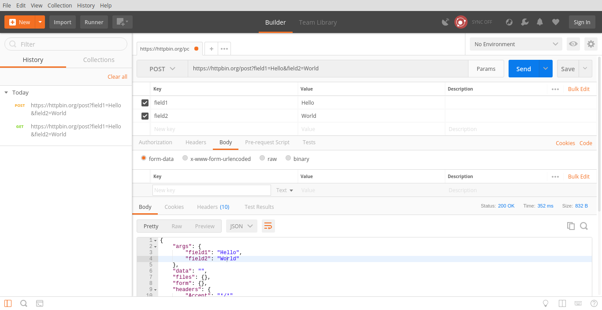
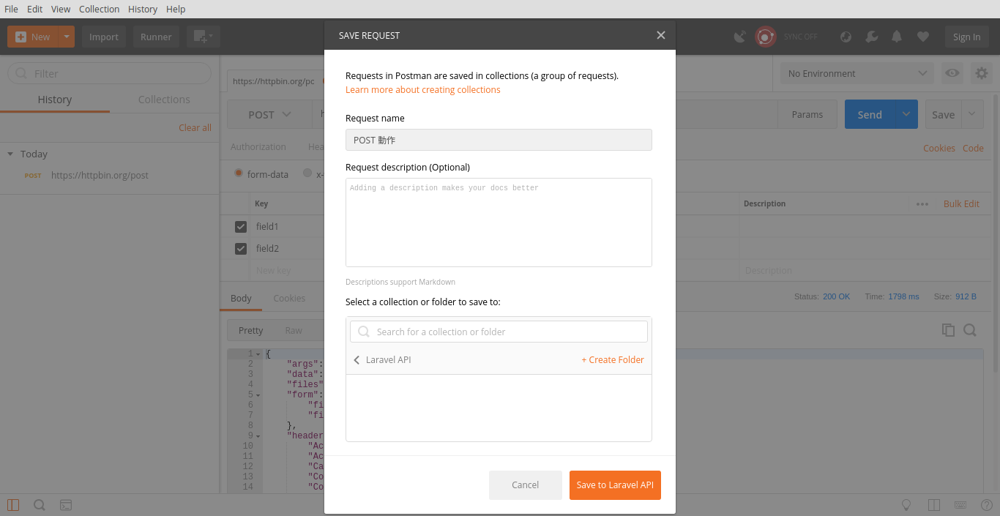

# 第 24 天：安裝/使用 Postman

我們當然可以用像 cURL、HTTPie、HTTP Prompt 等這種指令列的 HTTP Client 來做 API 開發，但這個系列不就說好是視覺系了嗎？不介紹個圖形介面工具說不過去對吧？

是的，即便是在 Linux 上，也是有好用又好看的 HTTP Client 可以選擇。以 API 開發來說，最知名也老牌的應該就屬 Postman 了。早期 Postman 其實是一個 Chrome App，也就是說原本 Postman 只是一個 Google Chrome 瀏覽器裡的外掛，隨著需求及功能愈做愈完整，加上 Chrome App 這種軟體釋出方式也逐漸式微，現在 Postman 改以 Native App 的方式獨立發行，其底層採用 Electron 技術，所以跨平台完全沒有問題。在這篇介紹裡，筆者就要來示範如何在 elementary OS 上安裝 Postman 來做 API 開發。

## 下載/安裝 Postman

首先，請打開瀏覽器，輸入網址：https://www.getpostman.com/ 到 Postman 官網，選擇 Linux 按鈕底下的 x64 版本下載。


官方下載下來的檔案是 `Postman-linux-x64-5.5.0.tar.gz`，只是個單純的 `.tar.gz` 壓縮檔。雖然可以直接解壓縮執行來用，不過為了後續管理方便，這邊依照 Linux 的慣例把它手動安裝到 `/opt` 底下。請打開終端機後，以 root 權限執行以下指令：

```bash
$ sudo tar -zxvf ~/Downloads/Postman-linux-x64-5.5.0.tar.gz -C /opt
```


為了方便我們可以在應用程式選單裡有圖示可以點選，可以在 `~/.local/share/applications/` 底下建立應用程式啟動捷徑 (launcher)。請執行 `$ vim ~/.local/share/applications/postman.desktop` 後輸入以下程式碼：

```
[Desktop Entry]
Version=5.5.0
Type=Application
Name=Postman
Icon=/opt/Postman/resources/app/assets/icon.png
Exec=/opt/Postman/Postman
Comment=Postman
Categories=Development;
Terminal=false
Encoding=UTF-8
```


完成後 `:wq` 存檔離開後，再進入應用程式選單就可以看到 Postman 的圖示了。


點擊圖示就可以啟動 Postman，看到主畫面了。


*註：第一次啟動時會出現登入 Postman 帳號的提示，您可以視需求註冊或跳過*

(選擇性動作) 假如您希望可以在終端機以 `postman` 指令直接啟動 Postman 的話，可以在 `/usr/bin` 建立 Symbolic Link：

```bash
$ sudo ln -s /opt/Postman/Post /usr/bin/postman
```


## 使用 Postman

有了 Postman 後，要模擬 HTTP 動作就很簡單了。在這邊針對發 Request、整理動作成 Collection 及 API 測試三點做簡單的介紹，示範的過程一樣用 httpbin 當目標。

### 發 Request

Postman 最主要的功能就是模擬發動 HTTP Request，所以主面板上的所有設定都是跟 HTTP 動作有關，比方說我們要發動一個 `POST` 動作到 `https://httpbin.org/post` 並以 `表單型式 (form-data)` 傳遞兩組資料 `field1=Hello`、`field2=World`，則依照我們的情境設定 Postman 如下圖：



然後再按下右邊藍色傳送 (Send) 的按鈕，Postman 就會發動這個 Request 並把回傳的結果顯示在下面的面板，我們從面板上的資訊就可以知道自己的動作是否成功。

### 整理成 Collection

Collection 在 Postman 裡就是「專案」或「資料夾」的概念，比方說我們有一個名為「Laravel API」的專案，裡面分別有 `GET`、`POST`、`PATCH`、`DELETE` 四個 Request 動作。我們就可以把這四個 Request 動作整理在一個 Collection 裡，方便我們管理。

整理成 Collection 的方式很簡單，就是先把自己要做的 Request 設定好後，按下傳送 (Send) 按鈕旁邊的儲存 (Save) 按鈕，然後就會出現存檔面板，依照面板上的提示新增 Collection，並把 Request 歸檔到該 Collection 下即可，如下圖：



完成後 Collection 裡就會有所有歸屬的 Request，如下圖：


### API 測試

Postman 不僅僅是個 HTTP Client，現在官方已經把它發展成全功能的 API 開發工具，其中一塊就是 API 測試。也就是說，您可以針對每一個 Request 回傳的結果寫測試，每次發動 Request 後，Postman 可以依照您的測試程式碼來驗證結果。比方說我們想要測試剛剛的 POST 動作有沒有正確，只要在該 Request 設定裡，切換到 Tests 面板，在裡面用 Javascirpt 寫測試程式碼，而每次發動 Request 完，Postman 就會顯示紅燈及綠燈的結果，如下圖：


甚至 Postman 還可以針對一整個 Collection 的 Request 做批次執行與測試，只要將 Collection 面板展開，點選執行 (Run)，就會開啟 Postman Runner 視窗：


在視窗上選定要跑的 Collection、要跑幾次、每次間隔多久等設定，再按執行 (Run)，Postman 就會依照設定開始執行所有動作，並把結果顯示在面板上，如下圖：


Postman 的功能不僅於此，若是註冊帳號的話，還可以同步自己的設定到所有其他裝置上的 Postman。若是使用付費版的話，還可以整合多人協作、文件製作/產生、Mock Server 等團隊合作的功能，愈來愈強大了。

您也是 Postman 的愛用者嗎？有沒有什麼密技或特性是我沒介紹到的呢？歡迎留言與我交流！

## 參考資料

* [Postman 官網](https://www.getpostman.com/)
* [Postman 官方文件](https://www.getpostman.com/docs/)
* [Postman 官方教學 Youtube 頻道](https://www.youtube.com/playlist?list=PLM-7VG-sgbtCJYpjQfmLCcJZ6Yd74oytQ)
* [在 Linux 上安裝 Postman 教學](https://blog.bluematador.com/posts/postman-how-to-install-on-ubuntu-1604/)
