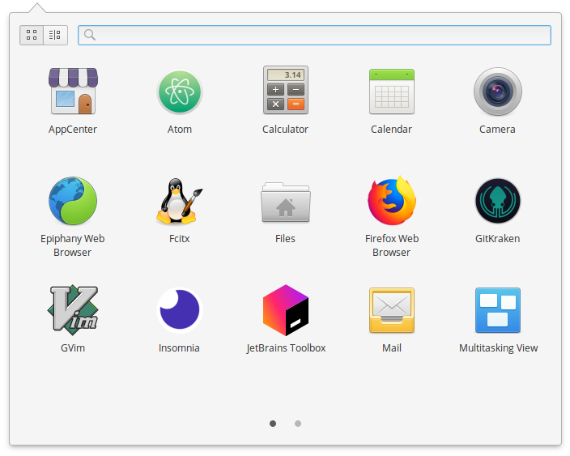

# 第 25 天：安裝/使用 Insomnia

在 Postman 出來之前，在 Linux 上要找到一個不是指令列、介面好看的 HTTP Client 還真的沒什麼像樣的選擇，許多類似的選項也大多都以瀏覽器外掛的方式提供，而非獨立應用程式，甚為可惜。不過，現在這個現況有些改變，最近讓筆者眼睛一亮的，是 Insomnia 這個專案。

Insomnia 是近期出現的一個 HTTP Client，它具備好看的圖形化介面、跨平台的特性，吸引了筆者的目光。更讓人驚訝的是，它是一個用 Electron 打造的開放原始碼專案，這意味著您不僅可以免費使用這個軟體，甚至還可以參與貢獻或是改造它！

在這篇介紹裡，就讓筆者帶著大家來一探這個新的選項，看看它可以在我們的開發流程中帶給我們什麼樣的幫助，以及操作體驗如何？

## 下載/安裝 Insomnia

Insomnia 官方除了提供跨平台的版本供下載外，針對 Linux 也非常有誠意的提供了多種安裝格式，包括 `.deb`、`apt` 套件管理庫、`AUR` 套件管理庫及 `AppImage` 這種新式的打包檔 (Postman 你看看你…)。

由於 elementary OS 是 Debian 流派，所以用 `.deb` 或是 `apt` 安裝都可以，在這邊很快速的提示兩種作法：

### 使用 `.deb` 安裝

請先打開瀏覽器，至 Insomnia 官網下載頁：https://insomnia.rest/download ，然後選擇 Ubuntu 14.04+ 的下載選項，將 `insomnia_5.12.4_amd64.deb` 這個檔案下載下來。


接著開啟終端機，用以下指令進行安裝：

```bash
$ cd ~/Downloads
$ sudo apt install ./insomnia_5.12.4_amd64.deb
```


### 使用 `apt` 安裝

Insomnia 官方也有支援 `apt` 從 source 安裝，只要用以下指令將 key 及 source list 加入，就可以直接用 `apt` 來安裝：

```bash
$ echo "deb https://dl.bintray.com/getinsomnia/Insomnia /" | sudo tee -a /etc/apt/sources.list.d/insomnia.list
$ wget --quiet -O - https://insomnia.rest/keys/debian-public.key.asc | sudo apt-key add -
$ sudo apt update
$ sudo apt install insomnia
```


不論是用以上哪種方式安裝，安裝完後就會可以在應用程式列表裡看到 Insomnia 的圖示。



點擊後就可以啟動並看到主畫面。


## 使用 Insomnia

接著延續這個系列的範例，來簡介一下 Insomnia 的操作方式：假設我們要發動一個 `POST` 動作到 `https://httpbin.org/post` 並以 `表單型式 (form-data)` 傳遞兩組資料 `field1=Hello`、`field2=World`。

### 發 Request

依照這個的情境，我們要先在 Insomnia 上建立一個 Request。您可以按面板上的 New Request 按鈕或快速鍵 `Ctrl`+`N`。先命名為「POST 動作」、選擇動詞為「POST」及方式採「Form URL Encoded」後按下建立 (Create) 按鈕。


再來在主畫面上方輸入目標網址為 `https://httpbin.org/post` 以及在下方的 Form 分頁裡輸入兩組資料的 key 及 value 後按下送出 (Send)，然後回傳的結果就會顯示在最右邊的面板裡。


### 整理成資料夾、區分工作區

在 Insomnia 裡也支援將多個 Request 設定分類到資料夾裡，只要按下側邊欄上的「+」按鈕，就可以選擇新增資料夾，輸入資料夾名稱後就可以透過滑鼠拖曳的方式將 Request 歸屬在資料夾內並排序。


不僅如此，Insomnia 還可以做成多個工作區，只要按下左上方紫色 Insomnia 區塊的按鈕，就可以呼叫出下拉式選單，選擇建立新工作區 (New Workspace)，輸入名稱就可以有一個全新不受影響的工作區，可以在新的工作區內有新的資料夾及 Request。若有需要再透過一樣的選單就可以切換不同的工作區，非常方便。


Insomnia 還有其他更多的功能，包括輸出/匯入 Request 檔、變更佈景主題 (視覺系最愛)、雲端同步甚至還支援外掛程式。不過部份進階功能是需要另外採訂閱制付費的，假如您喜歡這套 HTTP Client 的話，不妨支持一下作者開發喔！

經過這篇的介紹，不知道您的決策天平有因此開始傾斜嗎？對 Insomnia 的印象如何呢？歡迎留言與我交流！

## 參考資料

* [Insomnia 官網](https://insomnia.rest/)
* [官方文件](https://support.insomnia.rest/)
* [官方 Linux 安裝指南](https://support.insomnia.rest/article/23-installation#ubuntu)
