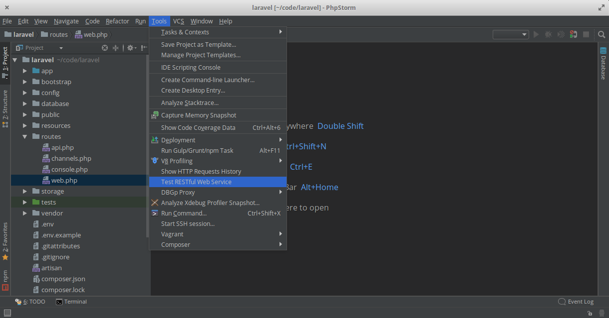

# 第 26 天：使用 PhpStorm 內建的 REST Client 功能

很多時候，我們跟自己所使用的工具其實並不太熟對吧？假如您去問已經有在使用 PhpStorm 的開發者，跟他/她說其實 PhpStorm 早就內建 REST Client 時，我相信大部份人的反應一定都是[黑人問號](https://www.google.com.tw/search?q=%E9%BB%91%E4%BA%BA%E5%95%8F%E8%99%9F)！

是的，您沒聽錯，PhpStorm 早就內建 REST Client 了。也就是說，假如您已經習慣使用 PhpStorm，您大可以不必再另外開其他的 HTTP Client 應用程式，而是直接在您熟悉的開發工具內做 HTTP Request 測試。甚至，PhpStorm 在 2017.3 的新版本裡，還支援了以編輯 `.http` 檔案的方式做 HTTP Request。在這篇介紹裡，筆者將會大家介紹這兩種可以提升生產力的兩個工具。

*註：本文以 PhpStorm 2017.3.2 版本做示範*

## 使用 REST Client 面板

當我們用 PhpStorm 開啟一個專案後，就可以透過上方的功能選單，選擇 Tool 底下的 Test RESTful Web Service，開啟 REST Client 面板。REST Client 面板會出現在畫面的下方 (應該會在 Terminal 或 Version Control 的右邊)。



我們一樣用這個系列的範例，來簡介一下 REST Client 面板的操作方式：假設我們要發動一個 `POST` 動作到 `https://httpbin.org/post` 並以 `表單型式 (form-data)` 傳遞兩組資料 `field1=Hello`、`field2=World`。REST Client 的面板也很直覺，直接照著需求填寫表單即可，如下圖。


接著，就按下面板左上方錄色的播放按鈕，REST Client 就會照著我們的設定發動 HTTP Request，然後把 Response 的結果顯示在面板裡，並且會自動依據回傳的 Header 做格式化 (若自動辨識失敗的話，仍可以手動切換 Text、JSON、HTML 及 XML 四種格式)。


REST Client 用起來體驗其實跟 Postman 或 Insomnia 差不多，比較美中不足的是，沒有類似的 Collection 或 Folder 的設計。不過可以透過面板左邊按鈕群裡的藍色空心向左箭頭來重送最近執行的 Request (快速鍵 `Ctrl`+`E`)。另外，REST Client 也支援輸出/匯入設定檔 (`.xml`)，所以若是不同專案或專案成員之間想要共享/同步的話，可以直接將設定檔存在專案內透過版本管理來傳送。

## 直接在編輯器裡發動 HTTP Request

有別於在 REST Client 面板裡透過表單填寫及一堆滑鼠點擊，對於開發者來說，直接用鍵盤輸入來發動 HTTP Request 或許來得更直接。從 2017.3 這個版本開始，PhpStorm 新增了一種新的觸發 HTTP Request 的方式，就是直接在編輯器裡撰寫 HTTP Request 設定 (參考 [RFC 2616](https://www.w3.org/Protocols/rfc2616/rfc2616.html) 及取而代之的 [RFCs (7230-7237)](https://tools.ietf.org/html/rfc7230))、直接在編輯器裡執行和除錯。聽起來很玄？筆者帶著您做一次！

首先，直接開始一個新的 Scratch 檔案，選擇檔案類型為 HTTP Request。


新增後，PhpStorm 就會開啟一個獨立的編輯器視窗，然後就可以開始輸入您想要發動的 HTTP Request 設定，在輸入的過程中，PhpStorm 會一如以往的發揮它強大的自動語法提示功能。


依照我們的範例，輸入程式碼如下：

```
### POST 動作
POST https://httpbin.org/post?field1=Hello&field2=World
Content-Type: application/x-www-form-urlencoded
```

接著，您可以按金 POST 字樣左邊的錄色播放鍵按鈕，或是在 POST 那一行用快速鍵 `Alt`+`Enter` 呼叫出執行 (Run) 選單，PhpStorm 就會依照設定觸發 HTTP Request。Response 的結果會以面板的型式出現在下方，並且自動依據 Header 格式化。同時，也會將結果存在一個暫存檔。


您可以執行多次來測試 Response 的結果，甚至還可以比較每次 Response 間的差異。


在 Request 格式裡，支援用 `###` 來區隔多個不同的 HTTP Request。若您想要瀏覽歷史的 HTTP Request 紀錄的話，可以用功能選單 Tools 底下的 Show HTTP Requests History 調出所有紀錄。


當所有測試都完成後，可以使用上方功能表 Refactor 底下的 Move 將 Request 移到正式的專案檔案裡儲存 (副檔名為 `.http` 或 `.rest`)。


有了這樣的設計，您就可以把這個檔案當成 API 文件來寫，示範每一個 API 的呼叫方式，再透過版本管理來做傳遞和散佈，是不是能讓開發工作更加輕鬆和快速呢？HTTP Request 這個格式甚至還支援環境變數的設計，若檔案內有些參數是固定的，可以透過變數的方式動態載入，讓開發流程更加的彈性。

不知道透過這樣的介紹，是不是能讓您對 PhpStorm 強大的功能有更深入的認識呢？假如您開發時覺得要切換多個應用程式很麻煩、想要一套打到底的話，使用 PhpStorm 內建的 REST Client 功能應該可以讓您輕鬆許多。

在這個 API 開發系列裡，介紹了幾個不同的 API 開發工具，不知道您比較偏好哪一種呢？歡迎留言與我交流。

## 參考資料

* [REST Client 介紹](https://blog.jetbrains.com/phpstorm/2013/02/using-the-rest-client-within-phpstorm/)
* [REST Client 面板官方文件](https://www.jetbrains.com/help/idea/rest-client-tool-window.html)
* [Editor-based Rest Client 功能介紹](https://blog.jetbrains.com/phpstorm/2017/09/editor-based-rest-client/)
* [REST Client in PhpStorm Code Editor 官方文件](https://www.jetbrains.com/help/phpstorm/rest-client-in-phpstorm-code-editor.html)
* [PhpStorm 2017.3 新功能 一覽表](https://www.jetbrains.com/phpstorm/whatsnew/#v2017-3-new-rest-client-interface)
* [PhpStorm 2017.3 新功能介紹 (影片)](https://www.youtube.com/watch?v=rA9pkfyrVXI)
* PhpStorm 2017.3 EAP 介紹：[介紹 1](https://blog.jetbrains.com/phpstorm/2017/09/phpstorm-2017-3-early-access-program-is-open/)
、[介紹 2](https://blog.jetbrains.com/phpstorm/2017/12/phpstorm-2017-3-3-eap-173-4301/)
