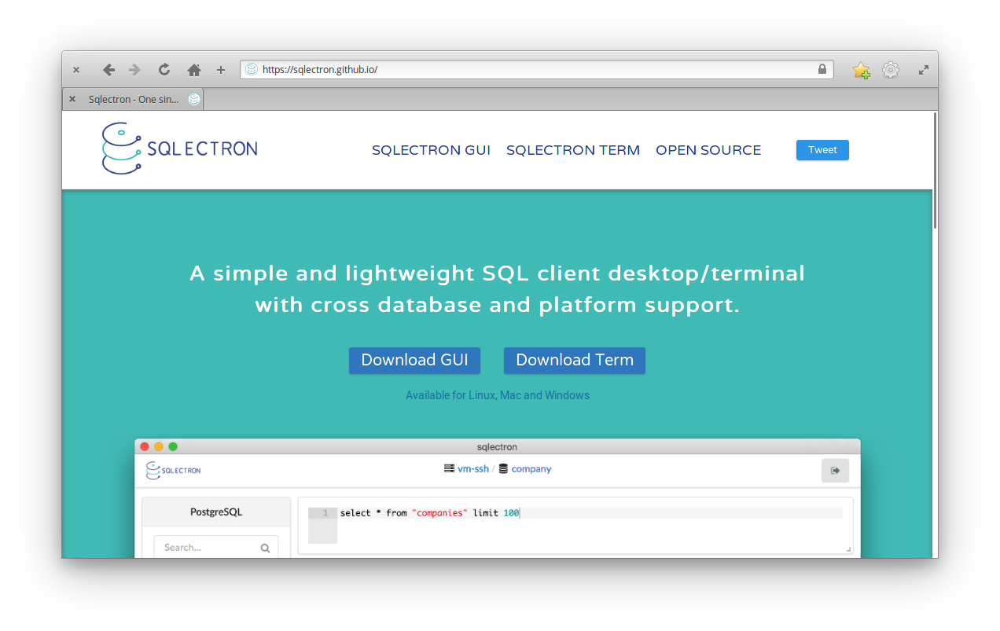
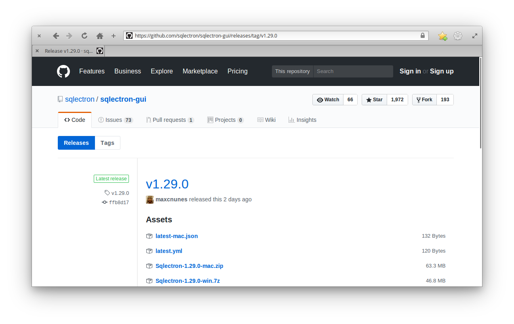
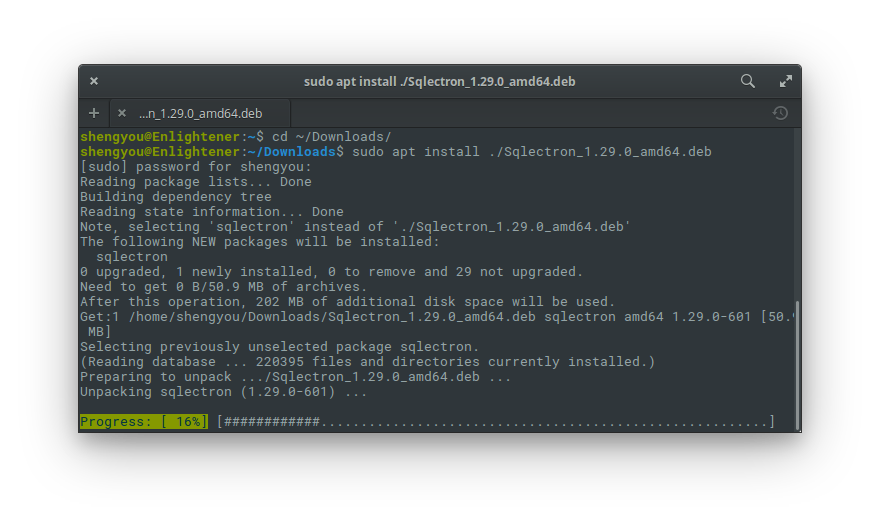
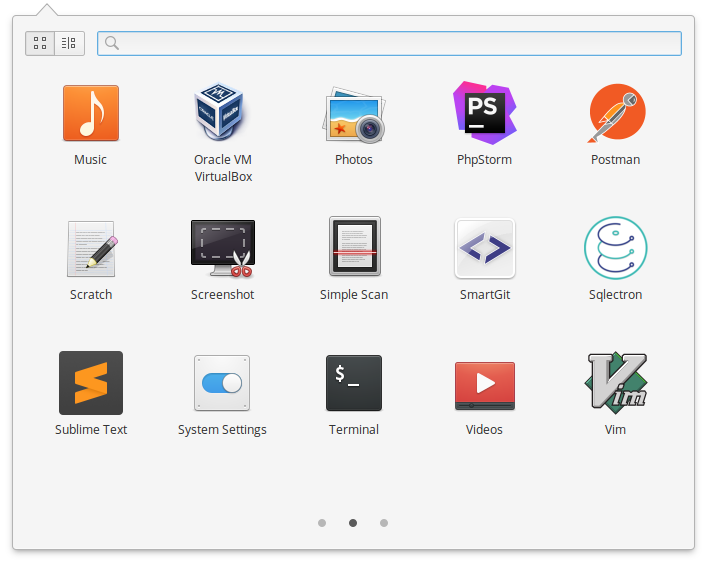
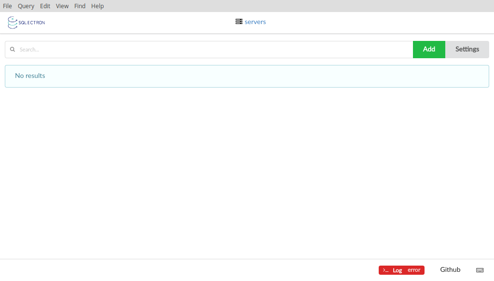
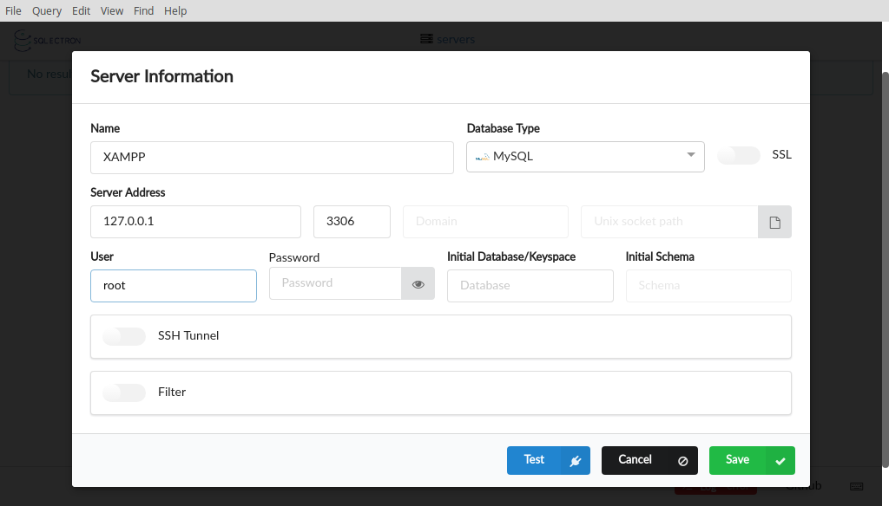
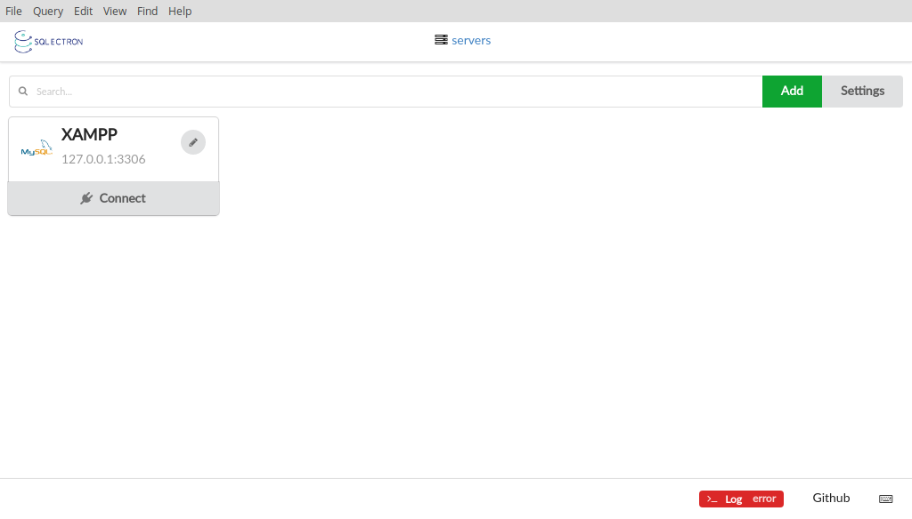
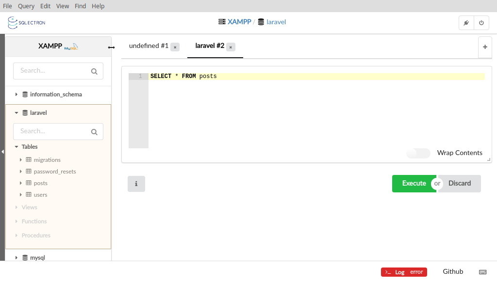
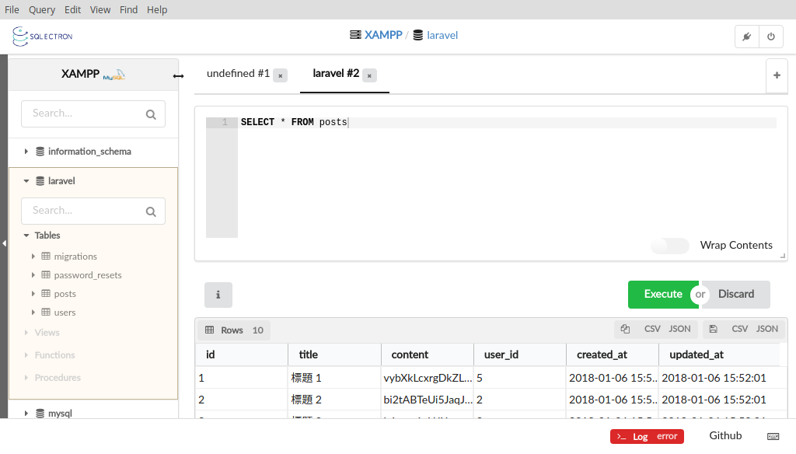

# 第 27 天：安裝/使用 Sqlectron 管理資料庫

以 PHP/Laravel 這種後端程式語言，主要打交道的對象多以資料庫為主。早期因為 PHP 大多搭配 MySQL，所以若不用指令列操作資料庫的話，常見的選項就是使用 phpmyadmin。但隨著需求愈來愈多元，需要介接的資料庫也從單一的 MySQL 到 MariaDB、PostgreSQL、SQLite 甚至 Microsoft SQL Server、Oracle…等，只靠特定平台、僅支援單一資料庫的 Client 已經不夠用了。這時候，尋找跨作業系統平台、可支援多種資料庫、獨立應用程式 (非 Web 應用程式)、有圖形化介面的 SQL Client 端就變得很重要了。在這次介紹裡的最後一個系列，筆者將會各位介紹幾個可以符合以上需求的 SQL Client 端，希望能讓您在開發資料庫應用程式時可以更加順手簡便。

筆者在觀察市面上符合上述需求的 SQL Client 好一段時間後，總算在前一陣子蒐集到幾個心儀的選項。其中，在這個口袋名單裡的，就是這個用 Electron 技術打造而成的 Sqlectron。Sqlectron 是由 Javascript 所撰寫，支援多種資料庫 (MySQL、PostgreSQL、SQLite、Microsoft SQL Server)，且有好看的圖形化介面的 SQL Client。官方甚至做出來兩種圖形化介面：GUI 版及 Terminal UI 版，一種心願滿足兩種風格。在這篇介紹裡，筆者將帶著大家安裝並使用 Sqlectron 來連線至 MySQL 做示範。



*註：本文以 Sqlectron 1.29.0 GUI 版本做示範*

## 下載/安裝 Sqlectron

Sqlectron 官方提供多個跨平台的版本供下載，請先連至 [官方 Github 下載頁面](https://github.com/sqlectron/sqlectron-gui/releases/) 下載最新版本 (文章撰寫時最新版本為 1.29.0)。



由於 elementary OS 是 Debian 流派，所以直接下載 `.deb` 應該是最簡單且容易安裝的版本。下載後，以 `apt` 指令安裝：

```bash
$ cd ~/Downloads
$ sudo apt install ./Sqlectron_1.29.0_amd64.deb
```



安裝完成後，就可以在應用程式選單裡看到圖示。



點選圖示後就可以啟動 Sqlectron。



## 使用 Sqlectron 連線至 MySQL

一般來說，使用 SQL Client 的流程都大同小異，不外乎就是三步：建立連線 (選擇 Data Source 及設定連線資訊)、下 Query、取得結果。

### 建立連線

當然，使用 Sqlectron 也無例外，第一件事就是建立連線，請先按下右上角綠色的新增 (Add) 按鈕：



依自己的資料庫資訊做設定 (圖中範例是以 XAMPP 為例)，輸入完畢後，可以按下下方的 Test 做連線測試，沒有問題的話就儲存 (Save)，然後就可以在主畫面看到剛剛設定好的連線來源。當然，您可以依照您的需求增加多個連線來源。



接著就按下想要連線的目標來源的連線 (Connect) 按鈕建立連線。


### 下 Query

連線建立完成後，就會進入資料庫主畫面。主畫面的左邊是資料庫列表，展開資料庫後會列出該資料庫所有的資料表，再展開就可以看到所有資料表的欄位設定；右邊則是可以直接寫 SQL 語法的地方。比方說我們想要查詢 `laravel` 這個資料庫裡 `posts` 這張資料表。則先點選左邊資料庫列表裡的 `laravel`，Sqlectron 的開啟一個新的 Query 功能分頁，並在 Query 輸入框裡輸入 `SELECT * FROM posts`，完成後按下右下角綠色的執行 (Execute) 按鈕。



*註：若覺得手工輸入 SQL 語法很苦的話，可以在設定裡將 auto complete 的功能打開，會稍為輕鬆一些。*

### 取得結果

執行完成後，Sqlectron 就會在下方顯示 Query 的結果，若您需要的話，還可以選擇性的以 CSV 或 JSON 格式複製到剪貼簿或匯出成檔案。



從這篇介紹裡，應該就可以看到 Sqlectron 在做跨平台圖形化 SQL Client 的潛力。雖然目前提供的視窗操作及輔助功能仍有限，但以日常查詢工作來說也堪用，相信未來官方會逐步完善，也歡迎您參與貢獻。您平常有慣用的 SQL Client 嗎？歡迎留言與我交流！

## 參考資料

* [Sqlectron 官網](https://sqlectron.github.io/)
* [Sqlectron 支援的資料庫清單](https://github.com/sqlectron/sqlectron-core#current-supported-databases)