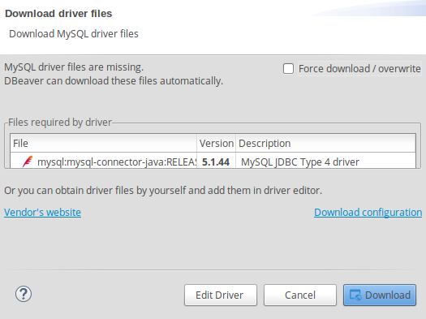

# 第 28 天：安裝/使用 DBeaver 管理資料庫

雖然有很多 SQL Client 可以操作資料庫，但若仔細觀察會發現能滿足跨平台、支援眾多主流資料庫系統、以圖形化介面操作資料、提供多種匯入輸出方式且以獨立應用程式運作的選擇還真沒幾個！

DBeaver 是筆者經過一段時間蒐集、過濾後唯三留下來的選項。其以 Java 為基底開發，從官方網站、版本號、Github commit 及 issue 回覆的狀況來看都是個仍在穩健開發的專案。因此，在這篇介紹裡，筆者將帶著大家安裝並使用 DBeaver 來連線至 MySQL 做示範。


*註：本文以 DBeaver Community Edition 4.3.1 版本做示範*

## 下載/安裝 DBeaver

DBeaver 官方提供多個跨平台的版本供下載，而因為 elementary OS 是 Debian 流派，所以用 `.deb` 或是 `apt` 安裝都可以，在這邊很快速的提示兩種作法：

### 使用 `.deb` 安裝

請先打開瀏覽器，並連至 [官方下載頁面](https://dbeaver.jkiss.org/download/) 選擇 [`Linux Debian package 64 bit (installer)`](https://dbeaver.jkiss.org/files/dbeaver-ce_latest_amd64.deb) 下載即可。


接著開啟終端機，用以下指令進行安裝：

```bash
$ cd ~/Downloads
$ sudo apt install ./dbeaver-ce_latest_amd64.deb
```


### 使用 `apt` 安裝

DBeaver 官方也有支援 `apt` 從 source 安裝，只要用以下指令將 key 及 source list 加入，就可以直接用 `apt` 來安裝：

```bash
$ sudo add-apt-repository ppa:serge-rider/dbeaver-ce
$ sudo apt update
$ sudo apt install dbeaver-ce
```


不論是用以上哪種方式安裝，安裝完後就會可以在應用程式列表裡看到 DBeaver 的圖示。


點擊後就可以啟動並看到主畫面。


## 使用 DBeaver 連線至 MySQL

接著，就照我們的基本三步：建立連線 (選擇 Data Source 及連線資訊)、下 Query、取得結果來示範 DBeaver 的操作介面與流程。

### 建立連線

首先點選功能表檔案 (File) 底下的新增 (New)，出現對話框，請選擇 DBeaver 底下的資料庫連線 (Database Connection)：


接著選擇資料庫類型，本篇示範以 MySQL 為例：


接著填寫連線資訊，包括 `Host`、`Username`、`Password`：


若是您的連線需要透過代理，則可以在下一步設定，若不需要則跳過：


最後為連線取個名字及一些進階設定後完成：


設定完後，應該就會在左手邊的資料庫面板裡看到剛剛建立的連線，當我們試圖展開時，DBeaver 就會自動進行連線。首次連線時，會自動跳出下載資料庫驅動程式的提示，這時只要按下載 (Download) 即可。DBeaver 會自己下載/安裝完成這個步驟：



全部完成時，應該就可以如下圖展開資料庫裡的所有階層列表：


### 下 Query 並取得結果

其實 DBeaver 的圖形介面非常成熟 (用 Eclipse 當基底嘛~)，所以若只是查詢資料的話，連 SQL 都不用下了，直接對想要查詢的資料表點兩下，就會在右邊出現查詢結果。


當然，假如您是 SQL 達人，習慣以輸入 SQL 語句來操作資料庫的話，可以透過功能表 SQL Editor 底下的 SQL Editor 開啟編輯器，然後在裡面輸入語法。以我們的範例來說，輸入`SELECT * FROM posts`，完成後按快速鍵 `Ctrl`+`Enter` 即可在下方取得查詢結果。


在輸入語法的過程中，DBeaver 也會是聰明的提示您 SQL 語句及資料庫、資料表、欄位等關鍵字，減少輸入過程中的痛苦。(效率++)

#### 編修資料

除了顯示查詢結果，在這個視窗裡還有許多功能，包括：

* **新增資料** - 按新增按鈕後像在 Excel 裡一樣輸入資料，新輸入的資料會以綠色的底色標記
* **刪除資料** - 按刪除按鈕後該列就會標示為移除，被刪除的資料會以紅色的底色標記
* **修改資料** - 直接對著想要修改的儲存格點兩下，然後就像在 Excel 裡一樣編輯資料，修改過的資料會以橘色的底色標記
* **複製資料** - 先選取想要複製的列，然後按複製按鈕，就會新增一列一模一樣的資料，新複製出來的資料會以綠色的底色標記


在編修資料的時候要注意，所有被底色標記的資料都只是暫存的狀態，並沒有實際更新至資料庫裡。若您確認要更新時，要按下儲存 (Save) 按鈕後，DBeaver 才會真正更新資料庫。

#### 匯入與輸出

DBeaver 支援匯入與輸出的功能。以輸出為例，假如我們要輸出 `posts` 資料表的內容，則對著資料表名稱按右鍵，然後依照著對話視窗一步一步回答要輸出的格式、編碼、檔名後，就可以資料表的內容輸出成檔案了。


相較之下 DBeaver 是一個發展比較久，完成比較完善的 SQL Client，底層是 Java 的關係，在 UI 的顯示與操作上也更顯成熟。若您在開發上需要功能較齊全的 SQL Client，或甚至您的工作就是 DBA，那或許 DBeaver 對您來說是更適合的選擇。

DBeaver 共分兩種版本：社群版 (Community Edition) 及企業版 (Enterprise Edition)。企業版除了有社群版所有的功能外，更增添了許多進階功能，包括支援更多 NoSQL 型式的資料庫、更多的匯出選項…等。若您覺得 DBeaver 用得順手且有這些額外的需求，可以考慮付費購買；官方也希望若您覺得好用，也可以將購買企業版當成是支持社群版的一種方式。

經過這篇文章的介紹，不知道您對 DBeaver 的印象如何？歡迎留言與我交流！

## 參考資料

* [DBeaver 官網](https://dbeaver.jkiss.org/)
* [DBeaver 官方下載頁](https://dbeaver.jkiss.org/download/)
* [DBeaver 官方文件](https://github.com/dbeaver/dbeaver/wiki)