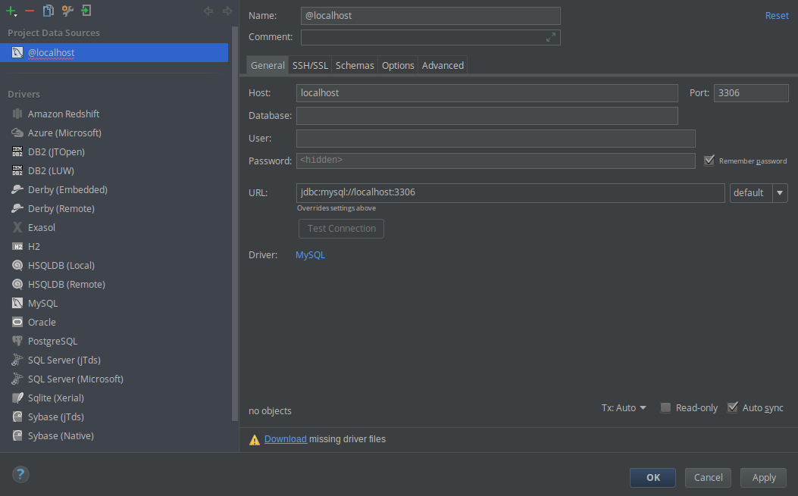

# 第 29 天：使用 PhpStorm 內建的資料庫面板

不知道當筆者在前篇介紹使用 PhpStorm 的 REST Client 功能時，您有驚訝到嗎？在這系列介紹 SQL Client 時，您是否有曾幻想過「若是 PhpStorm 裡也有內建 SQL Client 的話該有多好」嗎？假如筆者現在跟您說 PhpStorm 有內建 SQL Client 功能的話，不知道您有嚇到嗎？(還是已經習以為常 ^.< )

是的，**PhpStorm 是真的有內建 SQL Client 的功能**，它以資料庫 (Database) 面板的型式存在好長一段時間了。不知道是因為管理資料庫這個功能相較於 PhpStorm 其他功能亮點來說比較一般，還是因為官方太低調一直沒有好好強調這個功能。每每筆者在展示使用資料庫面板時，才發現原來大家都不知道 PhpStorm 早就內建 SQL Client，您壓根不需要離開 PhpStorm 就可以完成所有開發大小事。

在這篇介紹裡，筆者就來介紹如何使用 PhpStorm 的資料庫面板，來完成其他 SQL Client 軟體可以完成的功能。

## 使用 PhpStorm 連線至 MySQL

在 PhpStorm 裡要管理資料庫，首先得開啟資料庫 (Database) 面板。若您沒有調整過介面，預設來說會出現在右邊的面板按鈕，請先點擊後打開。

### 建立連線

首先要設定資料來源 (Data Source)，請按下面板左上角的綠色「+」按鈕，新增一個 MySQL 的資料來源。

接著就會跳出一個設定面板，我們要填寫資料庫的連線設定，包括 `Host`、`User`、`Password`。在第一次使用時，可以看到面板右邊左下角有一個要下載 MySQL 資料庫驅動程式的提示，只要點選下載 (Download)，PhpStorm 就會自動去下載下來安裝好。完成後可以按一下測試連線 (Test Connection) 的按鈕，只要看到成功即可。

連線建立完成後，剛剛新增的資料來源就會出現在資料庫面板裡。當然，若您需要的話，可以在專案裡設定多個資料庫連線。PhpStorm 幾乎支援市面上所有的資料庫，若您開發的系統有跨資料庫的需求，這點非常方便。

### 下 Query

連線建立完成後，PhpStorm 會同時開啟一個 SQL 語法的編輯器，我們就直接在編輯器裡下 Query 語法對資料庫進行操作。比方說我們想要查詢 `laravel` 這個資料庫裡 `posts` 這張資料表。則先點選右上角 `schemas` 切換選單，並在編輯區裡輸入 `SELECT * FROM posts` 語句。

在您輸入的時候應該會發現一邊輸入會一邊彈出語法提示。除了 SQL 關鍵字外，資料庫、資料表、欄位名稱這些都會一併自動補全。

### 取得結果

完成後按下左上角綠色的播放 (Execute) 按鈕，PhpStorm 就會把查詢結果顯示在資料庫終端機 (Database Console) 面板裡。當然，假如您不是這麼習慣用 SQL 語法做查詢的話，其實直接點選資料庫面板裡的資料表名字兩下也是可以的。

#### 編修資料

資料庫終端機 (Database Console) 這個面板其實不止用於顯示查詢結果，還有許多功能，包括：

* **重新查詢** - 按工具列上的旋轉按鈕就會重新抓取資料一次，面板上的資料結果會重新更新
* **新增資料** - 按 `+` 按鈕後像在 Excel 裡一樣輸入資料，新輸入的資料會以深綠色的底色標記
* **刪除資料** - 按 `-` 按鈕後該列就會標示為移除，被刪除的資料會以灰色的底色標記
* **修改資料** - 直接對著想要修改的儲存格點兩下，然後就像在 Excel 裡一樣編輯資料，修改過的資料會以藍色的底色標記
* **複製資料** - 直接對著想要複製的資料列按右鍵，選擇複製列 (Clone Row)，被複製的資料會以淺綠色的底色標記

在編修資料的時候要注意，所有被底色標記的資料都只是暫存的狀態，並沒有實際更新至資料庫裡。若您確認要更新時，要按下面板上「有 DB 字樣且有綠色向上箭頭的按鈕」後，PhpStorm 才會真正下語法至資料庫更新。

#### 匯入與輸出

資料庫面板的功能不僅止於此，在面板的右上方其實有數個跟資料匯入、輸出有關的功能，由左至右簡易的介紹一下：

* **格式選單** - 按下後可以選擇輸出時的格式，從常見的 `TSV`、`CSV`、`SQL` 甚至到 `JSON`、`HTML`、`XML` 任君挑選
* **輸出選單** - 可以直接複製到作業系統的剪貼簿，也可以輸出成檔案另存
* **匯入選單** - 點選後會有一系列的問答視窗尋問要匯入的資料及目標
* **DDL 按鈕** - 可以直接將目前查詢的資料表的結構轉成 SQL 語法顯示

甚至資料庫面板還支援從外部軟體直接把資料貼入查詢結果列表裡當作一種匯入方式，PhpStorm 會自動偵測貼入的格式後自動對應到儲存格內，然後就可直接存入資料庫，非常簡潔方便。

## 安裝/使用 DataGrip 管理資料庫

其實，PhpStorm 的資料庫功能，是來自於 JetBrains 工具群裡的另一套名為 DataGrip 的軟體，而在 2017.3 的更新裡，DataGrip 也升級、改版了一堆功能，而因為 PhpStorm 直接以外掛的方式讓 DataGrip 內建，所以 PhpStorm 也一起拿到這些更新且不用再付另一套軟體費用 (夠佛心吧~)。

當然，假如您的團隊裡有同事是 DBA，只需要資料庫管理工具而不需要撰寫程式碼的功能，其實可以推薦他使用 DataGrip 即可。而由於在前篇的介紹裡，我們已經安裝了 JetBrains Toolbox，所以要安裝 DataGrip 就是一鍵搞定！

安裝完後就會在應用程式選單裡看到 DataGrip 的圖示：

啟動後您會發現其實介面跟 PhpStorm 的資料庫面板大同小異，操作經驗可無痛轉移，一樣照著：建立連線、下 Query、取得結果的流程即可。

經過這篇的介紹，是不是能讓您對 PhpStorm 管理資料庫的功能有更深入的了解呢？在這個 SQL Client 系列裡，介紹了數個不同的 SQL Client 工具，哪一個最符合您在開發工作上的需求呢？歡迎留言與我交流。

## 參考資料

* [PhpStorm 資料庫功能官方文件](https://www.jetbrains.com/help/phpstorm/databases-and-sql.html)
* [PhpStorm 資料庫面板官方文件](https://www.jetbrains.com/help/phpstorm/database-tool-window.html)
* [DataGrip 官網](https://www.jetbrains.com/datagrip/)
* [DataGrip 簡介](https://www.youtube.com/watch?v=Xb9K8IAdZNg)
* [DataGrip 2017.3 新功能介紹](https://blog.jetbrains.com/datagrip/2017/12/06/datagrip-2017-3/)
