# 第 3 天：安裝作業系統

當我們依照安裝前準備工作指南完成製作 elementary OS 開機碟後，接下來就可以開始正式安裝作業系統了！接下來的示範環境，會以 PC 做為安裝測試平台。但其實 elementary OS 也是可以安裝在 Mac 機器上的，若您有興趣的話，可以參考文章未的參考資料。

## 第一步、以隨身碟開機

首先，請先將您製作的 elementary OS 開機碟插在電腦的 USB 埠後開機。開機後，依據您電腦廠牌的不同，按下 F1/F2/F10/F12/Del 鍵進入 BIOS 設定 (若不清楚自己的電腦怎麼進入 BIOS，請參考文章未的參考連結)，調整支援 UEFI 模式開機，並設定開機順序以 USB 埠優先。若這個步驟設定完成，成功用 USB 開機碟開機後，應該會看到類似如下的畫面：

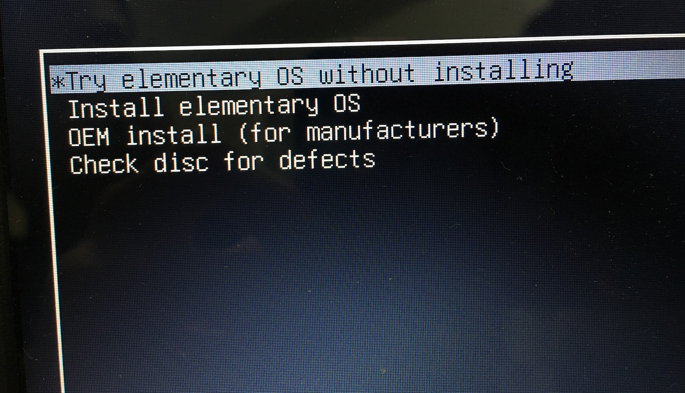

請選擇「Try elementary OS without installing」，接著畫面會跑一段時間後，正式進入 elementary OS 的 Live CD 模式，應該可以看到預設的桌面，如下圖：

## 第二步、安裝作業系統

在 Live CD 模式，其實您已經可以開始「試用」elementary OS 了。只是在這個模式底下，您的任何操作紀錄、檔案…等都不會被保留下來。若要正式安裝的話，請點選桌面右下角 elementary OS Logo 的圖示，啟動安裝程式。

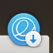

接下來出現安裝程式的歡迎畫面，在這裡可以選擇安裝的語系，我因為歷史因素所以習慣使用英文語系，請依您的習慣自由選擇。語系的部份日後還可以額外安裝和修改，若反悔還有救，不用太糾結 XD。

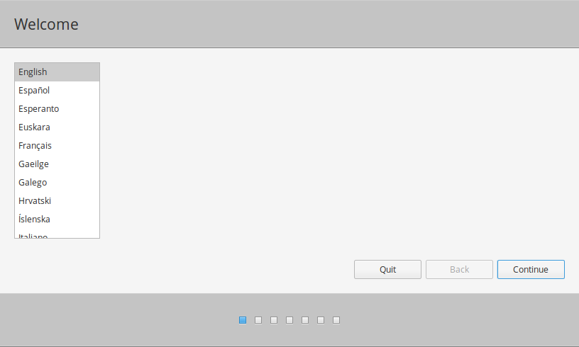

下一步是設定網路，請選擇您連得上的網路。在這邊建議接上網路，因為若有接上網路的話，在下一步可以一併安裝 elementary OS 的更新檔。

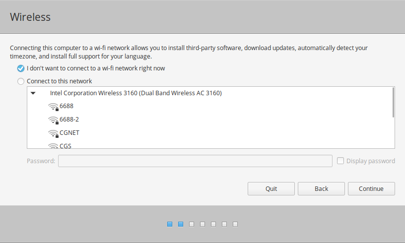

在這邊安裝程式會詢問您要不要安裝更新檔，以及要不要安裝第三方的軟體。因為部份第三方來源會安裝一些非開放授權的軟體，而 Linux 社群通常很在意軟體授權是不是開放的，所以會特別詢問。若您沒有特別偏好的話，這兩個選項直接勾選即可。

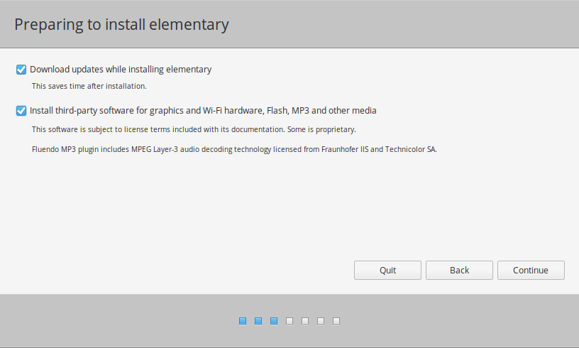

接著要設定安裝的方式，因為很多人會拿 Linux 做多重開機模式，所以可以在這一步決定是做成多重開機還是全新安裝。不過，既然我們都下定決心要用 elementary OS 當工作機了，當然是選全新安裝「Erase disk and install elementary」啊！

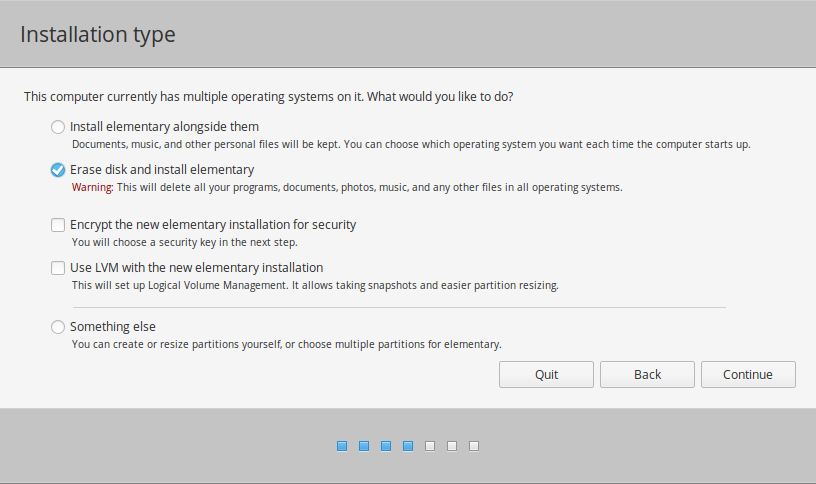

然後安裝程式會詢問要把作業系統裝在哪一顆硬碟上，假如您有多顆才需要選擇，不然就用預設的即可。

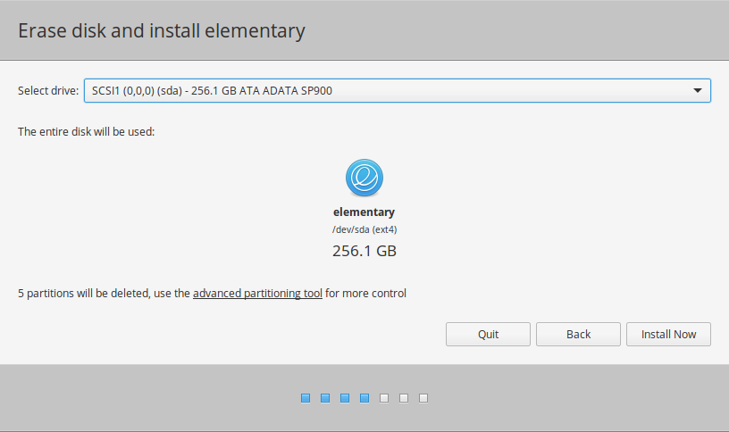

下一步就是設定時區，假如前面有接上網路的話，應該會自動抓到正確的時區，按下一步即可。

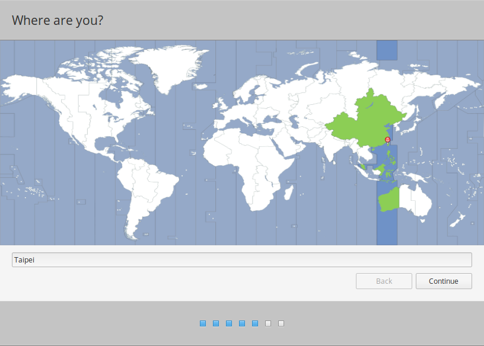

緊接著是設定鍵盤配置，除非您有特殊需求，不然預設的英文鍵盤即可。

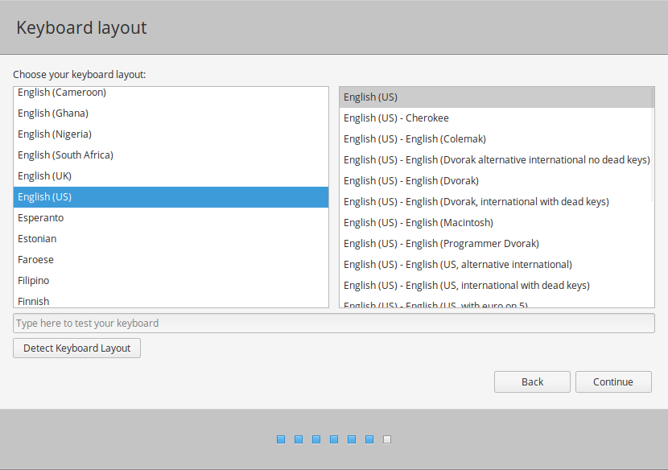

最後一步就是設定帳號，請依自己的喜好做設定。另外，我習慣每次開機輸入密碼，所以「Log in automatically」會取消勾選而「Require my password to log in」則會勾選。

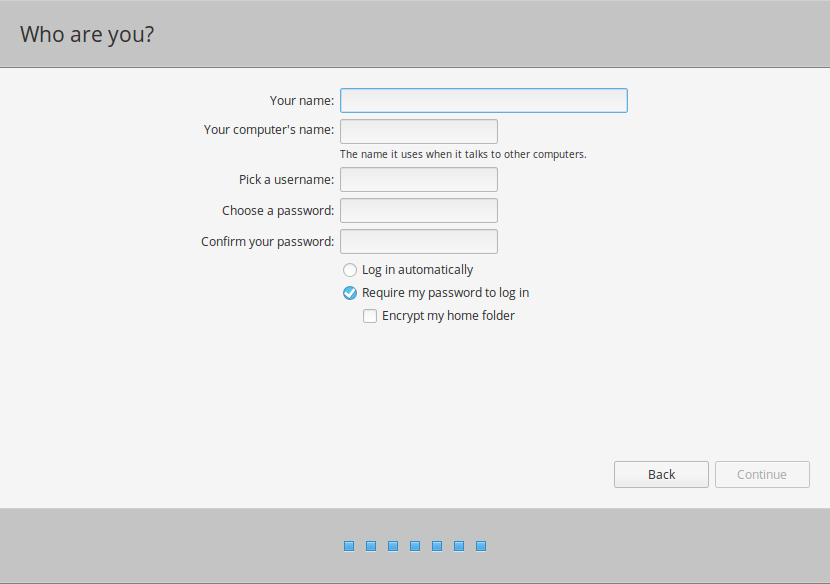

以上都完成後，接下來安裝程式就會將整個作業系統依照設定安裝起來。依據您隨身碟、電腦及網路的速度，安裝時間略有差異，請耐心等它跑完…

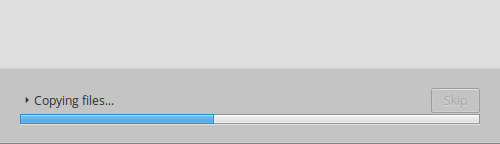

當看到下面這個對話框時，恭喜您！您成功的完成安裝了，請選「Restart Now」後重開電腦，並把開機碟拔除即可，末來只要照著正常開機方式就會進入 elementary OS 桌面了。

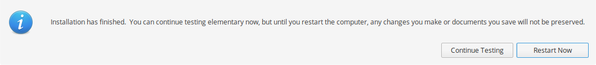

就這樣在圖形化安裝程式的輔助下，有沒有覺得整個流程很簡單且親和呢？下一個單元就會帶著您熟悉一下 elementary OS 的基本操作世界觀。

## 參考資料

* [在 Mac 機器上安裝 elementary OS 指南](https://github.com/aroman/elementary-on-a-mac)
* [各廠牌進入 BIOS 按鍵表](http://blog.xuite.net/weihsint269/cattalon/134710645)
* [安裝 elementary OS 圖說](https://itsfoss.com/guide-install-elementary-os-luna/)
