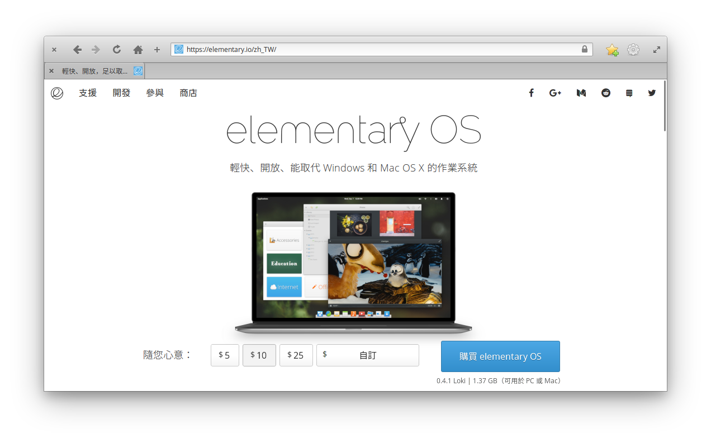

# 第 30 天：延伸閱讀與總結

經過 30 天的探索與嘗試，筆者帶著大家從 elementary OS 的安裝、微調環境設定、中文輸入，到各式瀏覽器、終端機、版本管理等工具的安裝，更進一步討論 4 種環境建置的方式、5 種跨平台原始碼編輯工具安裝與擴充、4 種開發 API 時可以使用的 HTTP Client、3 種操作資料庫的 SQL Client 介紹，希望能對您以 elementary OS 當做開發工作機能有所幫助且更具信心。

## 延伸閱讀

在最後一天，筆者將這一段研究過程所參考過的文件、論壇、學習資源網站做個整理，若您未來在使用 elementary OS 時遇到問題，希望這些資料能給您一些解答的線索。

### 官方資源

從 elementary OS 的網站應該就可以看得出官方的用心，除了[官網](https://elementary.io/)外，各社群媒體包括 [Facebook](https://www.facebook.com/elementaryos)、[Google Plus](https://plus.google.com/+elementary)、[Twitter](https://twitter.com/elementary) 也都看到官方定期的更新。另外，官方很用心在經營他們的[部落格](https://medium.com/elementaryos)，除了最新消息的宣佈外，也有應用程式商店內精選軟體的介紹，甚至三不五時會揭露一些開發秘辛 (也是筆者最喜歡看的幕後特輯)。若您希望能接到第一手訊息的話，歡迎訂閱！

### 論壇

假如您遇到問題不知道該如何解決，官方目前列出幾個頻道、論壇供大家討論，包括 [reddit](https://www.reddit.com/r/elementaryos/) 及 [Stack Exchange](https://elementaryos.stackexchange.com/)。筆者這次在撰寫的過程中，許多解決方案的來源都是從這兩個網站來的。當然，直接用 Google 搜尋對我們來說是更直覺的方案，筆者的經驗是，只要關鍵字有下對，幾乎都能找到正確的解答，著實輕鬆不少。

### 社群

由於 elementary OS 還太年輕，目前在台灣也還沒有在地社群。不過別擔心，因為 elementary OS 是根基於 Ubuntu 的 Debian 流派。所以若是有問題的話，其實可以從 Ubuntu 這個來源找方向。在台灣，Ubuntu 的社群可以在 Facebook 上找 [Ubuntu 正體中文社團](https://www.facebook.com/groups/ubuntu.zh.hant/) 或直接到 [Ubuntu 正體中文站](https://www.ubuntu-tw.org/) 找討論串。

假如您跟筆者一樣是在 Linux 上面開發 PHP/Laravel 的話，筆者本身就是台灣 PHP/Laravel 的社群志工，若是有相關的問題，其實也可以在上面發問喔！在 Facebook 上可以在 [Laravel 台灣](https://www.facebook.com/groups/laravel.tw/) (筆者主辦的社群，問題包括但不限於 elementary OS、PHP、Laravel)、[PHP 也有 Day](https://www.facebook.com/groups/849639948396465/)、[PHP 台灣](https://www.facebook.com/groups/199493136812961/)、[Backend 台灣](https://www.facebook.com/groups/616369245163622/) 等社群找同好們。筆者這次的系列，也意外在社群裡引發許多 Linux 愛好者的迴響 ([1](https://www.facebook.com/groups/laravel.tw/permalink/1540344319367945/)、[2](https://www.facebook.com/groups/199493136812961/permalink/1499314416830820/)、[3](https://www.facebook.com/groups/laravel.tw/permalink/1540344319367945/))，歡迎加入我們！

### 學習資源

另外，除了各篇介紹裡的參考/學習資源外，這邊也列出一些筆者覺得不錯可以參考的網站：

1. [It's FOSS](https://itsfoss.com/tag/elementary-os-freya/) - 在這個網站上有許多針對 elementary OS 的教學文章，可以不定期看看有無自己感興趣的主題。

2. [how to elementary os](https://howtoelementary.org/) - 這是一個專門針對 elementary OS 的教學站，上面也有許多文章可參考。

3. [alternativeTo](https://alternativeto.net/) - 這是一個專門找替代軟體的網站，您可以在這邊先用您熟悉的軟體名稱進行搜尋，網站會列出跟您搜尋的軟體一樣或類似功能的替代軟體。筆者常常用這種方式來尋找跨平台的軟體方案。

4. [在 Youtube 搜尋 elementary OS](https://www.youtube.com/results?search_query=elementary+os) - 筆者常常會在 Youtube 上搜尋感興趣的主題，現在許多人會把自己的安裝教學、評鑑報告放上來。

5. [Introduction to Linux 課程](https://training.linuxfoundation.org/linux-courses/system-administration-training/introduction-to-linux) - 假如您因為這個系列文而打算好好學習 Linux 的話，這裡有課程可以直接上課，從基礎打起。

## 總結

最後，筆者想跟讀者分享一下自己這段時間用 elementary OS 當工作機的一些心得、心態並總結：

### 對於使用 elementary OS 做工作機，我給 87 分！

經過這一段時間的測試與使用，相信您一定看到使用 elementary OS 做為工作機的潛力。不論是在桌面環境的視覺設計、環境操作哲學及軟體相容度，都已經有不錯的表現。而在這個系列介紹文裡，針對 PHP/Laravel 的開發工作，筆者也都為各位找到對應合適的開發工具，拿來做工作機是絕對沒有問題的。

當然，假如您也有跟著一起跳坑的話，應該也會發現畢竟 elementary OS 還在早期階段 (版本號才 0.4.1)，許多細節偶爾會遇到些小問題。另外，可能是因為其客製化的桌面視窗設計，部份軟體的支援度不是這麼優，或是沒有遵循其設計規範而顯得有些不搭，所以總體來說只能給 87 分！(不能再高了)

### 發行版各有特色，選一個自己所愛，然後好好調校

雖然這次筆者選用 elementary OS 這個發行版作為 Linux 桌面環境，不過在這邊還是要再次重申基本立場：**我無意挑起各發行版之間孰優孰劣的論戰，而是期待能展現使用 Linux 桌面環境的可能性，進一步引發開發者對自我謀生工具調校的熱情。**若讀者有在關注這些年 Linux 各發行版的新聞，一定會發現目前各 Linux 發行版都已經漸趨成熟，各陣營也都已經發展出獨立的特色。

本次選用的 elementary OS 是 Debian 流派。因此，就算您不喜歡 elementary OS 的環境，同樣的安裝方式及軟體工具，應都可以無痛在同流派 (包括但不限於 *buntu、Mint、Debian…等) 的發行版裡運作。若您跟筆者一樣是視覺系，那或許可以參考 [5 Most Beautiful Linux Distro 2017](https://www.youtube.com/watch?v=LfxircjKdaY) 這部影片的介紹，裡面有許多美侖美奐的 Linux 桌面發行版可以參考 (比方說 [Deepin](https://www.deepin.org/))。

所以，**對於開發者來說，選一個自己順手，然後花點時間調校，讓工具可以協助您發揮最大生產力才是本系列撰文時的初衷。**別吝嗇投資在調校工具上，要知道，您花愈多時間熟悉自己的謀生工具，到頭來有幫助的還是自己。

### 莫意氣之爭，向他者學習

只要討論到工具、發行版、作業系統等主題時，開發者們總會突然選邊站的戰起來。雖然爭論過程有火藥味在所難免，但筆者每次看到這樣的現況就很痛心。身為開發者，明明就知道沒有完美的銀彈，何苦彼此對立、相互為難呢？反之，這不是一個很好的機會向別人學習嗎？試著從不同的角度，去設想不同高手解決問題的思路，反省自己能否做得更好，相信如此會對自己、社群帶來更多的價值。

**莫意氣之爭，向他者學習。**不論您用什麼作業系統、發行版、開發語言/工具，求知若渴、虛心若愚，相信才是正確之道。

## 期許更多的交流

這次有幸參與鐵人賽，也意外用這個主題在社群裡釣出不少 Linux 前輩、進而認識許多好手。礙於此次篇幅及時間的限制，其實還有很多主題想要研究而未臻完美。當然，我相信鐵人賽是個很好的開始而非結束，未來若有研究出更多在 elementary OS 上對開發有幫助的主題，會繼續用番外篇的方式分享在筆者的[部落格](https://medium.com/@shengyou)，歡迎您持續關注追蹤！

若您跳坑後有任何回饋，歡迎透過以下管道或留言與筆者交流：

* [Facebook](https://www.facebook.com/shengyoufan) - 筆者的 Facebook
* [部落格](https://medium.com/@shengyou) - 筆者的 Medium
* [Laravel 道場](https://www.laravel-dojo.com/) - 筆者的 Laravel 教學站

感謝您對這個系列的興趣，我們保持聯絡了！(鞠躬)
