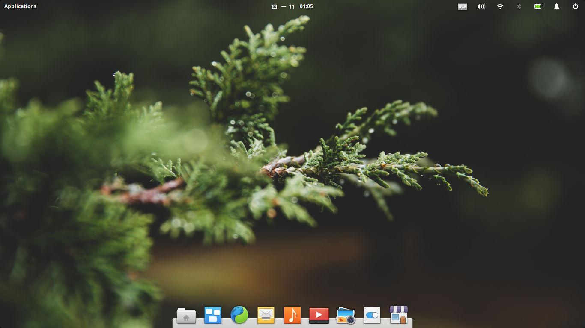
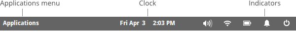
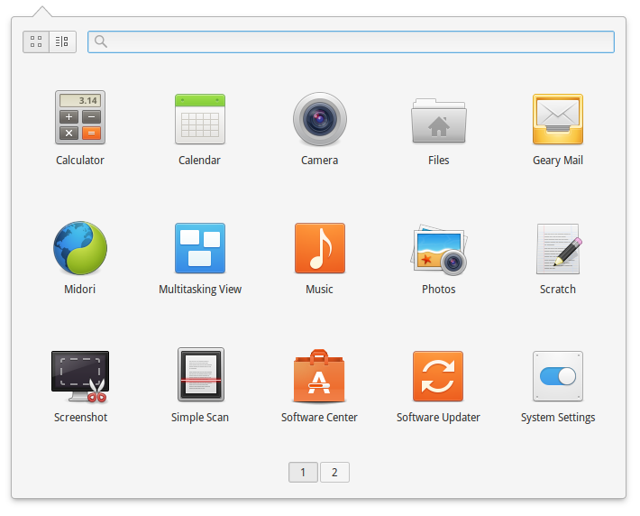
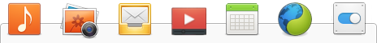
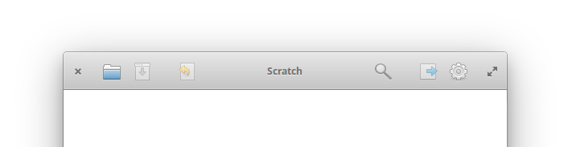

# 第 4 天：操作世界觀

圖形化操作介面 (Graphical Interface) 是透過大量的視覺與操作隱喻，設計出讓人易於理解與使用的互動介面。經過這麼多年的演變，各作業系統上的圖形化操作介面已經衍生出許多慣例，大多的操作習慣都可無痛轉換。不過，畢竟每一個圖形介面都有其風格及設計哲學；因此，在接觸新的作業系統時，先花一些時間理解其操作世界觀，有助於自己更快適應這個作業系統。

由於 elementary OS 的圖形介面是全新打造的，部份設計跟其他發行版略有不同。現在，就讓筆者為您導覽一下這個作業系統的基本操作吧！

## 桌面環境

elementary OS 的桌面環境僅分兩部份，一是面板 (Panel)、一是 Dock。以下逐一介紹：

### 面板 (Panel)

在畫面頂端的深棕色橫條就是面板。由左至右共有三個區塊，分別為：應用程式 (Applications)、時鐘 (Clock)、狀態指標 (Indicator)。

1. 應用程式 (Applications)

    點擊 Applications 字樣，就會出現所有安裝的應用程式，在這個啟動器頁面裡，會詳細列出這台電腦安裝的所有應用程式。您可以用滑鼠滾輪，或按底下的頁碼來切換分頁、左上角的圖示可以用來切換兩種顯示模式：格狀或目錄。除此之外，您還可以在上方的搜尋框裡用打字的方式搜尋 elementary OS 的功能。
    
    

    類似 macOS 上的 Spotlight 或 Windows 上的 Cortana 搜尋，在 elementary OS 裡，您不止可以搜尋應用程式的名稱，也能呼叫其他功能如：

    * 關機和重新啟動
    * 撰寫一則新訊息
    * 開啟瀏覽器視窗
    * 執行數學運算

2. 時鐘 (Clock)

    在面板的中間會顯示目前的系統時間，用滑鼠點擊的話會日曆面板出現。日期時間的格式及語系可以根據習慣在系統設定裡修改。

3. 狀態指標 (Indicator)

    在右上角有一排狀態指標，它會反映出目前的系統狀態，包括：聲音控制、網路連線、電池狀態、訊息中心及開關機選項。依據目前系統的不同狀態及設定，狀態指標的數量會略有不同。

    當使用滑鼠點擊各狀態指標後，會彈出對應的面板做進一步的設定。若使用滑鼠中鍵或三指觸控的話，則可以觸發快速設定：

    * 聲音控制：開/關靜音
    * 藍牙：開/關藍牙
    * 電池狀態：顯示剩餘電量百分比
    * 訊息中心：開/關請勿打擾
    * 開關機選項：顯示關機對話框

### Dock

在桌面的底部的一列圖示稱為 Dock，這邊可以設定您常用的應用程式，並會顯示您正在使用的應用程式。Dock 上的應用程式圖示是可以隨您心意來調整的，假如您想要新增一個應用程式在 Dock 上，可以從應用程式選單裡拖曳圖示過來放置、或是在正在開啟的應用程式上按一下右鍵，選「Keep in Dock」；假如想要移除，只要將應用程式圖示從 Dock 上拖曳到其他非 Dock 的桌面空白處即可、或是在應用程式圖示上按一下右鍵，取消勾選「Keep in Dock」。想要調整應用程式圖示的順序，只要用滑鼠拖曳即可完成。

當應用程式的視窗最大化時，Dock 預設就會隱藏。只要將滑鼠移回 Dock 原本的位置，Dock 就會再彈出顯現。假如對這個預設動作不滿意，可以至系統設定裡更改。

## 視窗/桌面切換與多螢幕支援

當您打開一個應用程式，這個應用程式就會有自己的視窗，且每一個應用程式可以支援多個視窗。在視窗的最左邊及最右邊各有一個按鈕，動作分別是關閉及最大化。當點擊最左邊的關閉按鈕時，會關閉應用程式、當點擊最大化時，會讓應用程式視窗最大化。當然，您可以拖曳應用程式上面的標頭列 (Header Bar) 來移動視窗的位置，視窗的四周可以調整視窗的大小。

elementary OS 也有多重桌面的功能，可依自己的工作習慣開啟多個桌面來群組應用程式的視窗。每個桌面是彼此獨立的，各應用程式的各個視窗可以在不同的桌面間移動。

當然，elementary OS 支援多螢幕。不過要注意的是，除了主螢幕外，其他延伸螢幕都被當作獨立的桌面來使用。而且，只有主螢幕上會顯示面板和 Dock。

## 適應指南

看完以上的介紹應該會發現，其實 elementary OS 的介面操作跟目前市面上的作業系統並沒有很大的差異，所以應該不需要花費太多時間即可適應。不過，眼尖或已經跟著安裝的讀者可能已經發現有幾個跟其他作業系統不太一樣的地方，在這邊特別提出來：

1. 沒有最小化視窗按鈕

    一般來說，視窗都會有三大按鈕：最小化、最大化、關閉。在 Microsoft Windows 上是在右邊、在 macOS 則是在左邊。而 macOS 則是在某一版把最大化變成全螢幕。不過 elementary OS 視窗沒有最小化的設計。
    
2. Dock 上沒有常駐的 Finder 及垃圾筒

    有用過 macOS 的讀者應該對 Dock 很熟悉。在 macOS 上，Dock 的左邊常駐 Finder、右邊是垃圾筒。elementary OS 上沒有這樣的設計。
    
3. 桌面上不能放東西

    elementary OS 的桌面不能放檔案、磁碟機、捷徑…等。剛開始還蠻不習慣的，不過後來想想覺得這根本就是強迫人把東西整理好的 Feature！

## 生產力祕訣

圖形化介面這種東西當然是很賞心悅目，不過相信對工程師來說，如何提高生產力才是真正關注的重點！以下就來介紹一下在 elementary OS 環境底下的常用快速鍵：

*注意！由於 elementary OS 也可以裝在 Mac 機器上，換言之也會支援 Mac 鍵盤配置。所以以下的快速鍵裡，紀錄為 `Meta` 的，在 PC 機器上是 Windows 鍵、在 Mac 機器上則是 Command (⌘) 鍵。*

* 切換應用程式：`Alt`+`Tab`

    在單一桌面內的不同應用程式間切換。

* 顯示所有開啟的應用程式：`Meta`+`W`

    類似 macOS 上的 Dashboard/Exposé/Mission Control，把目前開啟的所有應用程式視窗以群組呈現。

* 熱角 (Hot Corners)

    可以在系統設定裡設定當滑鼠移到螢幕的四個角落時要做什麼動作。

* 切換桌面：`Meta`+`Tab`

    除了在桌面間循序切換外，還可以用`Meta`+`←`及`Meta`+`→`來往左/右切換；或是搭配數字鍵`1`~`9`來切換到指定的桌面，若是用`0`則是建立一個新桌面。

* 移動視窗到左/右桌面：`Meta`+`Alt`+`←`或`Meta`+`Alt`+`→`
    
    把目前開啟的視窗移動到左邊或右邊的桌面。
    
* 顯示所有桌面：`Meta`+`S`

    顯示所有桌面的現況。
    
* 跨桌面顯示視窗：`Meta`+`A`

    不只是顯示單一桌面的所有視窗，而是跨桌面顯示所有視窗。

* 搜尋應用程式：`Meta`+`Space`

    類似 Spotlight 或 Alfred，可快速尋找應用程式後開啟。

* 開啟終端機 (Terminal)：`Meta`+`T`

    立馬開一個終端機視窗，這在 Linux 應該比什麼都重要！

相信看完了以上的介紹，應該會 elementary OS 的整體操作環境有一個基本的認識了。不過看千遍不如做一遍，還沒跟著安裝的讀者別猶豫了，跟著體驗看看吧！

## 參考資料

* [Dock 的歷史及介紹 (Wikipeida)](https://zh.wikipedia.org/wiki/Dock)
* [elementary OS 環境介紹 (官網)](https://elementary.io/zh_TW/docs/learning-the-basics)
