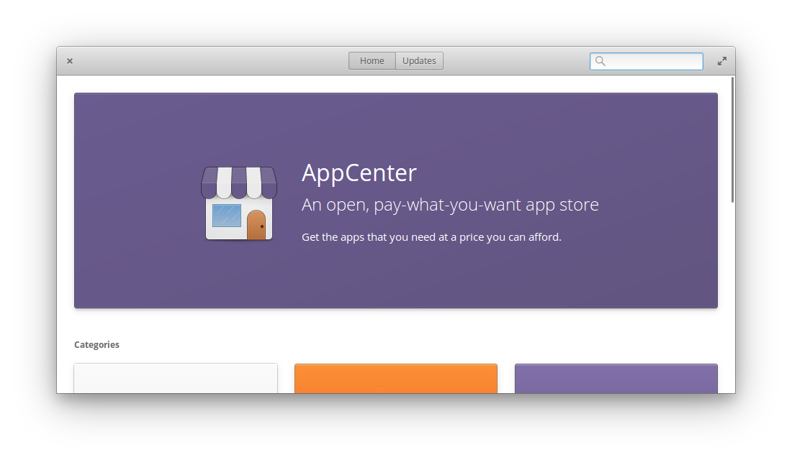
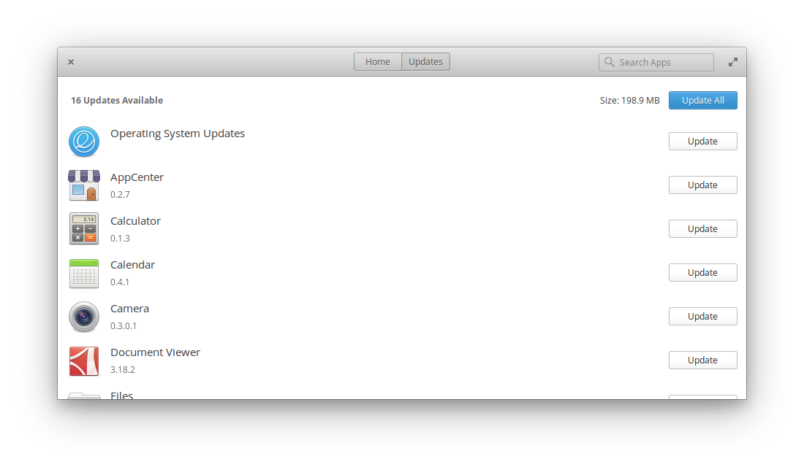
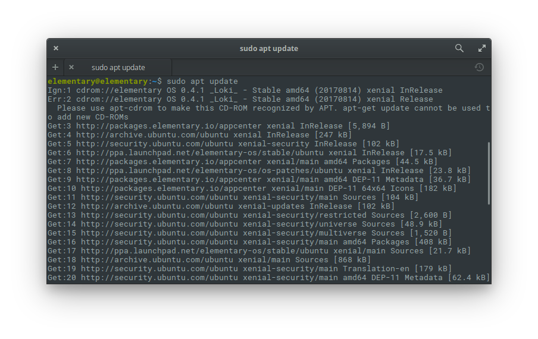

# 第 5 天：軟體安裝與更新

如同前面介紹所提的，elementary OS 出廠預裝的應用程式非常少，僅有一些常備應用程式，如瀏覽器、電子郵件、行事曆、音樂、照片、影片、文字編輯器，相信這樣的應用程式數量一定不能滿足於我們的日常工作。針對這點，elementary OS 的策略是提供一個海量、官方審核認證的應用程式商店，讓軟體安裝與更新這事變得非常輕鬆簡單。

## 應用程式商店

elementary OS 內建應用程式商店，只要透過應用程式 (Applications) 選單叫出應用程式商店，就可以在上面瀏覽由全世界開發者所上架的軟體。除了應用程式商店首頁挑出來的精選應用程式外，也可以透過分類瀏覽、搜尋等方式，供使用者尋找適合自己的應用程式。



應用程式商店除了可以拿來安裝軟體外，也可以用來更新。只要將視窗上面的頁籤切換到更新頁，應用程式商店就會根據本機端安裝的軟體清單開始檢查是否有對應的更新？有的話就會在清單列出，使用者一樣只要簡單的透過點擊更新按鈕就可以將應用程式更新完畢，整個操作體驗非常流暢。



elementary OS 的開發團隊希望提供最好的操作經驗給使用者，所以希望開發者可以開發原生 (Native)、高度融合作業系統、良好效能的應用程式給 elementary OS。因此官方除了提供設計指南、開發手冊等資源給開發者外，也鼓勵開發者透過應用程式商店的機制將自己的應用程式上架，並在官方的部落格上面定期介紹優質軟體，非常用心。而這些上架的應用程式，也可以從使用者付費的循環裡獲得持續開發的動力。相信這樣的正向循環機制可以讓整個生態更加的健康與完整。

## 唔？這樣真的夠嗎？

應用程式商店的設計真的非常美妙，假如您是終端使用者 (End user)的話，一定會愛上這個設計。不過，假如您跟筆者一樣是開發人員 (Developer)，甚至也不是第一次使用 Linux 作業系統的話，您的心裡想的一定是：「怎麼可能只靠應用程式商店裝？這哪夠啊~」或是「用 Linux 就是要用終端機啊！」。

是的，假如您要裝的應用程式不是圖形介面的話，是沒有辦法在應用程式商店裡找到的，這時候就要靠指令啦！在上一篇操作世界觀裡，其實有先埋好了一個哏，就是您可以在elementary OS 裡，使用全域快速鍵 `Meta`+`T` 立馬開啟一個終端機視窗，隨即就可以開始輸入指令啦！



好消息，如何在第一篇的介紹裡提到的，elementary OS 是以 Ubuntu 為基底，這意味著它是使用 Debian 流派的 `apt` 套件管理庫 (眼尖的讀者應該已經在上一張圖裡發現它根本就是直接抓 Ubuntu 套件庫的網址啊啊啊)。換言之，所有你在 Debian 流派習慣的 `apt` 指令可以完全無痛的在 elementary OS 使用。

相信這時候的您就像前鬼一樣解開封印啦！可以在終端機裡試試這些指令：

* 更新套件清單

```bash
$ sudo apt update
```

* 升級套件

```bash
$ sudo apt upgrade
```

* 安裝套件

```bash
$ sudo apt install {package}
```

* 移除套件

```bash
$ sudo apt remove {package}
$ sudo apt purge {package}
```

* 自動移除用不到的套件

```bash
$ sudo apt auto-remove
```

## 咦？沒聽過 `apt/deb`、`yum/rpm` 這些指令？

假如上面的 `apt/deb` 指令對您來說很陌生，`yum/rpm` 您也沒聽過，對您來說，在指令列裝套件應該是用 `brew` 的話。那我想您一定是從 macOS 轉過來的使用者吧？

沒問題，在 Linux 也有您的菜，請出門右轉使用 Linuxbrew！安裝方式非常的無腦，根據官方文件只需要先輸入以下指令：

```bash
sh -c "$(curl -fsSL https://raw.githubusercontent.com/Linuxbrew/install/master/install.sh)"
```

然後再把以下 script 貼進您的 dotfile 裡：

```bash
test -d ~/.linuxbrew && PATH="$HOME/.linuxbrew/bin:$HOME/.linuxbrew/sbin:$PATH"
test -d /home/linuxbrew/.linuxbrew && PATH="/home/linuxbrew/.linuxbrew/bin:/home/linuxbrew/.linuxbrew/sbin:$PATH"
test -r ~/.bash_profile && echo "export PATH='$(brew --prefix)/bin:$(brew --prefix)/sbin'":'"$PATH"' >>~/.bash_profile
echo "export PATH='$(brew --prefix)/bin:$(brew --prefix)/sbin'":'"$PATH"' >>~/.profile
```

接著重開終端機應用程式，就可以使用以下指令啦！

```bash
$ sudo brew install {package}
```

## 終端 V.S 終端機

不論您是終端使用者 (End user) 還是終端機愛用者 (Terminal lover)，也不管您是從哪個平台轉過來的，相信您一定都能在 elementary OS 找到讓自己最舒服的位置。

想了解更多終端機祕訣嗎？歡迎繼續關注這個系列文章喔！

## 參考資料

* [官方 AppCenter 介紹](https://elementary.io/zh_TW/docs/learning-the-basics#learning-the-basics)
* [Building the Future of elementary OS](https://medium.com/elementaryos/building-the-future-of-elementary-os-9df3fa940b67)
* [AppCenter & The Future of The Universe](https://medium.com/elementaryos/appcenter-the-future-of-the-universe-1d34f04d1c85)
* [官方部落格 AppCenter 軟體推薦文章](https://medium.com/elementaryos/tagged/appcenter)
* [Homebrew 官網](https://brew.sh/)
* [Linuxbrew](http://linuxbrew.sh/)
* [Linuxbrew 安裝指南](https://www.digitalocean.com/community/tutorials/how-to-install-and-use-linuxbrew-on-a-linux-vps)
