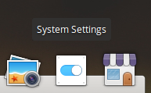
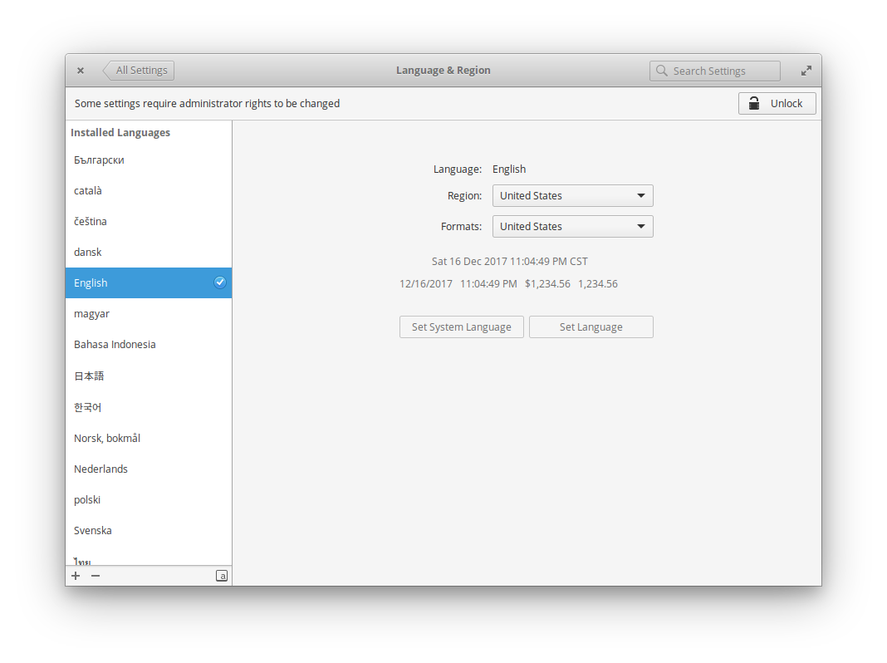

# 第 6 天：微調系統設定

如同各作業系統的慣例，elementary OS 出廠時也預載了系統設定這個應用程式，將作業系統層級的所有設定都整合在這個應用程式內。為了讓使用 elementary OS 時更符合自己的操作習慣，在這邊先介紹幾個常見會需要調整的一些系統設定，順便熟悉一下如何微調 elementary OS。請先點擊 Dock 上的系統設計圖示：

## 關閉訪客 (Guest) 帳號

首先，先進入使用者設定。在這邊除了可以設定目前使用的帳號外，也可以看到 elementary OS 有支援訪客帳號的設定。不過，由於是個人用的開發工作機，沒有打算開放這個功能，我們可以透過開關按鈕把這個功能關閉。在關閉前，需要先點擊右上角的解鎖 (Unlock) 並輸入密碼才可以調整。關閉後，需要先登出再重新登入，這個功能才會正式出效。

## 語系設定

elementary OS 支援多國語系，在我們安裝作業系統的時候，就已經選擇過使用的語系了。不過若您反悔了，還是可以進到語系設定裡面來做調整，或是改變作業系統內各種文字顯示的語言格式。調整後，elementary OS 就會依照您的設定去下載對應的語系檔。這項變更也是需要重新登出再登入才會生效，甚至部份顯示要重新開機才會正式的套用。

## 滑鼠與觸控板設定

每個人習慣的滑鼠和觸控板設定、靈敏度都不同，尤其是滑鼠滾輪、觸控板的捲動方式到底是同方向還是自然，也是每個人各有偏好，在這邊一併調整。

## 電源設定

現在愈來愈多開發者是用筆記型電腦做為工作機，好處是移動方便、行動力高，不過往往受限於電池續電力而影響可在外工作的時間。在電源設定裡，可以設定螢幕亮度、休眠選項及電源鍵的反應動作。部份選項可以依據插著電源與使用電池兩種情境做不同的設定。

## 藍芽設定

假如您是藍芽裝置的愛好者，可以在這裡設定您要配對/連接的藍芽裝置。

不過提醒您，若是您要關閉藍芽的話，要透過右上角狀態指標來開關。當然，別忘了在前面的章節有提到，只要用滑鼠中鍵去點選狀態指標的藍芽圖示的話，就可以直接開/關它。

相信透過以上的設定提示，會讓您操作 elementary OS 更加順手。還有哪些設定是您在使用作業系統時一定會調整的呢？歡迎留言分享！

## 參考資料

* [官網系統設定指南](https://elementary.io/zh_TW/docs/learning-the-basics#system-settings)
