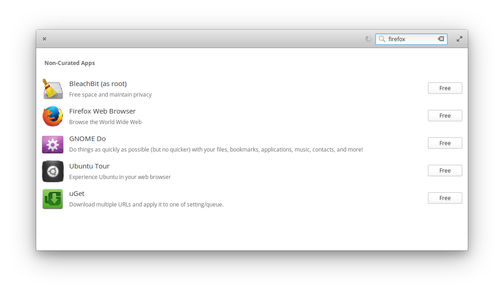
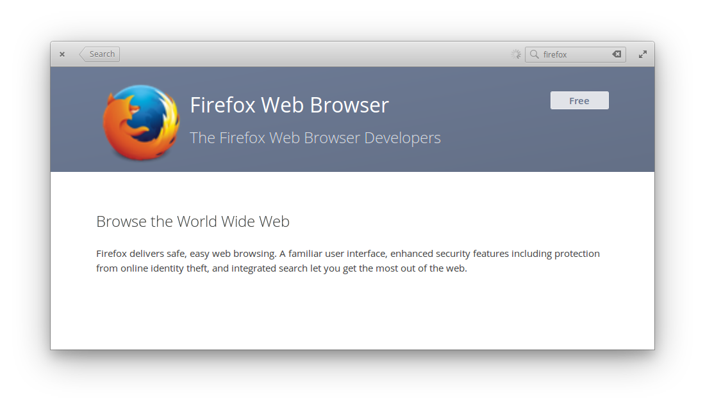
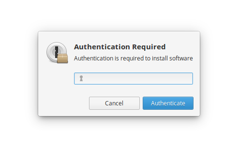
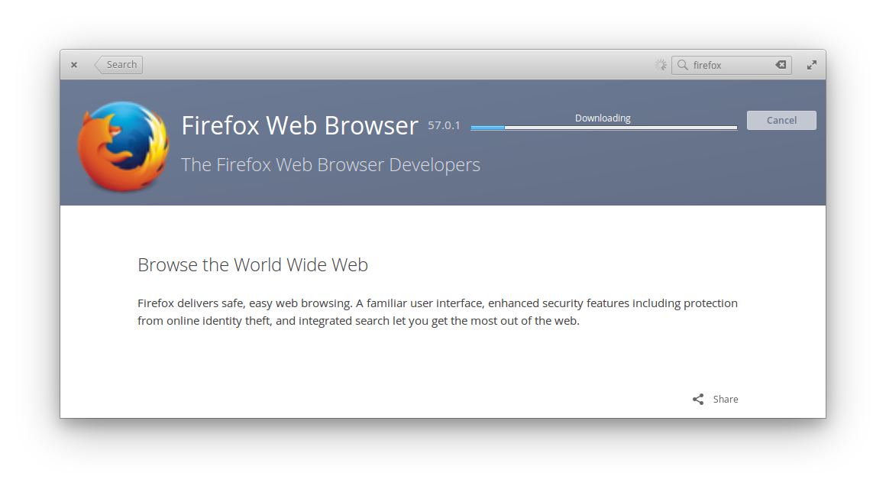
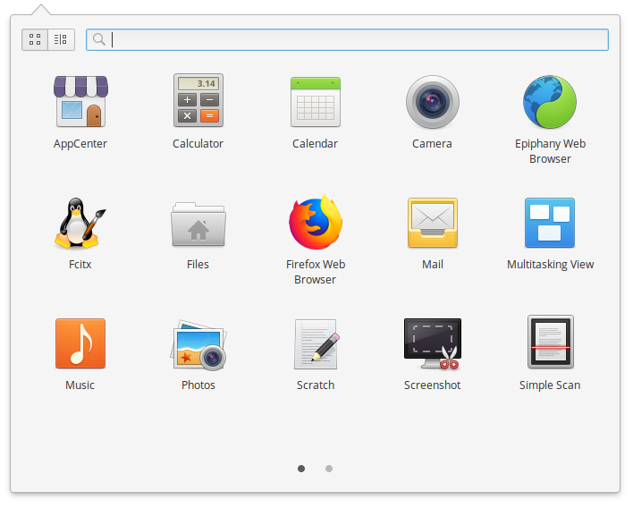
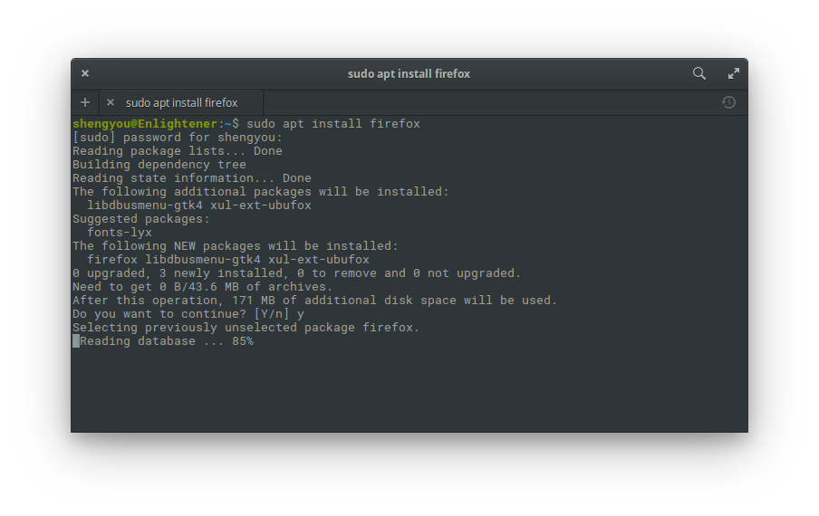
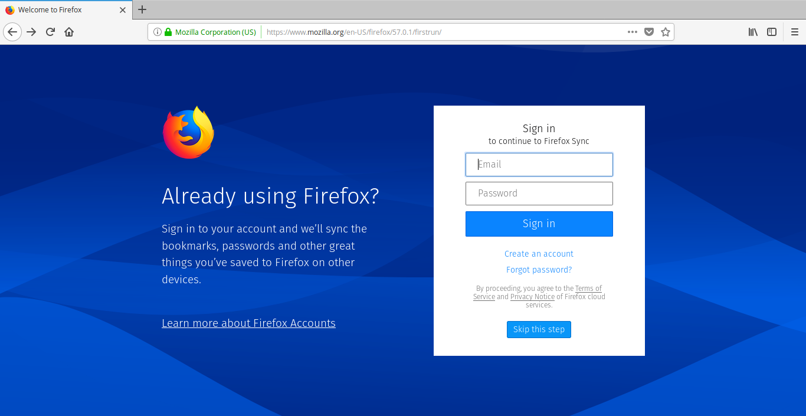

# 第 7 天：安裝 Firefox 瀏覽器

elementary OS 出廠預設帶的瀏覽器是 Epiphany，它是一個奉行簡單唯美原則的瀏覽器。大多數您需要的功能，都可以在 Epiphany 上找到，書籤、歷史紀錄、網頁原始碼一應俱全。

不過，由於這個系列的目標對象是 Web 開發者，相信您一定有自己習慣的瀏覽器。在這些眾多瀏覽器裡，也一定不乏 Firefox 的愛用者。現在，就讓我們在 elementary OS 上安裝 Firefox 瀏覽器！

在 elementary OS 上安裝 Firefox 瀏覽器非常簡單，筆者將介紹兩種方式：

1. 透過應用程式商店 (App Center) 安裝
2. 透過套件管理庫 (apt) 安裝

## 透過應用程式商店安裝

在軟體安裝與更新一篇裡，筆者介紹了 elementary OS 內建的應用程式商店。現在，我們就實際透過應用程式商店來安裝 Firefox 瀏覽器吧！請先點擊 Dock 上的應用程式商店圖示，開啟應用程式商店介面，然後在右上角的搜尋框輸入 Firefox。



出現 Firefox 選項後，點選進行應用程式詳細介紹頁，在這邊會有應用程式的詳細介紹。因為 Firefox 本身不需要額外付費使用，所以直接點選 Free 即可開始安裝。



安裝前會先彈出需要系統管理員權限的對話框，輸入您的密碼即可開始下載/安裝 Firefox。





安裝完成後，就可以在應用程式選單裡看到 Firefox 的圖示，點選就可以開啟 Firefox 瀏覽器。當然，您也可以將 Firefox 放到 Dock 上方便隨時開啟。



就這樣，非常簡單吧！

## 透過套件管理庫 (apt) 安裝

當然，假如您比較習慣在終端機裡透過套件管理庫來安裝軟體的話，也可以直接下指令安裝，在 elementary OS 裡，Firefox 瀏覽器的套件名稱就是 `firefox`，所以指令就是：

```bash
$ sudo apt update
$ sudo apt install firefox
```



一樣也是需要輸入具 root 權限的密碼，指令跑完就裝好了。一樣可以在應用程式選單裡看到 Firefox，剩下就看個人習慣設定和安裝 Firefox 的外掛程式了。



您有推薦的 Firefox 外掛程式嗎？歡迎在留言裡跟我分享！

## 參考資料

* [安裝 Firefox 影片教學](https://www.youtube.com/watch?v=vyUJ0lRqFrI)
