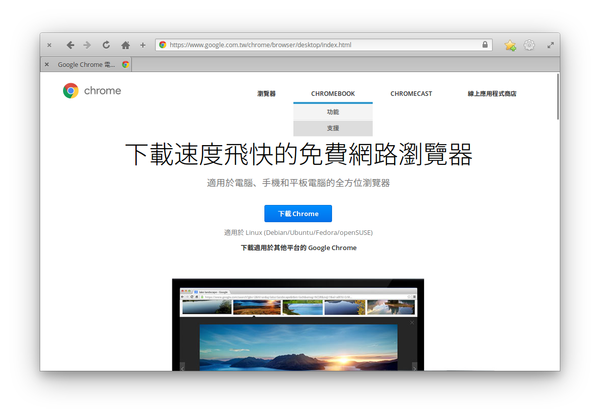
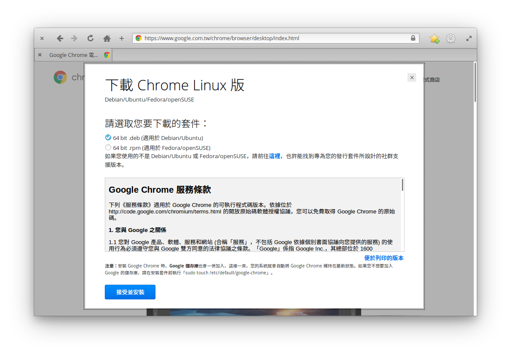
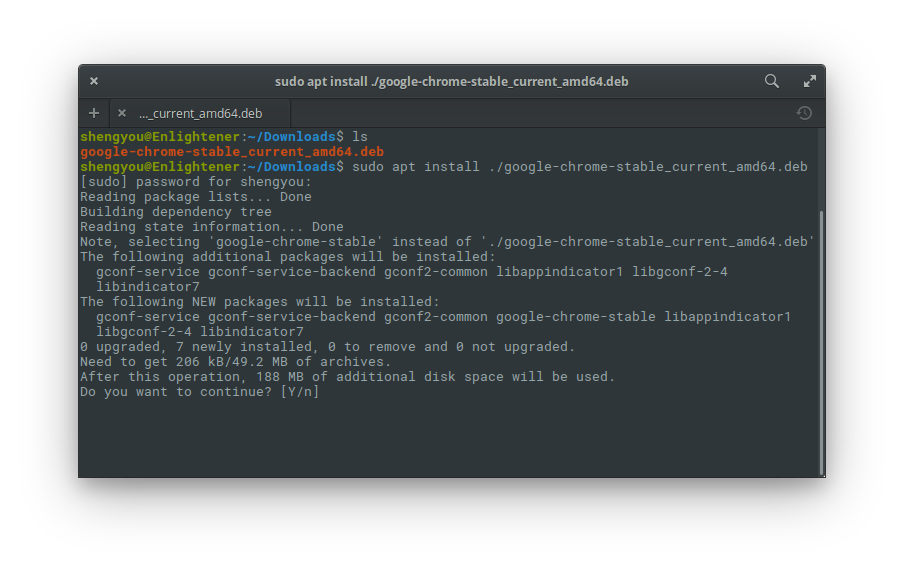
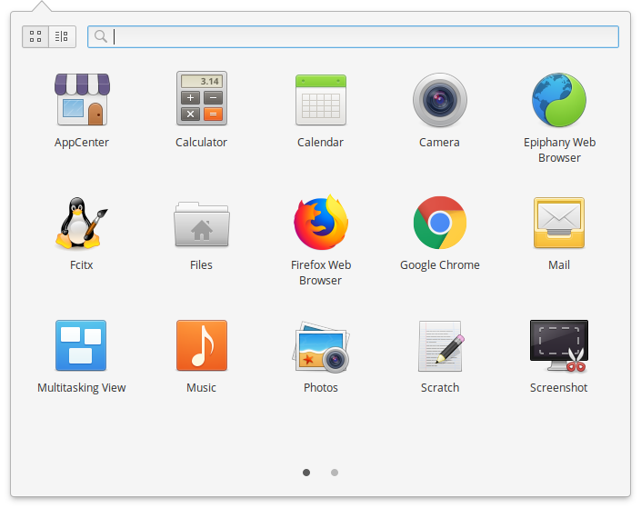
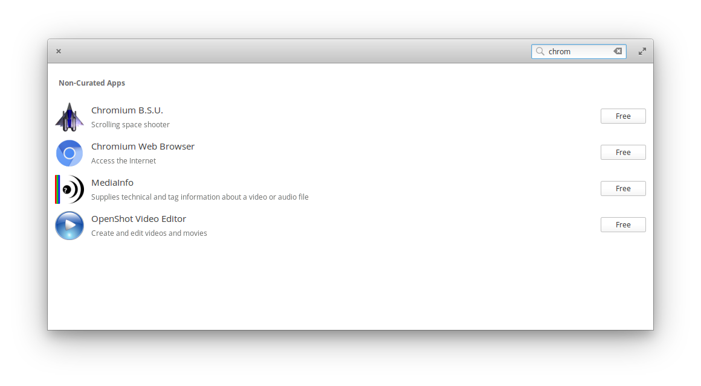
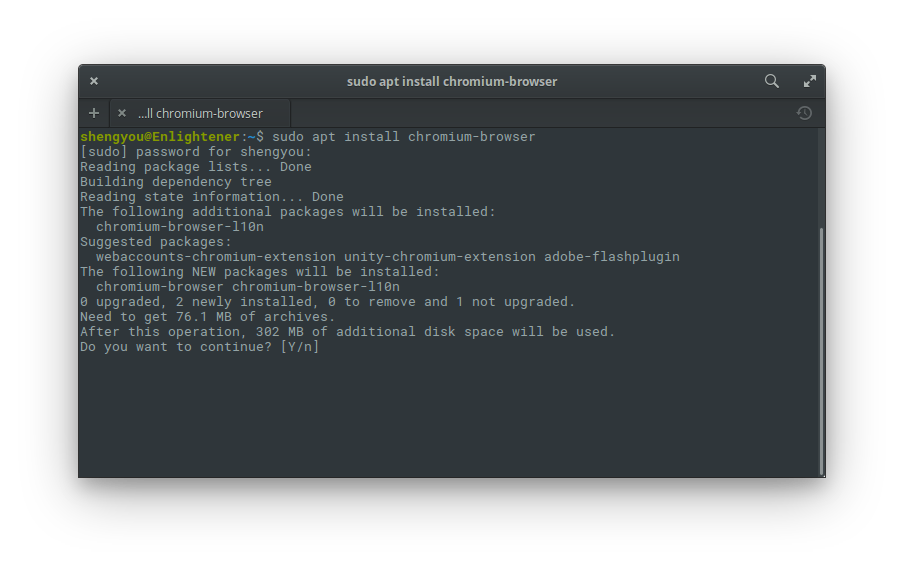

# 第 8 天：安裝 Google Chrome 瀏覽器

對比於 Firefox，另外一大陣營的瀏覽器派別相信就是 Google Chrome 了。Google Chrome 嚴格來說可以分成兩個版本，安裝方式也稍有不同：

1. Google Chrome 官方釋出版
2. Chromium 開源版

兩種版本在核心其實是一樣的，差在是否有整合 Google 官方的一些功能及應用程式內部使用的元件授權。依照您的喜好可以選擇自己喜歡的版本來安裝，在這邊筆者會逐一介紹如何安裝這兩種版本的 Google Chrome。

現在，就讓我們在 elementary OS 上安裝 Google Chrome 瀏覽器吧！

## 安裝 Google Chrome 官方釋出版

若要安裝 Google Chrome 官方釋出版，需要先至官網下載安裝檔。請先開啟瀏覽器輸入網址：https://www.google.com.tw/chrome/browser/desktop/index.html 進入首頁後，點選「下載 Chrome」按鈕即可。網頁會很聰明的偵測您的作業系統自動切換對應的下載版本。



當跳出選項時，請選擇正確的 Linux 版本。以 elementary OS 來說，請選擇 Debian/Ubuntu 的 64bit `.deb` 版本。



下載完畢後，因為 elementary OS 預設沒有辦法直接安裝 `.deb` 的檔案，所以接下來這步驟得依靠終端機來完成。請使用快速鍵 `Meta`+`T` 開啟終端機，將工作目錄切換到下載 (Downloads) 資料夾，並輸入以下指令：

```bash
$ sudo apt install ./google-chrome-stable_current_amd64.deb
```



接下來 apt 套件管理就會自動安裝相依套件，並把 Google Chrome 安裝至應用程式選單內。



雖然需要靠終端機才能完成全部的步驟，不過也還算簡單，對 apt 套件管理庫是不是愈來愈熟悉了呢？假如您覺得手續太繁複了，想要直接一次在終端機裡搞定，其實也可以輸入以下指令完成：

```bash
$ curl -O https://dl.google.com/linux/direct/google-chrome-stable_current_amd64.deb && sudo apt install ./google-chrome-stable_current_amd64.deb
```

## 安裝 Chromium 開源版

相較之下，Chromium 開源版就更好安裝了，假如您已經愛上應用程式商店的話，其實直接開啟應用程式商店，搜尋 Chromium 再按 Free 安裝就搞定了！



當然，用 apt 套件管理安裝也不遑多讓，一樣一行指令就搞定：

```bash
$ sudo apt install chromium-browser
```



不論是哪一種安裝方式，完成後一樣可以在應用程式選單裡看到 Chromium 的圖示。剩下就看個人習慣設定和安裝 Chrome 的外掛程式了。您有推薦的 Chrome 外掛程式嗎？歡迎在留言裡跟我分享！

## 參考資料

* [安裝 Google Chrome 影片教學](https://www.youtube.com/watch?v=T3yovzJXn-Y)
* [StackExchange 上的討論串](https://elementaryos.stackexchange.com/questions/7934/how-to-install-google-chrome)
