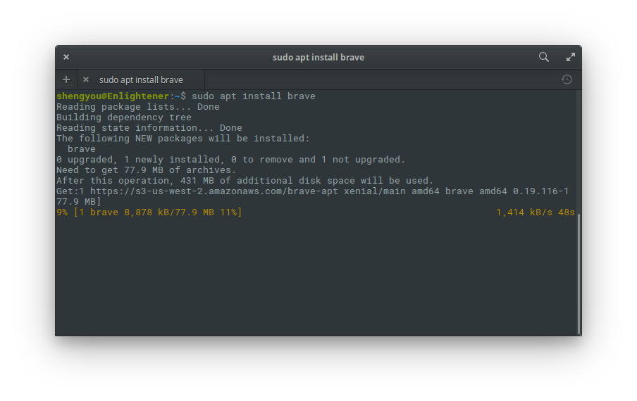
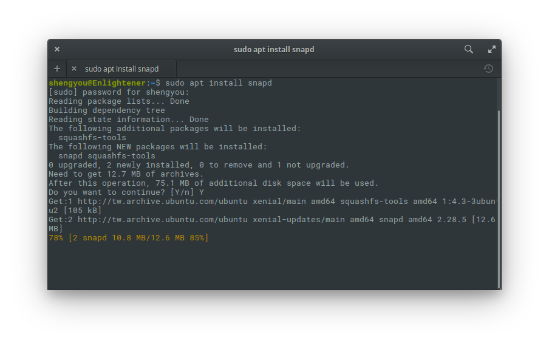
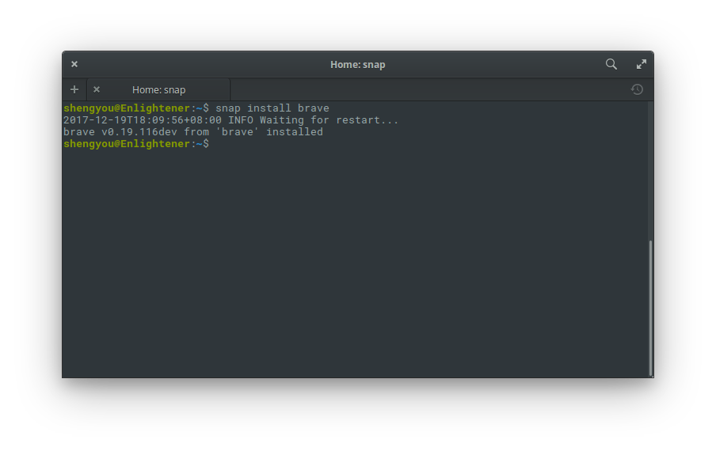
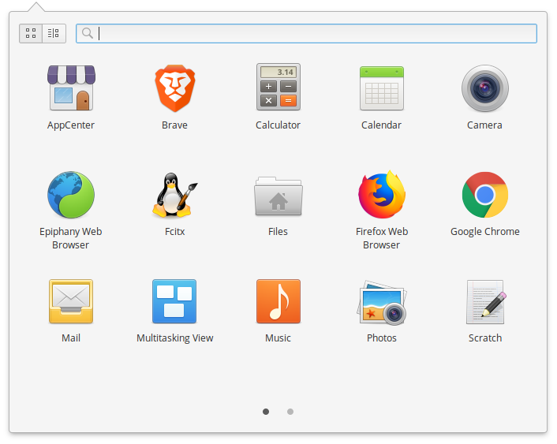

# 第 9 天：安裝 Brave 瀏覽器

在這個瀏覽器也是眾家爭鳴的年代，身為 Web 開發者，電腦裡有多套瀏覽器也是很合理的事。最近，一個新的瀏覽器 - Brave 搶到了我的眼球！Brave 是一個強調速度、安全及無廣告的瀏覽器，其使用 Chromium 為基底加上 Blink 渲染引擎，採用開放原始碼散佈並提供三種作業系統的桌面版本及兩種手機版本，從作業系統的涵蓋範圍就可以看出其野心如其名一樣的勇敢。而之所以引起我的興趣，是因為 Brave 的創辦人之一就是知名的 Javascript 之父 - Brendan Eich。

雖然目前 Brave 還在早期開發階段，不過相信您一定跟我一樣好奇，就讓我們在 elementary OS 上安裝 Brave 瀏覽器來體驗看看吧！

## 使用 apt 套件管理指令安裝

我們可以直接使用 apt 套件管理來安裝 Brave。且經過實際測試後，這也是筆者比較推薦的安裝方式，只要輸入以下指令即可：

```bash
$ curl https://s3-us-west-2.amazonaws.com/brave-apt/keys.asc | sudo apt-key add -
$ echo "deb [arch=amd64] https://s3-us-west-2.amazonaws.com/brave-apt xenial main" | sudo tee -a /etc/apt/sources.list
$ sudo apt update
$ sudo apt install brave
```



*註：因為 elementary OS 不是標準的 Ubuntu，因此安裝指令跟官方提供的路徑有些許不同，詳細內容可以查閱文章末的參考資料。*

## 使用 Snaps 套件管理指令安裝

*警告：依據筆者目前實測，使用 Snaps 安裝的 Brave 在啟動時會 Crash，可能暫時還不是很穩定。若您也遇到這樣的情況，建議移除後重新以 apt 套件管理方式安裝。*

為了在各 Linux 發行版發佈並降低安裝難度，Brave 官方預設採用 Snaps 進行散佈。使用 Snaps 安裝的好處，是開發者會幫我們處理好相依元件且未來可支援自動更新機制。所以在安裝 Brave 之前，先來安裝 Snaps。其安裝機制很簡單，一樣透過 apt 套件管理指令即可：

```bash
$ sudo apt update
$ sudo apt install snapd
```



*註：若您使用的是 Ubuntu 16.04 的話，其實預設就已經內建了。(畢竟 Snaps 是 Ubuntu 背後的公司 Canonical 所推動的格式)*

有了 Snap 指令後，接著就可以用 Snaps 來安裝 Brave，指令跟 apt 很像：

```bash
$ snap install brave
```



不論你喜歡用哪一種方式安裝，只要依照上面的步驟，等到安裝程序跑完，就可以在應用程式選單內看到 Brave 瀏覽器的圖示。



點擊後就可以開始使用 Brave，其介面如下：


實際使用後，覺得 Brave 是個具潛力、新概念的瀏覽器，不過目前仍在早期開發階段，所以使用起來並不是非常穩定，視窗的設計也不太符合 elementary OS 的風格，可以再關注一段時間。

連續幾個單元，筆者介紹了三種瀏覽器的安裝方式，也順道示範/體驗了 apt 及 Snaps 安裝應用程式的方式，希望能對您有幫助。平常在開發的時候習慣使用什麼瀏覽器呢？歡迎在留言裡跟我分享！

## 參考資料

* [Brave 官網](https://brave.com/)
* [Wikipedia 上的 Brave 條目](https://en.wikipedia.org/wiki/Brave)
* [Brave 的介紹影片](https://vimeo.com/228418113)
* [官方安裝指南](https://github.com/brave/browser-laptop/blob/master/docs/linuxInstall.md#debian-jessie-and-ubuntu-zesty-yakkety-xenial-and-trusty-amd64)
* [針對 elementary OS 的安裝指令](https://github.com/brave/browser-laptop/issues/6649)
* [snapd 安裝指南](https://docs.snapcraft.io/core/install-ubuntu)
* [snapd 中文介紹](https://blog.longwin.com.tw/2016/07/ubuntu-linux-common-package-snap-2016/)
